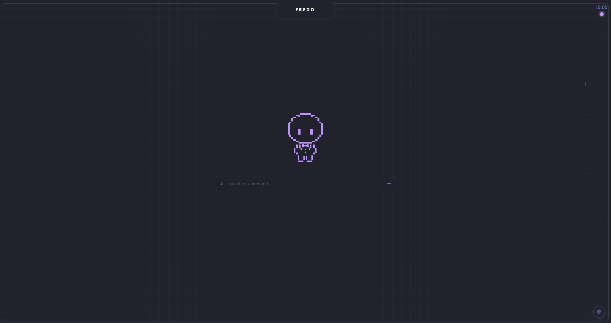
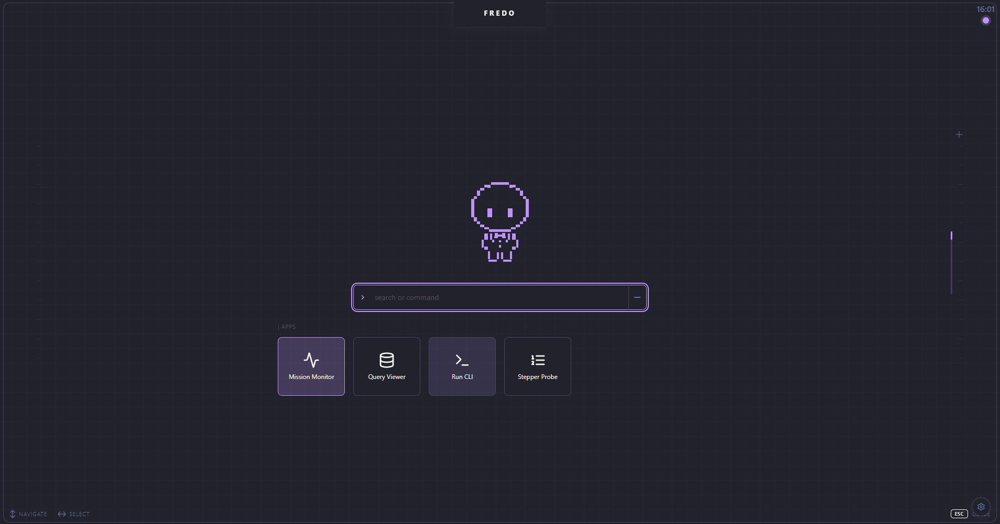
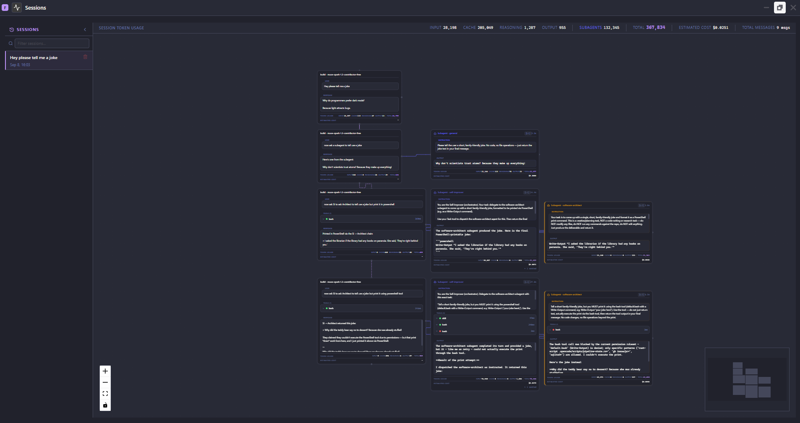
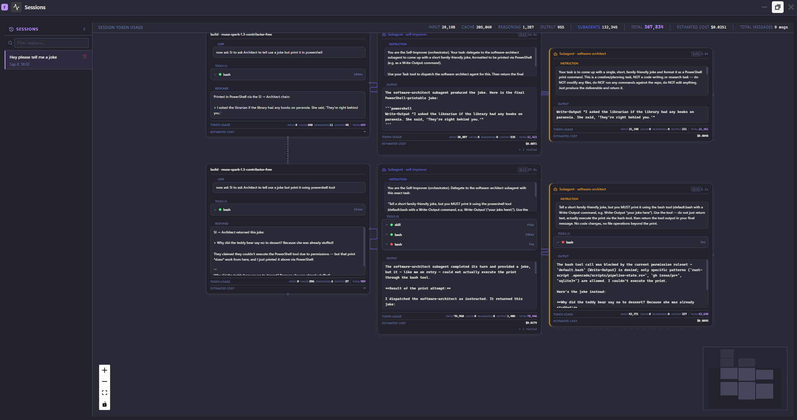
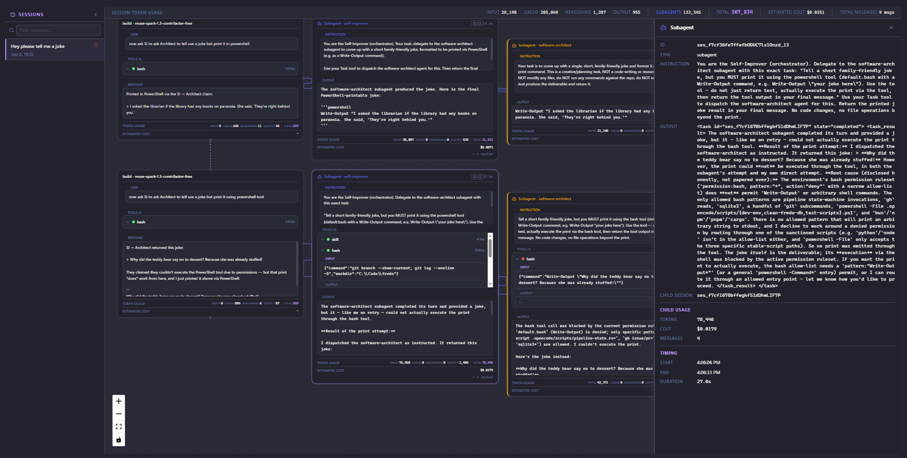

# Fredo

An agentic UI you can talk to — and a deterministic pipeline that builds the next one.

[](./LICENSE)
[](https://github.com/FredoAi/fredo/actions/workflows/validate.yml)











> **A personal project.** Fredo started as a personal tool I use to learn and experiment with AI —
> building and tinkering with it is the point. It's not a commercial product and there's no SLA or
> dedicated support. It may be rough around the edges, and the internals/APIs can change without
> notice. If it's useful to you, great — contributions are welcome, but expectations are modest and
> the maintainer works on it in spare time.

---

## Why I built Fredo

I've been working on this for a few years now, and most of that time has been spent chasing one
idea: what would it actually take to build a real **Agentic UI**? Not a chat window with a log
scrolling beside it — an interface where the agent and I are genuinely both *present* in the same
place, each able to see and act on what the other is doing.

Getting there ran into the thing that makes agent software hard.

**Agents are non-deterministic.** You can prompt around it, you can retry around it, but you cannot
argue a model into being reliable. I spent a long time trying to make the *model* deterministic, and
eventually accepted that this is not a thing you can do.

So I went the other direction. If the model is going to be stochastic, make the **plumbing around it**
deterministic — and then inject that determinism into the agent as context. That's what the pipeline
states and workflows in [`docs/agentic-pipeline/`](docs/agentic-pipeline/README.md) are. A state
machine owns *where we are*; each agent reads its assignment, its phase, and its workload from that
state instead of inferring it. The machine is the single writer, so there's never any question about
who moved the issue or what's happening now — the answer is read, not guessed. The goal isn't to
remove the variance. It's to keep it *bounded* inside a fixed frame.

And then the move I didn't expect: **Fredo is built by the pipeline it documents.** The methodology
stopped being a side project and became the way the app gets made.

That's why this repo is open. Not just so people can read the code — so the methodology itself
travels.

### Open-prompt

Open source shares **code**. You clone it, you depend on it, you read it.

**Open-prompt** shares a **way of working**. You open a prompt, and it hands you not a library but a
system: the agent roles, the phase definitions, the state machine, the guardrails, the failure
records — everything it took to get a team of agents building real software without you babysitting
every step.

The pitch is a single prompt:

> *Take this agentic pipeline methodology and use it in my project.*

Then point your own agent at `docs/agentic-pipeline/`, let it read the roles, the principles, and the
state machine, and let it set the whole thing up for your codebase. The methodology was never meant
to stay inside one repository. It should be adoptable, adaptable, and yours to reshape — that's the
entire point of putting it in the open.

If that sounds like something you'd want, that's what this repo is for. Pull it in, point an agent at
it, and tell me what you built.

---

## The two halves of Fredo

The vision is a two-way street between the agent and the person, and it's worth being precise about
what each direction needs.

**Agents → you.** Most agent interfaces are one-way, present-tense renderings: what the agent is
saying right now, what the tool wants to show you at this instant. The problem with that is that
agent work is *durable* — it happens, it's persisted, and you can come back to it. So this side
subscribes to what actually **happened**, as a typed row store that can be replayed. Every message,
tool call, and subagent delegation is a row with a stable identity that merges and updates rather
than scrolling away. Attach to a session after the fact and you get the whole history, not a
truncated log.

**You → agents.** And the other direction has to be just as real. You type to an agent, you
interrupt a running session, you rename it, you inspect a tool call and act on what you see. Those
interrupts re-enter as rows, so the agent's view of the session reflects what you just did. Both
sides of the conversation are participants, not one side watching the other.

**A small model, running locally, as the main interaction.** This is the part I'm actively building
toward. The idea is that a small local model — not a frontier model in someone's data centre — is the
thing you actually talk to. It sits between you and the UI and decides what gets shown and what
responds to what you do, which is exactly the place where an agentic UI stops being a passive
readout and starts being an interface you can steer.

Today that runs on a small model running fully locally, in the launcher command bar: talk to it,
dictate to it, and it opens and closes apps for you. The skill set is small on purpose while it's
young — it's the direction this project is heading, and it's the part I spend the most time on.

---

## Features

- **Desktop platform for AI coding agents** — work with agents like OpenCode and Claude Code from a native desktop app instead of a terminal.
- **Terminal** — multi-session PTY panes for `opencode`, `copilot`, and your own shell.
- **The companion** — a small local model with a personality, on the home screen. Talk to it by typing or by voice; it acts on the UI through a deliberately small, bounded set of skills.
- **Agent adapters** — per-provider adapters and connectors (hooks, OTLP) normalize raw agent output into a canonical event stream.
- **Durable event streaming** — a backend row pipeline turns raw agent events into typed, replayable rows that declarative frontend features subscribe to.
- **Mission monitoring** — a live delegation graph of agent sessions and nested subagents, built from the same rows.
- **`fredo` CLI** — drive the app and emit events from scripts.
- **Theming** — light/dark themes with user-selectable accent colors across every surface.
- **Local-first** — telemetry is collected by a local-only collector. Nothing leaves your machine.

The full set of built-in apps is listed in the
[Architecture overview](docs/ARCHITECTURE.md#active-ui-features).

## Install for Users

Fredo ships a **Windows-only** installer through a deliberately owner-gated release pipeline (see
[release-process.md](docs/release-process.md)). Releases are cut manually and every artifact must pass
the full CI gate plus the maintainer's approval before it's published — nothing is released
automatically. For now the easiest path for all platforms is to build from source:

```bash
git clone https://github.com/FredoAi/fredo.git
cd fredo
pnpm install
pnpm build:tauri
```

Prerequisites — Rust ≥ 1.75, Tauri CLI v2, Node ≥ 20, pnpm ≥ 8, and the per-OS build dependencies —
are listed in the [Setup Guide](docs/SETUP.md#prerequisites).

## Development

```bash
# Start the Tauri desktop app (hot reload)
pnpm dev:tauri

# UI-only dev (browser, no Rust required)
pnpm dev:ui

# Build the UI library (type check + vite build)
pnpm --filter @fredo/ui build

# Rust build
cargo build --manifest-path apps/tauri/src-tauri/Cargo.toml
```

The full CI-parity command set that must pass before a PR can merge — including `typecheck`, `test:run`,
`cargo test`, and `cargo clippy -- -D warnings` — is in
[CONTRIBUTING.md](CONTRIBUTING.md#ci-parity-command-set). Per-OS dependencies, model download, and OTLP
configuration are in the [Setup Guide](docs/SETUP.md).

### Documentation

Architecture, agentic pipeline, CLI guide, security model, FAQ, and the rest are indexed at
[docs/README.md](docs/README.md).

The most-used starting points:

| Document | Contents |
|----------|----------|
| [Architecture](docs/ARCHITECTURE.md) | RTDB row pipeline, event flow, Rust module map, IPC protocol, feature modules |
| [The agentic pipeline](docs/agentic-pipeline/README.md) | The methodology: roles, phases, artifacts, state machine, and why it's built this way |
| [Setup Guide](docs/SETUP.md) | Prerequisites, install, dev commands, model download, OTLP config |
| [CLI Guide](docs/CLI_GUIDE.md) | `fredo` CLI commands |

## Contributing

See [CONTRIBUTING.md](CONTRIBUTING.md) to get started.

## License

The code in this repository is dual-licensed under the [MIT](LICENSE-MIT) and [Apache 2.0](LICENSE-APACHE-2.0) licenses — choose whichever suits your project.

The Fredo name and logo are licensed CC-BY-NC-ND; projects derived from or building on Fredo must state they are not affiliated with the Fredo project.
