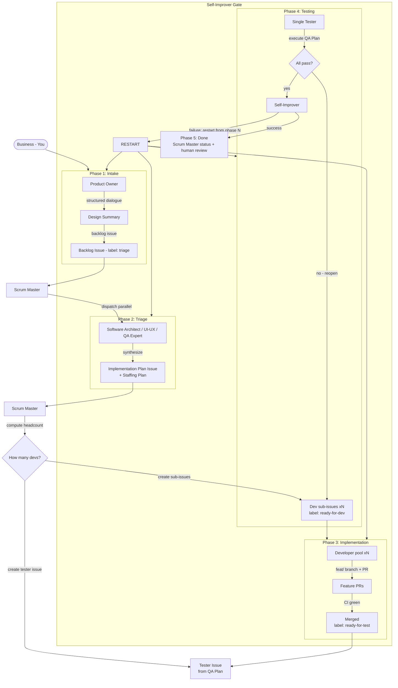

# Pipeline Phases

Six phases + a Self-Improver gate. Sequential handoffs between phases; parallel work within a phase wherever dependencies allow. Every handoff happens through GitHub issues and comments ([05-github.md](05-github.md)).

```
Business → Intake → Triage → Implementation → Testing → Audit → Done
   (You)      PO       SM          Dev pool        Tester     SI      SM
```

---

## Full Pipeline Flow



---

## Phase 1: Intake

**Owner:** Product Owner
**Input:** Business goals from the human
**Output:** Backlog issue (label: `triage`)
**Goals:** A backlog issue with confirmed requirements, Gherkin ACs, wireframe (UI only), priority, and label `triage` — agreed by the human before dispatch.

1. **Explore context** — understand scope, constraints, priority. Is this a trivial task (typo, label, single-file tweak) or a complex feature (new architecture, data flow, multiple surfaces)? Adjust dialogue depth accordingly.
2. **Structured dialogue** — one question at a time. Never ask about implementation details — flag them `[Technical: defer to triage]`.
3. **Design summary** — What, Wireframe (ASCII, UI only), Behavioral (Gherkin), Non-Behavioral, Risks/Unknowns.
4. **User confirmation** — the human approves the summary. No dispatch until this happens.
5. **Create backlog issue** — draft the body per the [backlog template](04-artifacts.md#backlog-issue), then request the state machine's `create-issue` action (labeled `triage`). The state machine is the single GitHub writer.
6. **Handoff to Scrum Master** — the Product Owner dispatches the Scrum Master with the backlog issue number.

**Simplicity heuristic:** trivial tasks get a one-line summary and a single dialogue round — but the summary + confirmation step is never skipped.

---

## Phase 2: Triage

**Owner:** Triage cluster (Software Architect + UI/UX Expert + QA Expert), orchestrated by the Scrum Master
**Input:** Backlog issue
**Output:** Implementation Plan issue (includes Staffing Plan)
**Goals:** An Implementation Plan issue with all required sections (Summary, Scope, Staffing Plan, Design assets, API contracts, QA Plan, Deployment notes, Risks) — every backlog requirement covered by a sub-issue.

### Scrum Master responsibilities
1. Read the backlog issue.
2. Dispatch the three planners **in parallel** with the same brief (backlog + any Product Owner notes).
3. Wait for all three, then synthesize the sections into the Implementation Plan.

### Planners
- **Software Architect** — research, domain model (file:line citations), EARS-style requirements, API contracts, data models, scope decomposition into independent sub-issues, **effort estimates** per sub-issue (these feed the Staffing Plan).
- **UI/UX Expert** — design assets (mockups, component specs, interaction flows, states, accessibility). Returns "N/A" for backend-only work.
- **QA Expert** — QA Plan (test cases per requirement, pass/fail criteria, test data, non-functional checks), edge cases, regression risks.

### The Implementation Plan must contain
| Section | Content |
|---------|---------|
| **Title** | Concise feature name + parent issue number |
| **Summary** | Goal + acceptance criteria |
| **Scope** | Components and sub-tasks (the decomposed sub-issues) |
| **Staffing Plan** | Number of developers required, suggested roles, estimated effort — and the heuristic used (see [06-staffing.md](06-staffing.md)) |
| **Design assets** | Links to mockups and component specs |
| **API contracts & data models** | Endpoints, payloads, schemas |
| **QA Plan** | Test cases, pass/fail criteria, required test data, non-functional checks |
| **Deployment notes** | Branch strategy, CI checks, infrastructure needs |
| **Risks & mitigations** | Blockers and fallback options |

The Scrum Master drafts the **Implementation Plan issue** and requests the state machine's `create-issue` action (label: `triage`). Dev sub-issues and the tester issue reference this parent issue.

---

## Phase 3: Implementation

**Owner:** Scrum Master (setup) + Developer pool (execution)
**Input:** Implementation Plan issue
**Output:** Merged feature PRs (label: `ready-for-test`)
**Goals:** All sub-issues created, assigned (≤2 active each), implemented, merged to base with passing CI and scope respected; feature labeled `ready-for-test`.

### 3a. Staffing (Scrum Master)

1. **Read the Staffing Plan** — extract total effort and the planner's suggested headcount.
2. **Apply the staffing heuristic** — convert effort to developer headcount (default: 1 full-stack dev ≈ 5 story points per sprint). See [06-staffing.md](06-staffing.md#staffing-heuristic).
3. **Check pool availability** — every developer has a max of 2 active sub-issues. Reduce headcount if the pool is saturated.
4. **Create dev sub-issues** — one per sub-task from the Implementation Plan. Each references the parent Implementation Plan issue, has clear acceptance criteria, estimated effort, and assigned developer + reviewers.
5. **Create the tester issue** — ONE consolidated tester issue per feature, drafted from the QA Plan and created via the state machine's `create-issue` action. Assigned to the single Tester. It does not get created per-PR — it consolidates all work for the feature.
6. **Transitions** — sub-issues → `ready-for-dev`; tester issue → `ready-for-test`.

### 3b. Development (Developer pool)

Each developer picks up its assigned sub-issue:

1. **Read the sub-issue** + parent Implementation Plan for full context. Read the API contracts and design assets.
2. **Create a worktree/branch** — `feat/<issue-number>-short-desc`.
3. **Implement** — strictly within sub-issue scope. Never touch files outside the sub-issue; never redesign architecture.
4. **Verify locally** — lint, typecheck, build, tests.
5. **Open the PR** — against the base branch, with the PR checklist completed (see [05-github.md](05-github.md#pr-checklist)).
6. **Report** — a `Status` comment on the sub-issue: what shipped, verification results, any scope notes.

### Dependency handling
- If a sub-issue blocks on another's work: request the state machine's `block` action (label `blocked` + `Status` comment) and notify the Scrum Master. Never stall silently.
- If a sub-issue is ambiguous: request the state machine's `comment` action with a `Question`. Never improvise scope.

### Retry path
When the Scrum Master requests changes:
1. Re-enter the worktree, fetch + rebase.
2. Fix exactly what was requested.
3. Push to the same branch — the PR updates.
4. Post `Status: PR #N updated`.

### Merge
The Scrum Master reviews PRs against their sub-issues, requests changes when needed, and merges approved PRs. When all sub-issues for the feature are merged, the Scrum Master sets the feature to `ready-for-test`, making the tester issue actionable.

---

## Phase 4: Testing

**Owner:** Tester (single)
**Input:** Consolidated tester issue (label: `ready-for-test`)
**Output:** Verdict on the tester issue (evidence posted), feature labeled `done` or sub-issues reopened
**Goals:** Tester verdict posted with per-case evidence; all failures reopened to the correct sub-issues with expected-vs-actual and repro steps.

1. **Read the tester issue** — QA Plan checklist, links to merged PRs/branches.
2. **Ensure the dev instance is running** (see the dev-environment workflow).
3. **Execute each test case** in order:
   - Attach evidence per case: screenshots, logs, DOM snapshots, test output.
   - Classify PASS / FAIL.
4. **Verdict:**
   - **All pass** → post the test report (`Evidence` comment), mark the tester issue `done`, notify the Scrum Master.
   - **Any fail** → reopen the offending dev sub-issue(s) with a precise failure description (expected vs actual, evidence, repro steps). Post the partial test report.

### Reopened sub-issues
Reopened sub-issues go back through Implementation (Phase 3) and, once merged, return to the Tester via the same consolidated tester issue — the tester issue stays open until the whole feature passes.

---

## Self-Improver Gate

**Owner:** Self-Improver (dispatched by Scrum Master)
**Input:** Tester verdict + the issue's full record
**Output:** `done`, or a restart instruction (phase + improvement applied)

1. **Audit** — read the Tester's verdict and the issue's recorded history (decisions, evidence, retries). Decide: was the issue completed successfully?
2. **Doc-sync** — the SI is the documentation owner. Classify the merged spec diff into doc categories (`ARCHITECTURE.md`, `CLI_GUIDE.md`, `SETUP.md`, `SECURITY.md`, `FAQ.md`), patch the affected product docs, and commit. Product docs are only coherent against the full merged diff, which the SI — running last — is uniquely positioned to see. If the product state doesn't match the docs, that is a failure.
3. **Success** → the issue is done. Return to the Scrum Master.
4. **Failure** → choose the phase to restart from (Intake, Triage, Implementation, or Testing), **after improving** the root cause of the failure. Improvement toolkit: agent prompts, skills, scripts, **references** (add/edit/delete in the playbook folder's `references.md`), **observability** (add metrics, logs, or traces for visibility), and **pipeline docs** (document the change in the same pass). Stale product docs are a valid failure reason → restart to Implementation with "sync docs" in scope.
5. **Return** — the restart instruction goes to the Scrum Master, who re-dispatches the pipeline from the chosen phase.

**Status: implemented.** The Self-Improver agent (`.opencode/agents/self-improver.md`) runs this gate; its steps are in `playbooks/self-improver.md`. Its verdict is recorded via the state machine's `audit-record` action.

---

## Phase 5: Done

**Owner:** Scrum Master
**Input:** Self-Improver verdict = success
**Output:** Closed feature, human review
**Goals:** Feature labeled `done`, branches cleaned, final `Status` summary posted, human review initiated.

1. Confirm all sub-issues and the tester issue are merged/passed.
2. Set feature status to `done`.
3. Post a final `Status` summary: what shipped, test results, remaining risks (if any).
4. Clean up merged branches.
5. **Human review** — the human validates the finished feature manually. If the human finds an issue, they report back and the Product Owner opens a follow-up backlog item (labeled `bug` or `triage`).

---

## Escalation

| Situation | Trigger | Action |
|-----------|---------|--------|
| Blocked sub-issue | label `blocked` | Scrum Master intervenes within the SLA (default 4h) |
| Dev pool saturated | all devs at 2 active sub-issues | Scrum Master queues work; staffs when capacity frees |
| Triage underspecification | sub-issue sent back by a developer | Scrum Master routes back to the relevant planner |
| Ambiguous QA Plan | tester can't execute a case | Scrum Master routes back to QA Expert |
| Repeated PR failures | same sub-issue rejected >3× | Scrum Master escalates to human with a summary of what was tried |

See [06-staffing.md](06-staffing.md) for the full staffing and escalation rules.
