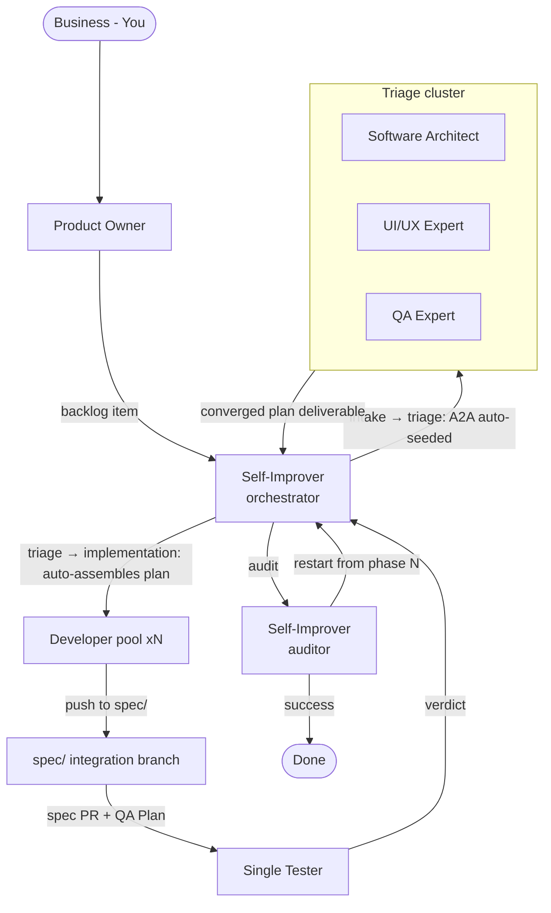

# Agentic Pipeline

A multi-agent workflow with a single orchestrator. The **Self-Improver** is the pipeline's orchestrator AND auditor: it dispatches the triage cluster, the developer pool, and the tester, assembles and generates work through the state machine, and then posts the end-of-spec audit verdict. A **triage cluster** plans and decides staffing; a pool of **full-stack developers** executes; a **single tester** runs the QA plan; the **Self-Improver** audits every issue and restarts the pipeline from any phase on failure. The mechanical orchestration steps are now state-machine transition side-effects. GitHub issues and comments are the communication backbone and the log.

---

## Master Diagram

---

## The Six Roles

| Role | Type | Question | Dispatches | Handles |
|------|------|----------|------------|---------|
| **Business (You)** | Human | What matters? | Product Owner | Goals, priorities, major tradeoffs |
| **Product Owner** | Primary agent | What are we building? | Self-Improver | Backlog, acceptance criteria, prioritization |
| **Self-Improver** | Subagent (×1) | Who does what, when, and did it complete? | Triage cluster, Developer pool, Tester | Orchestration, staffing, dependencies, status; audits completion; documentation owner (pipeline + product docs); improves prompts/skills/scripts/references/observability; restart decision |
| **Triage cluster** | Subagents (×3) | How should we build and prove it? | — | Implementation Plan, Staffing Plan, design, QA Plan |
| **Developer pool** | Subagents (×N) | Can I implement this plan item? | — | Implementation, verification, CI gates |
| **Tester** | Subagent (×1) | Does it work? | — | Executes QA Plan, evidence, verdict |

---

## Document Index

| File | Content |
|------|---------|
| [principles.md](principles.md) | The non-negotiable design rules: agents as persons, state-machine context, per-phase Goals, playbook-linked agents, GitHub backbone + log, Self-Improver audit gate |
| [pipeline.md](pipeline.md) | Phase walkthrough: Intake → Triage → Implementation → Testing → Audit → Done |
| [artifacts.md](artifacts.md) | Artifact catalog: every document/object produced, with templates |
| [github.md](github.md) | GitHub conventions: issue templates, labels, branch naming, PR checklist, comment prefixes, automation |
| [staffing.md](staffing.md) | Staffing heuristics, guardrails, SLAs, traceability |
| [state-machine.md](state-machine.md) | **Implemented:** the state-machine skill + script that gives agents phase context and is the single writer; also the metrics collector — per-issue JSONL event log, metric catalog, anti-metrics |
| [agent-definition-guide.md](agent-definition-guide.md) | Anatomy for writing agent `.md` files: identity, structure, length limits, DeepSeek-specific guidance, iteration/eval |
| [agent-skill-guide.md](agent-skill-guide.md) | Anatomy for writing `SKILL.md` files: description-as-router, progressive disclosure, length limits, degrees of freedom, iteration/eval |
| [templates/PO-issue-template.md](templates/PO-issue-template.md) | Backlog issue template for the Product Owner: title (Connextra), problem/why, scope, success metrics, 3–5 bullet acceptance criteria (Gherkin only where warranted), INVEST self-check, bug variant |

---

## Phase at a Glance

| Phase | Owner | Goals (definition of done) | Key actions | Artifact produced |
|-------|-------|----------------------------|-------------|-------------------|
| 1. Intake | Product Owner | Confirmed backlog issue with ACs + priority | Clarify → design summary → backlog item | Backlog issue |
| 2. Triage | Triage cluster (orchestrated by Self-Improver) | Complete Implementation Plan covering all requirements | Research → consult UX + QA in parallel → converge → marker → transition auto-assembles plan | Implementation Plan (incl. Staffing Plan) |
| 3. Implementation | Self-Improver (setup) + Developer pool | All plan checklist work pushed to `spec/<N>`, CI green | Staff → dispatch devs → worktree on spec branch → push → spec PR | Implementation Plan checklist, spec/<N> branch |
| 4. Testing | Tester | Verdict posted with evidence; failures re-dispatched | Execute QA Plan → attach evidence → verdict | Test report, verdict comments |
| **Gate** | Self-Improver | Verdict: success, or restart phase + applied improvement | Audit → decide → improve → restart | Audit verdict |
| 5. Done | Self-Improver | Feature `done`, worktrees cleaned, human review | Status updates, cleanup, human review | Closed work, final status |

---

## Core Conventions

- **Single source of truth:** GitHub issues and comments track every artifact, decision, status, and piece of evidence.
- **Comment prefixes:** one agent-facing prefix — `Status` (blockers/escalations only). Verdicts are the machine-posted `## Tests Runs`; decisions are the machine-posted audit `Decision`.
- **Issue model per feature:** one **Implementation Plan issue** (the single work-tracking artifact). Its `### Sub-issue Decomposition` `- [ ]` lines are the work checklist developers execute on the spec branch — there are **no sub-issues and no tester issue** (`generate-work` was removed).
- **Branch naming:** one **spec integration branch** `spec/<N>` per spec (never deleted — it carries the evidence trail). No per-developer branches: developers work in worktrees **detached at `spec/<N>`'s tip** and push with `git push origin HEAD:spec/<N>`. The only PR is the spec PR (`spec/<N>` → `main`).
- **The machine owns the mechanics:** the A2A file is auto-seeded on `intake → triage`; the `triage → implementation` transition auto-assembles the Implementation Plan, persists the QA-seeded test suites, and creates the spec branch. The Self-Improver runs the transitions and dispatches the agents; it never runs these mechanical steps by hand.
- **Self-Improver gate:** the Self-Improver (which orchestrated the whole pipeline) audits every issue after testing; on failure it improves an agent/skill/observability and restarts the pipeline from the chosen phase.

---

## Quick Comparison: What Changed vs the Deprecated Workflow

| Aspect | Deprecated (`workflow_deprecated/`) | Agentic Pipeline |
|--------|-------------------------------------|-------------------|
| Orchestration | Product Owner dispatches Architect; Architect runs Phases 2–4 | Self-Improver owns orchestration end-to-end (as orchestrator + auditor) |
| Planning | Software Architect alone (2 consultants) | Triage cluster of 3 parallel planners |
| Staffing | 1 Developer per capsule (Architect decides) | Pool of interchangeable full-stack devs, headcount from Staffing Plan |
| Review | Self-Improver (orchestrator) reviews + QA runs e2e | Merging by Self-Improver + single Tester |
| Verification | QA Lead (plan) + QA (execute) | QA Expert (plan + tests in triage) + Tester (execute) |
| Improvement | Self-Improver gate + 3-gate validation | Self-Improver audit gate (implemented) |
| Docs | Documentation Keeper agent | Self-Improver (documentation owner — pipeline + product docs, doc-sync at gate) |
