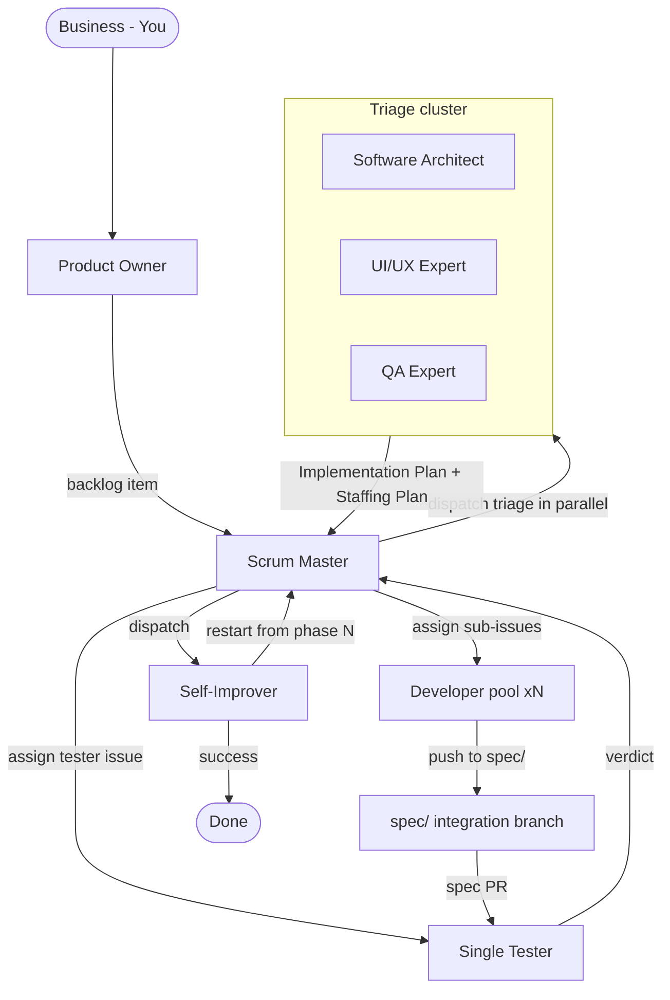

# Agentic Pipeline

A Scrum-inspired multi-agent workflow. The **Scrum Master** orchestrates; a **triage cluster** plans and decides staffing; a pool of **full-stack developers** executes; a **single tester** runs the QA plan; a **Self-Improver** audits every issue and restarts the pipeline from any phase on failure. GitHub issues and comments are the communication backbone and the log.

---

## Master Diagram

---

## The Six Roles

| Role | Type | Question | Dispatches | Handles |
|------|------|----------|------------|---------|
| **Business (You)** | Human | What matters? | Product Owner | Goals, priorities, major tradeoffs |
| **Product Owner** | Primary agent | What are we building? | Scrum Master | Backlog, acceptance criteria, prioritization |
| **Scrum Master** | Primary agent | Who does what, when? | Triage cluster, Developer pool, Tester, Self-Improver | Orchestration, staffing, dependencies, status |
| **Triage cluster** | Subagents (×3) | How should we build and prove it? | — | Implementation Plan, Staffing Plan, design, QA Plan |
| **Developer pool** | Subagents (×N) | Can I implement this sub-issue? | — | Implementation, verification, CI gates |
| **Tester** | Subagent (×1) | Does it work? | — | Executes QA Plan, evidence, verdict |
| **Self-Improver** | Subagent (×1) | Did it complete, and if not, what do we fix? | — | Audits completion; documentation owner (pipeline + product docs); improves prompts/skills/scripts/references/observability; restart decision |

---

## Document Index

| File | Content |
|------|---------|
| [principles.md](principles.md) | The non-negotiable design rules: agents as persons, state-machine context, per-phase Goals, playbook-linked agents, GitHub backbone + log, Self-Improver audit gate |
| [pipeline.md](pipeline.md) | Phase walkthrough: Intake → Triage → Implementation → Testing → Audit → Done |
| [artifacts.md](artifacts.md) | Artifact catalog: every document/object produced, with templates |
| [github.md](github.md) | GitHub conventions: issue templates, labels, branch naming, PR checklist, comment prefixes, automation |
| [staffing.md](staffing.md) | Staffing heuristics, guardrails, SLAs, traceability |
| [state-machine.md](state-machine.md) | **Implemented:** the state-machine skill + script that gives agents phase context and is the single writer; also the metrics collector — per-issue JSONL event log, metric catalog, anti-metrics |
| [agent-definition-guide.md](agent-definition-guide.md) | Anatomy for writing agent `.md` files: identity, structure, length limits, DeepSeek-specific guidance, iteration/eval |
| [agent-skill-guide.md](agent-skill-guide.md) | Anatomy for writing `SKILL.md` files: description-as-router, progressive disclosure, length limits, degrees of freedom, iteration/eval |
| [templates/PO-issue-template.md](templates/PO-issue-template.md) | Backlog issue template for the Product Owner: title (Connextra), problem/why, scope, success metrics, 3–5 bullet acceptance criteria (Gherkin only where warranted), INVEST self-check, bug variant |

---

## Phase at a Glance

| Phase | Owner | Goals (definition of done) | Key actions | Artifact produced |
|-------|-------|----------------------------|-------------|-------------------|
| 1. Intake | Product Owner | Confirmed backlog issue with ACs + priority | Clarify → design summary → backlog item | Backlog issue |
| 2. Triage | Triage cluster (dispatched by Scrum Master) | Complete Implementation Plan covering all requirements | Research → consult UX + QA in parallel → synthesize | Implementation Plan (incl. Staffing Plan) |
| 3. Implementation | Scrum Master (setup) + Developer pool | All sub-issues pushed to `spec/<N>`, CI green | Staff → assign devs → worktree on spec branch → push → spec PR | Dev sub-issues, spec/<N> branch, tester issue |
| 4. Testing | Tester | Verdict posted with evidence; failures reopened | Execute QA Plan → attach evidence → verdict | Test report, verdict comments |
| **Gate** | Self-Improver | Verdict: success, or restart phase + applied improvement | Audit → decide → improve → return restart instruction | Audit verdict |
| 5. Done | Scrum Master | Feature `done`, worktrees cleaned, human review | Status updates, cleanup, human review | Closed work, final status |

---

## Core Conventions

- **Single source of truth:** GitHub issues and comments track every artifact, decision, status, and piece of evidence.
- **Comment prefixes:** `Decision`, `Question`, `Status`, `Evidence` reduce noise and make issue timelines scannable.
- **Issue model per feature:** one **Implementation Plan issue** + one or more **Dev sub-issues** + one consolidated **Tester issue**.
- **Branch naming:** one **spec integration branch** `spec/<N>` per spec (never deleted — it carries the evidence trail). No per-developer or per-sub-issue branches: developers work in worktrees **detached at `spec/<N>`'s tip** and push with `git push origin HEAD:spec/<N>`. The only PR is the spec PR (`spec/<N>` → `main`).
- **Self-Improver gate:** the Self-Improver audits every issue after testing; on failure it improves an agent/skill/observability and returns a restart instruction to the Scrum Master.

---

## Quick Comparison: What Changed vs the Deprecated Workflow

| Aspect | Deprecated (`workflow_deprecated/`) | Agentic Pipeline |
|--------|-------------------------------------|-------------------|
| Orchestration | Product Owner dispatches Architect; Architect runs Phases 2–4 | Scrum Master owns orchestration end-to-end |
| Planning | Software Architect alone (2 consultants) | Triage cluster of 3 parallel planners |
| Staffing | 1 Developer per capsule (Architect decides) | Pool of interchangeable full-stack devs, headcount from Staffing Plan |
| Review | Engineering Lead reviews + QA runs e2e | Merging by Scrum Master + single Tester |
| Verification | QA Lead (plan) + QA (execute) | QA Expert (plan in triage) + Tester (execute) |
| Improvement | Self-Improver gate + 3-gate validation | Self-Improver audit gate (implemented) |
| Docs | Documentation Keeper agent | Self-Improver (documentation owner — pipeline + product docs, doc-sync at gate) |
