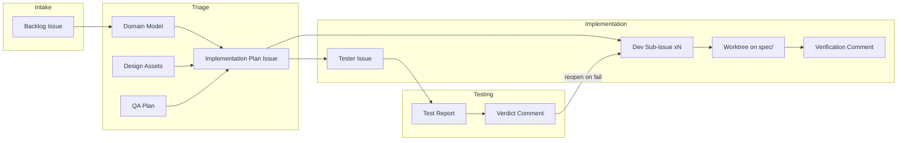

# Artifact Catalog

Every document and object produced in the pipeline — who creates it, who consumes it, and its template. All artifacts live on GitHub (issues, comments, branches) per the backbone rule.

---

## Artifact Flow



---

## Production / Consumption Table

| Artifact | Producer | Consumer | Format | Location |
|----------|----------|----------|--------|----------|
| Backlog Issue | Product Owner | Scrum Master, Triage cluster | GitHub issue | Backlog #N |
| Domain Model | Software Architect (triage) | UI/UX Expert, QA Expert, Scrum Master | Markdown bullets (file:line) | Implementation Plan |
| Design Assets | UI/UX Expert (triage) | Developer, Tester | Mockups / component specs / images | Implementation Plan (links) |
| QA Plan | QA Expert (triage) | Scrum Master, Tester | Structured markdown | Implementation Plan |
| Implementation Plan Issue | Scrum Master (synthesizing triage) | Developer pool, Tester | GitHub issue (parent) | Impl Plan #N |
| Staffing Plan | Triage cluster | Scrum Master | Section of Implementation Plan | Impl Plan #N |
| Dev Sub-issue | Scrum Master | Developer pool | GitHub issue (child) | Sub-issue #N |
| Tester Issue | Scrum Master | Tester | GitHub issue (child) | Tester issue #N |
| Feature PR | State machine (auto: created on `→testing`, merged on `testing→audit`) | Tester | GitHub PR | `spec/<N>` branch → `main` |
| Verification Comment | Developer | Scrum Master | Markdown comment (`Status`) | Sub-issue #N |
| Test Report | Tester | Scrum Master, Product Owner | Markdown + evidence | Tester issue #N |
| Verdict Comment | Tester | Scrum Master, Developer pool | Markdown comment (`Evidence` / `Status`) | Tester issue #N |

---

## Templates

### Backlog Issue

> **Canonical template:** [templates/PO-issue-template.md](templates/PO-issue-template.md) — the full form lives there. Summary below.

```markdown
## Title
As a <specific role>, I can <outcome>, so that <value>

## Problem / Why now
<who is affected, the problem, why now — NO solutions>

## Intended users
<personas or roles; "Unknown — to be refined" is acceptable>

## Proposed behavior / Scope
<what we will build, in user terms; constraint of the slice>

## Success metrics
<business outcomes that prove it was worth building>

## Acceptance Criteria  (3-5 observable bullets; Gherkin only for complex cases)
- [ ] <observable, independently verifiable behavior>
- [ ] <...>
- [ ] <edge / negative case>

## Out of scope / constraints
<non-goals, dependencies, NFRs>

## Priority & value
<Priority: P0-P3 | RICE gut-check | Must/Should/Could/Won't | strategic goal>

## INVEST self-check + Ready statement
<Independent/Negotiable/Valuable/Estimable/Small/Testable all pass>

## Done statement
<reference the shared Definition of Done>

## Item type
<user story | business story | technical story/task | spike | bug | NFR>
```

### Implementation Plan Issue

```markdown
## Summary
<goal + acceptance criteria>

## Scope
<components and sub-tasks>
- [ ] Sub-task 1: <short description>
- [ ] Sub-task 2: <short description>

## Staffing Plan
- Number of developers required: <N>
- Suggested roles: <full-stack / frontend-lean / backend-lean>
- Estimated effort: <total story points>
- Heuristic used: <which staffing heuristic, see staffing.md>

## Design Assets
- Mockups: <links>
- Component specs: <links>

## API Contracts & Data Models
- Endpoints / payloads / schemas: <as code blocks>

## QA Plan
- Test cases per requirement: <table: REQ → test case → expected → edge cases>
- Pass/fail criteria: <observable, per case>
- Required test data: <fixtures, mock events>
- Non-functional checks: <perf, accessibility, theme, states>

## Deployment Notes
- Branch strategy: <base branch, spec/<N> integration branch, worktree-on-spec convention>
- CI checks: <which gates must pass>
- Infrastructure needs: <ports, services, env vars>

## Risks & Mitigations
- <risk> → <mitigation>
```

### Dev Sub-issue

```markdown
Parent: Implementation Plan #N

## Acceptance Criteria
- <clear, testable, observable criteria>
- ...

## Scope
- <files / modules this sub-issue owns>
- <explicitly out of scope>

## Estimated Effort
<story points>

## Work Conventions
Work happens in a worktree on the spec integration branch `spec/<N>` (via the state machine's `create-worktree` action); changes are pushed directly to `spec/<N>`. The spec PR (`spec/<N>` → `main`) is auto-created by the state machine when the feature transitions to testing.

## Definition of Done
- [ ] Changes verified and pushed to `spec/<N>` (worktree removed)
- [ ] Verification comment posted
- [ ] Every acceptance criterion met or explicitly reported as blocked

## Dependencies
<none, or links to sub-issues this blocks / blocks on>
```

### Tester Issue

```markdown
Parent: Implementation Plan #N
Spec branch to test: spec/<N>

## QA Plan Checklist
| Test case | Expected | Pass/Fail | Evidence |
|-----------|----------|-----------|----------|
| <from QA Plan> | <observable outcome> | | |
| ... | | | |

## Non-Functional Checks
- [ ] <accessibility / theme / performance / states>

## Required Test Data
<fixtures, mock event injection commands>

## Verdict
<filled in by Tester: PASS or FAIL with summary>
```

### Test Report

```markdown
## Test Report — Tester Issue #N

| Test case | Expected | Result | Evidence |
|-----------|----------|--------|----------|
| TC-1 | <...> | PASS |  |
| TC-2 | <...> | FAIL | <log excerpt> |

## Summary
- Total: X / Passed: Y / Failed: Z
- Failed: TC-2 — reopened Dev sub-issue #M with expected-vs-actual and repro steps.
- Verdict: PASS / FAIL
```

### Verification Comment (Developer)

```markdown
## Status — Sub-issue #N
- Files changed: <summary>
- Build: PASSED / FAILED
- Tests: <P passed, F failed>
- Acceptance criteria: <X/Y met>
- Notes: <implementation decisions within scope>
```
