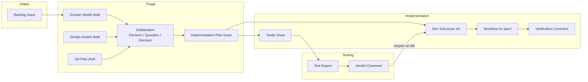

# Artifact Catalog

Every document and object produced in the pipeline — who creates it, who consumes it, and its template. All artifacts live on GitHub (issues, comments, branches) per the backbone rule.

---

## Artifact Flow



---

## Production / Consumption Table

| Artifact | Producer | Consumer | Format | Location |
|----------|----------|----------|--------|----------|
| Backlog Issue | Product Owner | Scrum Master, Triage cluster | GitHub issue | Backlog #N |
| Domain Model | Software Architect (triage) | UI/UX Expert, QA Expert, Scrum Master | Markdown bullets (file:line) | Implementation Plan |
| Design Assets | UI/UX Expert (triage) | Developer, Tester | Mockups / component specs / images | Implementation Plan (links) |
| QA Plan | QA Expert (triage) | Scrum Master, Tester | Structured markdown | Implementation Plan |
| Triage section draft | Software Architect / UI/UX Expert / QA Expert | Triage cluster, Scrum Master | `Decision` comment (`Draft — <Section>: ...`) | Feature issue #N |
| Convergence marker | Scrum Master | State machine (triage exit guard) | `Decision` comment ("Triage converged — all planner questions resolved.") | Feature issue #N |
| Implementation Plan Issue | State machine (seeds from template) + Scrum Master (writes sections via `update-plan`) | Developer pool, Tester | GitHub issue (parent), seeded from the triage template | Impl Plan #N |
| Staffing Plan | Triage cluster | Scrum Master | Section of Implementation Plan | Impl Plan #N |
| Dev Sub-issue | Scrum Master | Developer pool | GitHub issue (child) | Sub-issue #N |
| Tester Issue | Scrum Master | Tester | GitHub issue (child) | Tester issue #N |
| Feature PR | State machine (auto: created on `→testing`, merged on `testing→audit`) | Tester | GitHub PR | `spec/<N>` branch → `main` |
| Verification Comment | Developer | Scrum Master | Markdown comment (`Status`) | Sub-issue #N |
| Test Report | Tester | Scrum Master, Product Owner | Markdown + evidence | Tester issue #N |
| Verdict Comment | Tester | Scrum Master, Developer pool | Markdown comment (`Evidence` / `Status`) | Tester issue #N |

---

## Templates

### Backlog Issue

> **Canonical template:** [templates/PO-issue-template.md](templates/PO-issue-template.md) — the full form lives there. Summary below.

```markdown
## Title
As a <specific role>, I can <outcome>, so that <value>

## Problem / Why now
<who is affected, the problem, why now — NO solutions>

## Intended users
<personas or roles; "Unknown — to be refined" is acceptable>

## Proposed behavior / Scope
<what we will build, in user terms; constraint of the slice>

## Success metrics
<business outcomes that prove it was worth building>

## Acceptance Criteria  (3-5 observable bullets; Gherkin only for complex cases)
- [ ] <observable, independently verifiable behavior>
- [ ] <...>
- [ ] <edge / negative case>

## Out of scope / constraints
<non-goals, dependencies, NFRs>

## Priority & value
<Priority: P0-P3 | RICE gut-check | Must/Should/Could/Won't | strategic goal>

## INVEST self-check + Ready statement
<Independent/Negotiable/Valuable/Estimable/Small/Testable all pass>

## Done statement
<reference the shared Definition of Done>

## Item type
<user story | business story | technical story/task | spike | bug | NFR>
```

### Implementation Plan Issue

> **Canonical template:** [templates/triage-plan-template.md](templates/triage-plan-template.md) — the deliverable scaffold. When the Scrum Master requests `create-issue --issue-type impl-plan` with **no** `--body-file`, the state machine seeds the issue body from this template, filling the `<issue>`, `<title>`, and `<backlog>` placeholders. Each agent's agreed section is then written into the seeded body via the `update-plan` action (idempotent per-section replacement). Summary below.

The plan is one issue per feature, structured per-agent. Each `##` section is produced during Triage deliberation and written by the Scrum Master:

| Section (`##`) | Content | Produced by |
|----------------|---------|-------------|
| Software Architect | Domain Model (file:line), Requirements (EARS), API Contracts & Data Models, Sub-issue Decomposition + Effort Estimates | Software Architect |
| UI/UX Expert | Design Assets (or "N/A") | UI/UX Expert |
| QA Expert | QA Plan (test-case table) | QA Expert |
| Summary | Goal + acceptance criteria | Scrum Master |
| Staffing Plan | Developer count, roles, effort, heuristic used | Scrum Master |
| Deployment Notes | Branch strategy, CI checks, infrastructure | Scrum Master |
| Risks & Mitigations | Blockers + fallbacks | Scrum Master |

```markdown
# Implementation Plan #<issue> — <title>

> Backlog: #<backlog> — filled from the agreed triage drafts.

## Software Architect
### Domain Model (file:line)
### Requirements (EARS)
### API Contracts & Data Models
### Sub-issue Decomposition + Effort Estimates
- [ ] Sub-task 1: <desc>

## UI/UX Expert
### Design Assets (or "N/A")

## QA Expert
### QA Plan
| REQ | Test case | Expected | Edge cases |
|-----|-----------|----------|------------|

## Summary
## Staffing Plan
## Deployment Notes
## Risks & Mitigations
```

### Dev Sub-issue

```markdown
Parent: Implementation Plan #N

## Acceptance Criteria
- <clear, testable, observable criteria>
- ...

## Scope
- <files / modules this sub-issue owns>
- <explicitly out of scope>

## Estimated Effort
<story points>

## Work Conventions
Work happens in a worktree on the spec integration branch `spec/<N>` (via the state machine's `create-worktree` action); changes are pushed directly to `spec/<N>`. The spec PR (`spec/<N>` → `main`) is auto-created by the state machine when the feature transitions to testing.

## Definition of Done
- [ ] Changes verified and pushed to `spec/<N>` (worktree removed)
- [ ] Verification comment posted
- [ ] Every acceptance criterion met or explicitly reported as blocked

## Dependencies
<none, or links to sub-issues this blocks / blocks on>
```

### Tester Issue

```markdown
Parent: Implementation Plan #N
Spec branch to test: spec/<N>

## QA Plan Checklist
| Test case | Expected | Pass/Fail | Evidence |
|-----------|----------|-----------|----------|
| <from QA Plan> | <observable outcome> | | |
| ... | | | |

## Non-Functional Checks
- [ ] <accessibility / theme / performance / states>

## Required Test Data
<fixtures, mock event injection commands>

## Verdict
<filled in by Tester: PASS or FAIL with summary>
```

### Test Report

```markdown
## Test Report — Tester Issue #N

| Test case | Expected | Result | Evidence |
|-----------|----------|--------|----------|
| TC-1 | <...> | PASS |  |
| TC-2 | <...> | FAIL | <log excerpt> |

## Summary
- Total: X / Passed: Y / Failed: Z
- Failed: TC-2 — reopened Dev sub-issue #M with expected-vs-actual and repro steps.
- Verdict: PASS / FAIL
```

### Verification Comment (Developer)

```markdown
## Status — Sub-issue #N
- Files changed: <summary>
- Build: PASSED / FAILED
- Tests: <P passed, F failed>
- Acceptance criteria: <X/Y met>
- Notes: <implementation decisions within scope>
```
