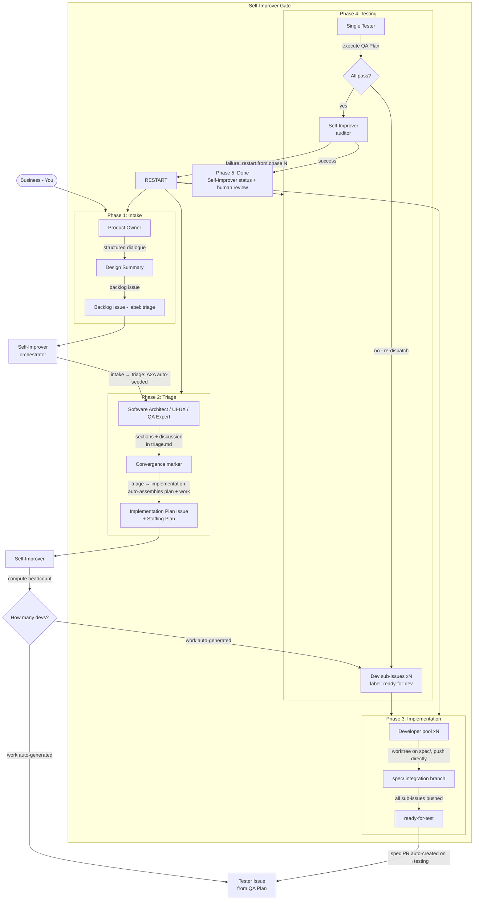

# Pipeline Phases

Six phases + a Self-Improver gate. Sequential handoffs between phases; parallel work within a phase wherever dependencies allow. Every handoff happens through GitHub issues and comments ([github.md](github.md)) — the exceptions are the ephemeral working files `.opencode/tmp/<issue>/triage.md` (where the triage deliberation itself takes place) and the Self-Improver's observations log `.opencode/tmp/<issue>/observations.md` (improvement candidates captured while orchestrating).

```
Business → Intake → Triage → Implementation → Testing → Audit → Done
   (You)      PO       SI          Dev pool        Tester     SI      SI
```

The **Self-Improver (SI)** is the pipeline's orchestrator AND auditor: it dispatches the triage cluster, the developer pool, and the tester, and then posts the end-of-spec audit verdict. Its former mechanical orchestration steps (A2A seed, plan assembly, work-item generation, test-suite persistence) are now **state-machine transition side-effects** — the SI runs the transitions and the machine does the mechanics.

---

## Full Pipeline Flow



---

## Phase 1: Intake

**Owner:** Product Owner
**Input:** Business goals from the human
**Output:** Backlog issue (label: `triage`)
**Goals:** A backlog issue with the required intake sections (## Title, ## Problem / Why now, ## Intended users, ## Proposed behavior / Scope, ## Success metrics, ## Acceptance criteria, ## Out of scope, ## Priority), Gherkin ACs, priority, and label `triage` — agreed by the human before dispatch. The `intake → triage` exit gate **enforces the required sections** (a backlog missing them is blocked).

1. **Explore context** — understand scope, constraints, priority. Is this a trivial task (typo, label, single-file tweak) or a complex feature (new architecture, data flow, multiple surfaces)? Adjust dialogue depth accordingly.
2. **Structured dialogue** — one question at a time. Never ask about implementation details — flag them `[Technical: defer to triage]`.
3. **Design summary** — What, Wireframe (ASCII, UI only), Behavioral (Gherkin), Non-Behavioral, Risks/Unknowns.
4. **User confirmation** — the human approves the summary. No dispatch until this happens.
5. **Create backlog issue** — draft the body per the [backlog template](artifacts.md#backlog-issue), then request the state machine's `create-issue` action (labeled `triage`). The state machine is the single GitHub writer.
6. **Handoff to Self-Improver** — the Product Owner dispatches the Self-Improver (orchestrator) with the backlog issue number.

**Simplicity heuristic:** trivial tasks get a one-line summary and a single dialogue round — but the summary + confirmation step is never skipped.

---

## Phase 2: Triage

**Owner:** Triage cluster (Software Architect + UI/UX Expert + QA Expert), orchestrated by the Self-Improver
**Input:** Backlog issue
**Output:** Implementation Plan issue (includes Staffing Plan)
**Goals:** A converged triage deliberation on the feature issue, then an Implementation Plan issue seeded from [templates/triage-plan-template.md](templates/triage-plan-template.md) with all required sections (Summary, Software Architect, UI/UX Expert, QA Expert, Staffing Plan, Deployment Notes, Risks) — every backlog requirement covered by a sub-issue.

### Self-Improver responsibilities (orchestrator)
1. Read the backlog issue.
2. **Run `transition intake → triage`** — request the state machine's `transition` action (applies the `triage-plan` label) *before* dispatching the triage cluster, so the triage subagents (software-architect / ui-ux-expert / qa-expert) read the triage phase in their context block. **Auto side-effect:** the machine seeds the A2A working file `.opencode/tmp/<issue>/triage.md` (idempotent). You do NOT run `triage-init` — the transition owns it.
3. **Dispatch the three planners in parallel** with the same brief (backlog + any Product Owner notes) and the A2A file path. Each planner works in the shared file.
4. **Coordinate the deliberation** — see [the triage deliberation protocol](#the-triage-deliberation-protocol). Track open `## Discussion` items in the A2A file and route each to its owning section.
5. **Write the orchestrator sections + convergence** — when no `## Discussion` item remains open, write the orchestrator-owned plan sections (`## Summary`, `## Staffing Plan`, `## Deployment Notes`, `## Risks & Mitigations`) into the A2A file and append `## Convergence: agreed`.
6. **Post the convergence marker** — request a `Decision` comment on the feature issue with body `Triage converged — all planner questions resolved.` This marker is the **only** triage exit guard: the state machine refuses the `triage → implementation` transition while it is absent. The Implementation Plan does not need to pre-exist — the transition creates it.
7. **Handoff** — request the `transition` action `triage → implementation`. **Auto side-effects:** the machine (a) **assembles the Implementation Plan** — creates the seeded impl-plan issue from `templates/triage-plan-template.md` and fills every section (`software-architect`, `ui-ux`, `qa`, `summary`, `staffing`, `deployment`, `risks`) from the converged A2A file; (b) **generates the work items** — one dev sub-issue per `- [ ]` item under the plan's `### Sub-issue Decomposition` (label `ready-for-dev`) plus the consolidated tester issue from the `### QA Plan` table (label `testing`); (c) **persists the QA-seeded test suites** to `main` via `tests-commit` (feature names parsed from the QA Expert's `**Feature tests:**` line in the A2A file); (d) creates the spec branch `spec/<N>`. You do NOT run `generate-work` or `tests-commit` manually — the transition owns them.

### The triage deliberation protocol (file-based A2A)
The three planners deliberate in a shared A2A working file, `.opencode/tmp/<issue>/triage.md` (ephemeral and gitignored) — not in GitHub comment threads. GitHub keeps only the convergence marker and the final Implementation Plan (auto-assembled).
1. **A2A auto-seeded.** The `intake → triage` transition creates the A2A working file `.opencode/tmp/<issue>/triage.md`, seeded from the triage template's per-agent `## <Agent>` sections plus a `## Discussion` section (idempotent).
2. **Parallel drafts.** The Self-Improver dispatches the three planners in parallel with the same brief. Each planner reads the file, writes its section draft under its own `## <Agent>` heading, and appends agent-tagged points to `## Discussion` (e.g. `**QA:** REQ-3 has no observable target — can you scope it?`).
3. **Cross-review.** Each planner reads the other two planners' drafts in the file (the Architect's Domain Model anchors UI/UX and QA) and replies to their `## Discussion` points — it never edits another planner's section heading.
4. **Convergence.** When no unresolved `## Discussion` items remain, the Self-Improver reviews the file, writes the orchestrator-owned sections (`## Summary`, `## Staffing Plan`, `## Deployment Notes`, `## Risks & Mitigations`), and appends `## Convergence: agreed`. Then it posts the convergence marker `Decision` comment: `Triage converged — all planner questions resolved.` The state machine's triage exit guard requires this marker (**agreement gate**) before `triage → implementation`.
5. **Plan assembly (automatic).** The `triage → implementation` transition reads each agreed section from the A2A file and assembles the Implementation Plan issue (auto-assembled, no manual `update-plan` on the happy path). The detailed back-and-forth stays in the ephemeral file; the plan captures the agreed decisions.

### Planners
- **Software Architect** — research, domain model (file:line citations), EARS-style requirements for observable behavior (constraints/NFRs in prose), API contracts, data models, scope decomposition into independent sub-issues, **effort estimates** per sub-issue (these feed the Staffing Plan).
- **UI/UX Expert** — design assets (mockups, component specs, interaction flows, states, accessibility). Returns "N/A" for backend-only work. Bases the draft on the Software Architect's Domain Model section (read from the A2A file).
- **QA Expert** — QA Plan (test cases per requirement, pass/fail criteria, test data, non-functional checks), edge cases, regression risks; the **sole test author**: seeds/extends the feature test suites under `.opencode/tests/<feature>/` (functional / smoke / regression / exploratory — conventions in `.opencode/tests/README.md`) AND declares the seeded folder names as a `**Feature tests:** <name1, name2>` line in its `## QA Expert` A2A section so the transition can auto-persist them via `tests-commit`. Bases the draft on the Software Architect's Domain Model section (read from the A2A file).

### The Implementation Plan must contain
| Section | Content |
|---------|---------|
| **Title** | Concise feature name + parent issue number |
| **Summary** | Goal + acceptance criteria |
| **Software Architect** | Domain model (file:line), EARS requirements (behavioral) + prose constraints, API contracts & data models, sub-issue decomposition + effort estimates |
| **UI/UX Expert** | Design assets (or "N/A") |
| **QA Expert** | QA Plan (test cases, pass/fail criteria, required test data, non-functional checks) |
| **Staffing Plan** | Number of developers required, suggested roles, estimated effort — and the heuristic used (see [staffing.md](staffing.md)) |
| **Deployment notes** | Branch strategy, CI checks, infrastructure needs |
| **Risks & mitigations** | Blockers and fallback options |

The `triage → implementation` transition **assembles the Implementation Plan issue**: it creates the seeded impl-plan issue from [templates/triage-plan-template.md](templates/triage-plan-template.md) and fills every section from the converged A2A file (no manual `update-plan` on the happy path). The same transition generates the dev sub-issues and the tester issue from this parent issue, persists the QA-seeded test suites, and creates the spec branch.

---

## Phase 3: Implementation

**Owner:** Self-Improver (setup/review) + Developer pool (execution)
**Input:** Implementation Plan issue
**Output:** All sub-issues closed as `done` by the Self-Improver (after reviewing each push on `spec/<N>`); the feature is labeled `ready-for-test`
**Goals:** All sub-issues created, implemented, pushed to `spec/<N>`, reviewed, and **closed as `done`** (scope respected, verification comment matches). The `implementation → testing` exit gate is **zero open sub-issues** — the machine blocks the transition while any sub-issue remains open.

### 3a. Staffing (Self-Improver)

1. **Read the Staffing Plan** — extract total effort and the planner's suggested headcount.
2. **Apply the staffing heuristic** — convert effort to developer headcount (default: 1 full-stack dev ≈ 5 story points per delivery window). See [staffing.md](staffing.md#staffing-heuristic).
3. **Check pool availability** — every developer has a max of 2 active sub-issues. Reduce headcount if the pool is saturated.
4. **Work items (auto-generated)** — the `triage → implementation` transition already created the work items: one sub-issue per `- [ ]` item in the plan's Software Architect `### Sub-issue Decomposition` section (label `ready-for-dev`, parent = plan) and the consolidated tester issue from the QA Expert's `### QA Plan` section (label `testing`). One tester issue per feature — it does not get created per-PR; it consolidates all work for the feature. No manual `generate-work` step on the happy path.
5. **Spec integration branch** — auto-created by the state machine as a side-effect of the `triage → implementation` transition (`spec/<spec-issue>` from `main`). This is the working base for every developer's worktree, testing, and the evidence trail (see [github.md](github.md#branch-naming)).
6. **Transitions** — sub-issues → `ready-for-dev`; the tester issue is created with `testing` so it reads as the testing phase.

### 3b. Development (Developer pool)

Each developer picks up its assigned sub-issue:

1. **Read the sub-issue** + parent Implementation Plan for full context. Read the API contracts and design assets.
2. **Create a worktree detached at the tip of `spec/<N>`** — request the state machine's `create-worktree` action (`--worktree-path <path>`; base auto-resolved from the sub-issue's `Parent: Implementation Plan #N`). Detached worktrees let many developers run in parallel.
3. **Implement** — strictly within sub-issue scope. Never touch files outside the sub-issue; never redesign architecture.
4. **Verify locally** — lint, typecheck, build, tests.
5. **Push with `git push origin HEAD:spec/<N>`** — the developer's one allowed direct write (never `main`/`master`). Pull/merge `spec/<N>` first if the push is rejected.
6. **Remove the worktree** (`remove-worktree`) and **Report** — a `Status` comment on the sub-issue: what shipped, verification results, any scope notes.

### Dependency handling
- If a sub-issue blocks on another's work: request the state machine's `block` action (label `blocked` + `Status` comment) and notify the Self-Improver. Never stall silently.
- If a sub-issue is ambiguous: request the state machine's `comment` action with a `Question`. Never improvise scope.

### Retry path
When the Self-Improver requests changes:
1. Re-enter the worktree, fetch + rebase.
2. Fix exactly what was requested.
3. Push to the same branch — the PR updates.
4. Post `Status: PR #N updated`.

### Merge
The Self-Improver reviews each developer's pushes on the spec integration branch against their sub-issues, requests changes when needed, and returns failed work to the same developer. When all sub-issues are pushed to `spec/<N>`, the Self-Improver transitions the feature to `testing` — which **auto-creates the spec PR** (`spec/<N>` → `main`) and applies the `testing` label — making the tester issue actionable. Once testing passes, the Self-Improver transitions to `audit`, which **auto-merges the spec PR**; the `spec/<N>` branch is kept so evidence URLs keep rendering.

---

## Phase 4: Testing

**Owner:** Tester (single)
**Input:** Consolidated tester issue (label: `testing`)
**Output:** Verdict on the tester issue (evidence posted); the Self-Improver transitions the feature to `audit` (auto-merging the spec PR), its `audit-record --verdict success` auto-transitions `audit → done` and closes as done, or the Self-Improver returns the feature to implementation for the failing sub-issues
**Goals:** Tester verdict posted with per-case evidence; all failures re-dispatched to the correct sub-issues with expected-vs-actual and repro steps.

1. **Read the tester issue** — QA Plan checklist, the spec integration branch to test (`spec/<N>`), and required test data. Identify the feature domain(s) and read the matching durable suites under `.opencode/tests/<feature>/` (persisted to `main` via `tests-commit`; conventions in `.opencode/tests/README.md`).
2. **Ensure the dev instance is running on the spec integration branch** (see the dev-environment workflow).
3. **Execute each test case** in order — functional + smoke, then regression + exploratory (unscripted probes; a confirmed finding promotes to `functional.md`):
   - Attach evidence per case: screenshots, logs, DOM snapshots, test output. Screenshots are committed to `.opencode/evidence/<tester-issue>/` on `spec/<N>` and embedded in `Evidence` comments via `upload-evidence`, so they render inline for repo members.
   - Classify PASS / FAIL.
   - Persist suite updates to `main` via the `tests-commit` action.
4. **Verdict:**
   - **All pass** → post the test report (`Evidence` comment), notify the Self-Improver — who transitions the feature to `audit` (auto-merging the spec PR). The Self-Improver's `audit-record --verdict success` then auto-transitions `audit → done` and closes the issue as done.
   - **Any fail** → post the partial test report (`Evidence` comment) with a precise failure description per failing case (expected vs actual, evidence, repro steps) and notify the Self-Improver — who returns the feature to implementation and re-dispatches the failing dev sub-issue(s). There is no reopen action.

### Re-dispatched sub-issues
Failing sub-issues go back through Implementation (Phase 3) and, once merged, return to the Tester via the same consolidated tester issue — the tester issue stays open until the whole feature passes.

---

## Self-Improver Gate

**Owner:** Self-Improver — the same agent that orchestrated the pipeline now audits it
**Input:** Tester verdict + the issue's full record
**Output:** `done`, or a restart instruction (phase + improvement applied)

1. **Audit** — read the Tester's verdict and the issue's recorded history (decisions, evidence, retries). Decide: was the issue completed successfully?
2. **Doc-sync** — the SI is the documentation owner. Classify the merged spec diff into doc categories (`ARCHITECTURE.md`, `CLI_GUIDE.md`, `SETUP.md`, `SECURITY.md`, `FAQ.md`), patch the affected product docs, and commit. Product docs are only coherent against the full merged diff, which the SI — running last — is uniquely positioned to see. If the product state doesn't match the docs, that is a failure.
3. **Success** → `audit-record --verdict success` — the state machine **auto-transitions `audit → done` and closes the issue as done**, then the SI posts the final `Status` summary and initiates human review.
4. **Failure** → choose the phase to restart from (Intake, Triage, Implementation, or Testing), **after improving** the root cause of the failure. `audit-record --verdict restart --phase <p>` **auto-transitions `audit → <p>`**. Improvement toolkit: agent prompts, skills, scripts, **references** (add/edit/delete in the playbook folder's `references.md`), **observability** (add metrics, logs, or traces for visibility), and **pipeline docs** (document the change in the same pass). Stale product docs are a valid failure reason → restart to Implementation with "sync docs" in scope.
5. **Return** — the restart instruction re-dispatching the pipeline from the chosen phase is executed by the Self-Improver itself (the orchestrator owns the whole flow, including restarts).

**Status: implemented.** The Self-Improver agent (`.opencode/agents/self-improver.md`) runs the full pipeline (orchestration) and this gate (audit); its steps are in `playbooks/self-improver.md`. The verdict is recorded via the state machine's `audit-record` action, which also drives the next phase automatically.

---

## Phase 5: Done

**Owner:** Self-Improver
**Input:** Self-Improver verdict = success
**Output:** Closed feature, human review
**Goals:** Feature labeled `done`, branches cleaned, final `Status` summary posted, human review initiated.

1. Confirm all sub-issues and the tester issue are merged/passed.
2. Feature is already labeled `done` and closed as done — `audit-record --verdict success` did both automatically.
3. Post a final `Status` summary: what shipped, test results, remaining risks (if any).
4. Clean up — the spec integration branch `spec/<N>` is **kept** (it carries the evidence trail, and `prune` never touches `spec/*`); remove any leftover local worktrees via `prune`.
5. **Human review** — the human validates the finished feature manually. If the human finds an issue, they report back and the Product Owner opens a follow-up backlog item (labeled `triage`, with the bug variant of the PO template).

---

## Escalation

| Situation | Trigger | Action |
|-----------|---------|--------|
| Blocked sub-issue | label `blocked` | Self-Improver intervenes within the SLA (default 4h) |
| Dev pool saturated | all devs at 2 active sub-issues | Self-Improver queues work; staffs when capacity frees |
| Triage underspecification | sub-issue sent back by a developer | Self-Improver routes back to the relevant planner |
| Ambiguous QA Plan | tester can't execute a case | Self-Improver routes back to QA Expert |
| Repeated PR failures | same sub-issue rejected >3× | Self-Improver escalates to human with a summary of what was tried |

See [staffing.md](staffing.md) for the full staffing and escalation rules.
