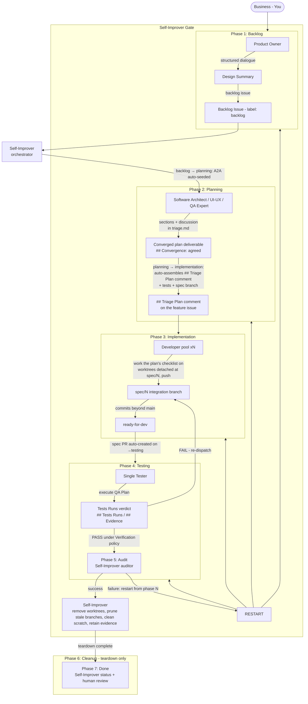

# Pipeline Phases

Seven phases + a Self-Improver gate. Sequential handoffs between phases; parallel work within a phase wherever dependencies allow. Every handoff happens through GitHub issues and comments ([github.md](github.md)) — the exceptions are the ephemeral working files `.opencode/tmp/<issue>/triage.md` (where the planning deliberation itself takes place) and the Self-Improver's observations log `.opencode/tmp/<issue>/observations.md` (improvement candidates captured while orchestrating).

```
Business → Backlog → Planning → Implementation → Testing → Audit → Cleanup → Done
   (You)      PO        SI          Dev pool        Tester     SI       SI      SI
```

The **Self-Improver (SI)** is the pipeline's orchestrator AND auditor: it dispatches the planning cluster, the developer pool, and the tester, records the audit verdict (the gate between Testing and Cleanup), and runs the teardown-only Cleanup phase. Its former mechanical orchestration steps (A2A seed, plan assembly, test-suite persistence) are now **state-machine transition side-effects** — the SI runs the transitions and the machine does the mechanics.

---

## Full Pipeline Flow



---

## Phase 1: Backlog

**Owner:** Product Owner
**Input:** Business goals from the human
**Output:** Backlog issue (label: `backlog`)
**Goals:** A backlog issue with the required intake sections (## Title, ## Problem / Why now, ## Intended users, ## Proposed behavior / Scope, ## Success metrics, ## Acceptance criteria, ## Out of scope, ## Priority), Gherkin ACs, priority, and label `backlog` — agreed by the human before dispatch. The `backlog → planning` exit gate **enforces the required sections** (a backlog missing them is blocked).

1. **Explore context** — understand scope, constraints, priority. Is this a trivial task (typo, label, single-file tweak) or a complex feature (new architecture, data flow, multiple surfaces)? Adjust dialogue depth accordingly.
2. **Structured dialogue** — one question at a time. Never ask about implementation details — flag them `[Technical: defer to planning]`.
3. **Design summary** — What, Wireframe (ASCII, UI only), Behavioral (Gherkin), Non-Behavioral, Risks/Unknowns.
4. **User confirmation** — the human approves the summary. No dispatch until this happens.
5. **Create backlog issue** — draft the body per the [backlog template](artifacts.md#backlog-issue), then request the state machine's `create-issue` action (labeled `backlog`). The state machine is the single GitHub writer.
6. **Handoff to Self-Improver** — the Product Owner dispatches the Self-Improver (orchestrator) with the backlog issue number.

**Simplicity heuristic:** trivial tasks get a one-line summary and a single dialogue round — but the summary + confirmation step is never skipped.

---

## Phase 2: Planning

**Owner:** Planning cluster (Software Architect + UI/UX Expert + QA Expert), orchestrated by the Self-Improver
**Input:** Backlog issue
**Output:** The `## Triage Plan` timeline comment on the feature issue (single-issue model — no separate plan issue)
**Goals:** A converged planning deliberation on the feature issue, then the plan auto-assembled into the `## Triage Plan` comment from [templates/triage-plan-template.md](templates/triage-plan-template.md) with all required sections (Summary, Software Architect, UI/UX Expert, QA Expert, Staffing Plan, Deployment Notes, Risks) — every backlog requirement covered by a plan checklist item (the `- [ ]` lines under `### Sub-issue Decomposition`).

### Self-Improver responsibilities (orchestrator)
1. Read the backlog issue.
2. **Run `transition backlog → planning`** — request the state machine's `transition` action (applies the `planning` label) *before* dispatching the planning cluster, so the planning subagents (software-architect / ui-ux-expert / qa-expert) read the planning phase in their context block. **Auto side-effect:** the machine seeds the A2A working file `.opencode/tmp/<issue>/triage.md` (idempotent). You do NOT run `triage-init` — the transition owns it.
3. **Dispatch the three planners in parallel** with the same brief (backlog + any Product Owner notes) and the A2A file path. Each planner works in the shared file.
4. **Coordinate the deliberation** — see [the planning deliberation protocol](#the-planning-deliberation-protocol). Track open `## Discussion` items in the A2A file and route each to its owning section.
5. **Write the orchestrator sections + convergence** — when no `## Discussion` item remains open, write the orchestrator-owned plan sections (`## Summary`, `## Staffing Plan`, `## Deployment Notes`, `## Risks & Mitigations`) into the A2A file and append `## Convergence: agreed`. **The plan deliverable is the planning artifact — no GitHub `Decision` convergence comment is posted.**
6. **Handoff** — request the `transition` action `planning → implementation`. **Auto side-effects:** the machine (a) **assembles the plan into the `## Triage Plan` timeline draft** `.opencode/tmp/<issue>/triage-plan.md` from `templates/triage-plan-template.md`, filling every section (`software-architect`, `ui-ux`, `qa`, `summary`, `staffing`, `deployment`, `risks`) from the converged A2A file, and auto-posts it on the feature issue (single-issue model — **no plan issue is created**); (b) **persists the QA-seeded test suites** to `main` via `tests-commit` (feature names parsed from the QA Expert's `**Feature tests:**` line in the A2A file); (c) creates the spec branch `spec/<N>`. No sub-issues or tester issue are generated — the plan's `- [ ]` checklist is the work list. You do NOT run `tests-commit` manually — the transition owns it (`generate-work` is removed).

### The planning deliberation protocol (file-based A2A)
The three planners deliberate in a shared A2A working file, `.opencode/tmp/<issue>/triage.md` (ephemeral and gitignored) — not in GitHub comment threads. GitHub keeps only the final plan (auto-assembled into the `## Triage Plan` comment). **The plan file is the deliverable** — if an agent looks for a GitHub comment and finds none, it reads the `.md` files under `.opencode/tmp/<issue>/`.
1. **A2A auto-seeded.** The `backlog → planning` transition creates the A2A working file `.opencode/tmp/<issue>/triage.md`, seeded from the triage template's per-agent `## <Agent>` sections plus a `## Discussion` section (idempotent).
2. **Parallel drafts.** The Self-Improver dispatches the three planners in parallel with the same brief. Each planner reads the file, writes its section draft under its own `## <Agent>` heading, and appends agent-tagged points to `## Discussion` (e.g. `**QA:** REQ-3 has no observable target — can you scope it?`).
3. **Cross-review.** Each planner reads the other two planners' drafts in the file (the Architect's Domain Model anchors UI/UX and QA) and replies to their `## Discussion` points — it never edits another planner's section heading.
4. **Convergence.** When no unresolved `## Discussion` items remain, the Self-Improver reviews the file, writes the orchestrator-owned sections (`## Summary`, `## Staffing Plan`, `## Deployment Notes`, `## Risks & Mitigations`), and appends `## Convergence: agreed`. The state machine's planning exit guard checks the file itself (all required sections + `## Convergence: agreed`) before `planning → implementation` — **no `Decision` comment is involved**.
5. **Plan assembly (automatic).** The `planning → implementation` transition reads each agreed section from the A2A file and assembles the plan into the `## Triage Plan` comment (auto-assembled, no manual `update-plan` on the happy path). The detailed back-and-forth stays in the ephemeral file; the plan captures the agreed decisions.

### Planners
- **Software Architect** — research, domain model (file:line citations), EARS-style requirements for observable behavior (constraints/NFRs in prose), API contracts, data models, scope decomposition into independent sub-tasks, **effort estimates** per sub-task (these feed the Staffing Plan).
- **UI/UX Expert** — design assets (mockups, component specs, interaction flows, states, accessibility). Returns "N/A" for backend-only work. Bases the draft on the Software Architect's Domain Model section (read from the A2A file).
- **QA Expert** — QA Plan (test cases per requirement, pass/fail criteria, test data, non-functional checks), edge cases, regression risks; the **sole test author**: seeds/extends the feature test suites under `.opencode/tests/<feature>/` (functional / smoke / regression / exploratory — conventions in `.opencode/tests/README.md`) AND declares the seeded folder names as a `**Feature tests:** <name1, name2>` line in its `## QA Expert` A2A section so the transition can auto-persist them via `tests-commit`. Bases the draft on the Software Architect's Domain Model section (read from the A2A file).

### The Implementation Plan must contain
| Section | Content |
|---------|---------|
| **Title** | Concise feature name + parent issue number |
| **Summary** | Goal + acceptance criteria |
| **Software Architect** | Domain model (file:line), EARS requirements (behavioral) + prose constraints, API contracts & data models, sub-task decomposition + effort estimates |
| **UI/UX Expert** | Design assets (or "N/A") |
| **QA Expert** | QA Plan (test cases, pass/fail criteria, required test data, non-functional checks) |
| **Staffing Plan** | Number of developers required, suggested roles, estimated effort — and the heuristic used (see [staffing.md](staffing.md)) |
| **Deployment notes** | Branch strategy, CI checks, infrastructure needs |
| **Risks & mitigations** | Blockers and fallback options |

The `planning → implementation` transition **assembles the plan into the `## Triage Plan` comment on the feature issue** (single-issue model): it writes the seeded plan from [templates/triage-plan-template.md](templates/triage-plan-template.md) to `.opencode/tmp/<issue>/triage-plan.md` and fills every section from the converged A2A file (no manual `update-plan` on the happy path), then auto-posts it. **No separate plan issue is created.** The same transition persists the QA-seeded test suites and creates the spec branch. No sub-issues or tester issue are generated — the plan's `### Sub-issue Decomposition` checklist is the work list developers execute on `spec/<N>`.

---

## Phase 3: Implementation

**Owner:** Self-Improver (setup/review) + Developer pool (execution)
**Input:** The `## Triage Plan` comment on the feature issue (single-issue model)
**Output:** Spec branch `spec/<N>` has commits beyond main (the developer pushed); the feature is labeled `ready-for-dev`
**Goals:** All plan checklist items implemented, verified, and pushed to `spec/<N>`. The `implementation → testing` exit gate is **spec branch `spec/<N>` has commits beyond main** — the machine blocks the transition until the developer pushes.

### 3a. Staffing (Self-Improver)

1. **Read the Staffing Plan** — extract total effort and the planner's suggested headcount.
2. **Apply the staffing heuristic** — convert effort to developer headcount (default: 1 full-stack dev ≈ 5 story points per delivery window). See [staffing.md](staffing.md#staffing-heuristic).
3. **Check pool availability** — every developer has a max of 2 active workstreams on the spec branch. Reduce headcount if the pool is saturated.
4. **Work list (the plan's checklist)** — there are no sub-issues: the `planning → implementation` transition created only the `## Triage Plan` comment and the spec branch. The plan's `### Sub-issue Decomposition` `- [ ]` lines are the checklist the developer pool works through directly on the feature's `spec/<N>` branch. `generate-work` is removed — no manual work-generation step exists.
5. **Spec integration branch** — auto-created by the state machine as a side-effect of the `planning → implementation` transition (`spec/<spec-issue>` from `main`). This is the working base for every developer's worktree, testing, and the evidence trail (see [github.md](github.md#branch-naming)).
6. **Transitions** — the feature issue carries `ready-for-dev` during implementation; no sub-issue, tester-issue, or plan-issue transitions exist.

### 3b. Development (Developer pool)

Each developer works a slice of the plan's task decomposition directly on the feature issue / `spec/<N>`:

1. **Read the plan** — the `## Triage Plan` comment on the feature issue: task decomposition, acceptance criteria, effort, scope. Read the API contracts and design assets.
2. **Create a worktree detached at the tip of `spec/<N>`** — request the state machine's `create-worktree` action (`--worktree-path <path>`; base auto-resolved to the feature's `spec/<N>`). Detached worktrees let many developers run in parallel.
3. **Implement** — strictly within the plan's scope. Never touch files outside the task; never redesign architecture.
4. **Verify locally** — lint, typecheck, build, tests.
5. **Push with `git push origin HEAD:spec/<N>`** — the developer's one allowed direct write (never `main`/`master`). Pull/merge `spec/<N>` first if the push is rejected.
6. **Remove the worktree** (`remove-worktree`) and **Report** — a `Status` comment on the FEATURE issue: what shipped, verification results, any scope notes.

### Dependency handling
- If work blocks on a dependency: request the state machine's `block` action (label `blocked` + `Status` comment) and notify the Self-Improver. Never stall silently.
- If the plan is ambiguous: request the state machine's `comment` action with a `Question`. Never improvise scope.

### Retry path
When the Self-Improver requests changes:
1. Re-enter the worktree, fetch + rebase.
2. Fix exactly what was requested.
3. Push to the same branch — the PR updates.
4. Post `Status: PR #N updated`.

### Merge
The Self-Improver reviews each developer's pushes on the spec integration branch against the plan's checklist, requests changes when needed, and returns failed work to the same developer. Once the spec branch has commits beyond main, the Self-Improver transitions the feature to `testing` — which **auto-creates the spec PR** (`spec/<N>` → `main`) and applies the `testing` label — making the feature testable. Once testing passes, the Self-Improver transitions to `audit`, which **auto-merges the spec PR**; the `spec/<N>` branch is kept so evidence URLs keep rendering.

---

## Phase 4: Testing

**Owner:** Tester (single)
**Input:** Feature issue (label: `testing`) + the plan's `### QA Plan` (from the `## Triage Plan` comment)
**Output:** Verdict on the feature issue (a `## Tests Runs` / `## Evidence` timeline comment); the Self-Improver transitions the feature to `audit` (auto-merging the spec PR), its `audit-record --verdict success` auto-transitions `audit → cleanup`, and the SI's `close-issue --to-phase done` from cleanup closes the issue as done, or the Self-Improver returns the feature to implementation for the failing work
**Goals:** Tester verdict posted with per-case evidence; all failures re-dispatched to the plan's checklist items with expected-vs-actual and repro steps. The testing exit gate is a **verification guardrail**: the verdict must substantiate a PASS under the plan's `> Verification policy` — for `live` policies the evidence must reference `telemetry_spans` (a live-query result); a static-only PASS or a FAIL blocks the exit.

1. **Read the plan's `### QA Plan`** — QA Plan checklist, the spec integration branch to test (`spec/<N>`), and required test data. Identify the feature domain(s) and read the matching durable suites under `.opencode/tests/<feature>/` (persisted to `main` via `tests-commit`; conventions in `.opencode/tests/README.md`).
2. **Ensure the dev instance is running on the spec integration branch** (see the dev-environment workflow). Before starting, the tester (or the SI) must ensure `spec/<N>` is synced with `main`'s pipeline config and the dev build's checkout has `node_modules` installed — a stale `opencode.json` re-blocks the tester's sandbox (telemetry-query, `fredo emit`, opencode prerequisites), and a bare worktree cannot build the app.
3. **Execute each test case** in order — functional + smoke, then regression + exploratory (unscripted probes; a confirmed finding promotes to `functional.md`):
   - Attach evidence per case: screenshots, logs, DOM snapshots, test output. Screenshots are committed to `.opencode/evidence/<feature-issue>/` on `spec/<N>` and embedded in `Evidence` comments via `upload-evidence`, so they render inline for repo members.
   - Classify PASS / FAIL.
   - Persist suite updates to `main` via the `tests-commit` action.
4. **Verdict:**
   - **All pass** → post the test report as a `## Tests Runs` timeline comment (draft `.opencode/tmp/<issue>/tests-runs.md` per the Tests-runs template — the machine auto-posts pending timeline drafts on transitions / `audit-record`, or via `post-comments`; `## Evidence` is accepted as an alias) and notify the Self-Improver — who transitions the feature to `audit` (auto-merging the spec PR). The Self-Improver's `audit-record --verdict success` then auto-transitions `audit → cleanup`, and its `close-issue --to-phase done` from cleanup closes the issue as done.
   - **Any fail** → post the partial test report (`## Tests Runs` / `## Evidence`) with a precise failure description per failing case (expected vs actual, evidence, repro steps) and notify the Self-Improver — who returns the feature to implementation and re-dispatches the failing plan checklist work. There is no reopen action.

### Re-dispatched work
Failing work goes back through Implementation (Phase 3) and, once pushed again, returns to the Tester on the same feature issue — the feature stays in `testing` until the whole feature passes.

---

## Phase 5: Audit

**Owner:** Self-Improver — the same agent that orchestrated the pipeline now audits it
**Input:** Tester verdict + the issue's full record
**Output:** `cleanup` (success), or a restart instruction (phase + improvement applied)

1. **Audit** — read the Tester's verdict and the issue's recorded history (decisions, evidence, retries). Decide: was the issue completed successfully?
2. **Doc-sync** — the SI is the documentation owner. Classify the merged spec diff into doc categories (`ARCHITECTURE.md`, `CLI_GUIDE.md`, `SETUP.md`, `SECURITY.md`, `FAQ.md`), patch the affected product docs, and commit. Product docs are only coherent against the full merged diff, which the SI — running last — is uniquely positioned to see. If the product state doesn't match the docs, that is a failure.
3. **Success** → `audit-record --verdict success` — the state machine **auto-transitions `audit → cleanup`** (the teardown-only phase); the issue stays OPEN in cleanup. The SI then runs the cleanup teardown and closes as done via `close-issue --to-phase done` (which swaps the label to `done`, records the phase events, and closes the issue).
4. **Failure** → choose the phase to restart from (Backlog, Planning, Implementation, or Testing), **after improving** the root cause of the failure. `audit-record --verdict restart --phase <p>` **auto-transitions `audit → <p>`**. Improvement toolkit: agent prompts, skills, scripts, **references** (add/edit/delete in the playbook folder's `references.md`), and **pipeline docs** (document the change in the same pass). Stale product docs are a valid failure reason → restart to Implementation with "sync docs" in scope. **The SI never researches code or telemetry to improve the pipeline** — code/observability improvements are routed through the Software Architect (a planning → implementation cycle), not fixed directly by the SI.
5. **Return** — the restart instruction re-dispatching the pipeline from the chosen phase is executed by the Self-Improver itself (the orchestrator owns the whole flow, including restarts).

**Status: implemented.** The Self-Improver agent (`.opencode/agents/self-improver.md`) runs the full pipeline (orchestration) and this gate (audit); its steps are in `playbooks/self-improver.md`. The verdict is recorded via the state machine's `audit-record` action, which also drives the next phase automatically.

---

## Phase 6: Cleanup

**Owner:** Self-Improver — teardown only (the audit verdict was already recorded as the testing → audit gate and confirmed at audit success)
**Input:** Self-Improver audit verdict = success (issue in `cleanup`, label `cleanup`)
**Output:** Closed feature, human review
**Goals:** Teardown complete — no leftover worktrees, stale branches, or scratch — then the feature is closed as done.

1. **Remove worktrees** — any leftover developer worktrees are removed (`git worktree remove` / `prune`).
2. **Prune stale branches** — leftover local feature branches pruned via the state machine's `prune` action. **`spec/*` is always kept** — the spec integration branch `spec/<N>` carries the evidence trail, and `prune` never touches `spec/*`.
3. **Clean scratch** — leftover gitignored scratch under `.opencode/tmp/` is removed; `.opencode/evidence/<N>/` is **retained** (it is committed evidence).
4. **Verify no dirty state** — confirm the working tree is clean (no leftover modified/untracked files from the run).
5. **Close as done** — `close-issue --to-phase done` (cleanup → done): the machine swaps the label to `done`, records the phase transition, posts the final-metrics summary, and closes the issue.
6. **Human review** — the human validates the finished feature manually. If the human finds an issue, they report back and the Product Owner opens a follow-up backlog item (labeled `backlog`, with the bug variant of the PO template).

---

## Phase 7: Done

**Owner:** Self-Improver
**Input:** Cleanup complete (teardown done, issue closed)
**Output:** Closed feature, human review
**Goals:** Feature labeled `done`, branches cleaned, final `Status` summary posted, human review initiated.

1. Confirm the spec PR was merged and the tester verdict passed.
2. The feature is already labeled `done` and closed — `close-issue --to-phase done` from cleanup did both.
3. Post a final `Status` summary: what shipped, test results, remaining risks (if any).
4. **Human review** — the human validates the finished feature manually. If the human finds an issue, they report back and the Product Owner opens a follow-up backlog item (labeled `backlog`, with the bug variant of the PO template).

---

## Escalation

| Situation | Trigger | Action |
|-----------|---------|--------|
| Blocked work / issue | label `blocked` | Self-Improver intervenes within the SLA (default 4h) |
| Dev pool saturated | all devs at 2 active workstreams | Self-Improver queues work; staffs when capacity frees |
| Triage underspecification | plan item sent back by a developer | Self-Improver routes back to the relevant planner |
| Ambiguous QA Plan | tester can't execute a case | Self-Improver routes back to QA Expert |
| Repeated PR failures | same work rejected >3× | Self-Improver escalates to human with a summary of what was tried |

See [staffing.md](staffing.md) for the full staffing and escalation rules.
