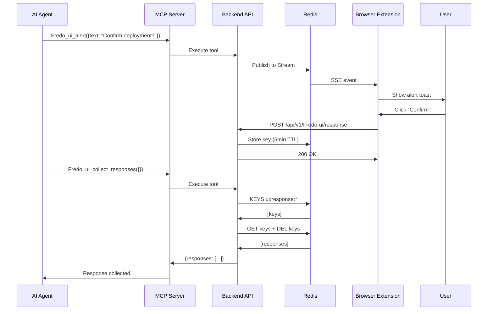
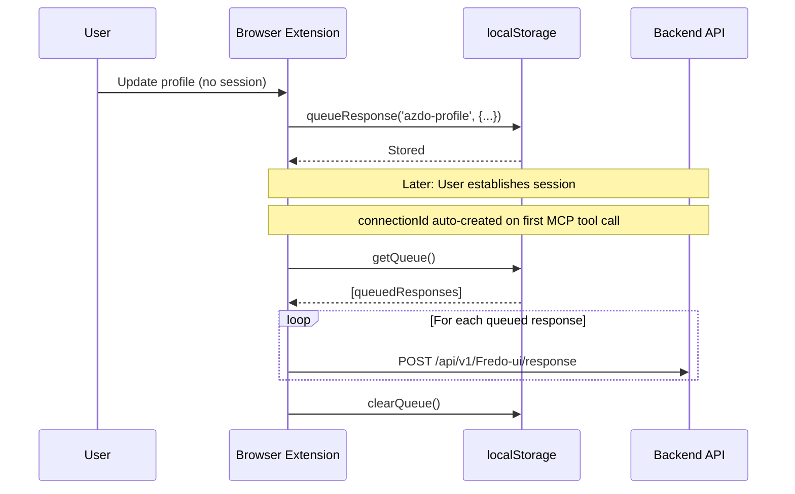

# Browser Extension Response Flow

## Overview

The **response flow** allows the browser extension to send user interactions, confirmations, and form submissions back to the AI agent (via MCP). This enables bidirectional communication where the agent can:

1. **Send requests** to the extension (alerts, work item forms, queries)
2. **Receive responses** from user interactions in the extension
3. **Make decisions** based on user input

### Key Use Cases

- **Alert Confirmations**: User confirms an alert → AI agent proceeds with action
- **Work Item Creation**: User fills form → AI agent receives work item ID and URL
- **Profile Configuration**: User updates settings → AI agent uses new credentials
- **Feature Acknowledgements**: User interacts with UI → AI agent knows action completed

---

## Architecture Overview

```
┌─────────────────┐         ┌──────────────┐         ┌─────────────┐         ┌──────────┐
│ Browser Ext     │  POST   │ Backend API  │  Redis  │ Redis Keys  │   MCP   │ AI Agent │
│ (UI Interaction)│────────▶│ /response    │────────▶│ + Streams   │────────▶│ (Claude) │
└─────────────────┘         └──────────────┘         └─────────────┘         └──────────┘
```

### Three-Stage Flow

1. **Browser Extension** → Captures user interaction → POST to `/api/v1/Fredo-ui/response`
2. **Backend** → Stores in Redis (5min TTL) + Publishes to Redis Stream
3. **AI Agent** → Calls `Fredo_ui_collect_responses` MCP tool → Retrieves and deletes responses

---

## Component Details

### 1. Browser Extension Side

#### 1.1 Response Queue (localStorage)

**File**: [`apps/browser-extension/src/shared/utils/responseQueue.ts`](../../apps/browser-extension/src/shared/utils/responseQueue.ts)

**Purpose**: Persists responses in localStorage when handshake is not yet established.

```typescript
interface QueuedResponse {
  featureId: string;
  data: any;
  timestamp: string;
}

// Store response for later sending
queueResponse('azdo-profile', { organizationId: 'my-org' });

// Get all queued responses
const queue = getQueue(); // QueuedResponse[]

// Clear after successful send
clearQueue();
```

**Key Features**:
- **Persistence**: Survives page reloads and extension restarts
- **Storage**: Browser localStorage (not Redis)
- **TTL**: No automatic expiration (manual cleanup)
- **Use Case**: Pre-handshake responses, offline scenarios

#### 1.2 Feature Response API

**File**: [`apps/browser-extension/src/shared/utils/featureResponseApi.ts`](../../apps/browser-extension/src/shared/utils/featureResponseApi.ts)

**Purpose**: Sends responses to backend via HTTP POST.

```typescript
interface GenericFeatureResponse {
  connectionId: string;   // MCP session ID (from handshake)
  featureId: string;      // Feature identifier (e.g., 'alerts', 'azdo-create-workitem')
  payload: Record<string, any>;    // Flexible response data
  metadata?: Record<string, any>;  // Optional metadata (timestamps, etc.)
}

// Send alert confirmation
await sendFeatureResponse(
  connectionId,
  'alerts',
  {
    alertId: 'alert-123',
    alertText: 'Please confirm deployment',
    action: 'confirmed'
  }
);

// Send work item creation response
await sendFeatureResponse(
  connectionId,
  'azdo-create-workitem',
  {
    action: 'created',
    workItemId: 12345,
    workItemUrl: 'https://dev.azure.com/...',
    timestamp: new Date().toISOString()
  }
);
```

**HTTP Request**:
```http
POST https://Fredo.frnx.site/api/v1/Fredo-ui/response
Content-Type: application/json

{
  "connectionId": "a3245ba6-3cfb-420d-bc74-9151603d2e7c",
  "featureId": "alerts",
  "payload": {
    "alertId": "alert-123",
    "action": "confirmed"
  },
  "metadata": {
    "timestamp": "2026-02-18T10:30:00.000Z"
  }
}
```

**Response**:
```json
{
  "success": true,
  "message": "Response received and stored"
}
```

#### 1.3 Real-World Usage Examples

##### Example 1: Alert Confirmation

**File**: [`apps/browser-extension/src/features/alerts/components/AlertHandler.tsx`](../../apps/browser-extension/src/features/alerts/components/AlertHandler.tsx)

```tsx
const handleConfirm = async (alertId: string, alertText: string) => {
  if (!connectionId) {
    console.error('❌ No connectionId - cannot post response');
    return;
  }

  await sendFeatureResponse(connectionId, 'alerts', {
    alertId,
    alertText,
    action: 'confirmed'
  });

  toaster.create({
    title: 'Confirmed',
    description: 'Your confirmation has been sent',
    type: 'success',
  });
};
```

**Flow**:
1. AI agent calls `Fredo_ui_alert` with `needsConfirmation: true`
2. Browser shows toast with "Confirm" button
3. User clicks "Confirm" → `handleConfirm()` called
4. POST to `/api/v1/Fredo-ui/response` with alert details
5. AI agent calls `Fredo_ui_collect_responses` → receives confirmation
6. AI agent proceeds with deployment/action

##### Example 2: Work Item Creation

**File**: [`apps/browser-extension/src/features/azdo-create-workitem/hooks/useCreateWorkItem.ts`](../../apps/browser-extension/src/features/azdo-create-workitem/hooks/useCreateWorkItem.ts)

```tsx
const create = async (workItemData: CreateWorkItemInput) => {
  // Create work item via Azure DevOps API
  const createdWorkItem = await createWorkItem(org, pat, project, workItemData);
  const workItemId = createdWorkItem.id;
  const workItemUrl = `https://dev.azure.com/${org}/_workitems/edit/${workItemId}`;

  // Send response to AI agent
  await sendFeatureResponse(
    connectionId,
    'azdo-create-workitem',
    {
      action: 'created',
      workItemId,
      workItemUrl,
      title: workItemData.title,
      type: workItemData.type,
      timestamp: new Date().toISOString()
    }
  );
};
```

**Flow**:
1. AI agent calls `azdo_create_workitem` MCP tool
2. Browser extension shows pre-filled form modal
3. User reviews/edits form and clicks "Create"
4. Extension creates work item via Azure DevOps REST API
5. POST to `/api/v1/Fredo-ui/response` with work item ID and URL
6. AI agent collects response → knows work item was created successfully

##### Example 3: Profile Settings Update

**File**: [`apps/browser-extension/src/features/profile-settings/components/ProfileSettingsComponent.tsx`](../../apps/browser-extension/src/features/profile-settings/components/ProfileSettingsComponent.tsx)

```tsx
const handleSave = async () => {
  const responseData = {
    organization,
    project,
    pat: pat.replace(/./g, '*'), // Mask PAT for security
    savedAt: new Date().toISOString()
  };

  if (connectionId) {
    // Send immediately if session active
    await sendFeatureResponse(connectionId, 'azdo-profile', responseData);
  } else {
    // Queue for later if no session
    queueResponse('azdo-profile', responseData);
  }
};
```

**Flow**:
1. User updates Azure DevOps credentials in profile settings
2. If session active → immediate POST
3. If no session → queued in localStorage
4. Next handshake → queue flushed automatically
5. AI agent can now use updated credentials for Azure DevOps operations

---

### 2. Backend Side

#### 2.1 POST /api/v1/Fredo-ui/response Endpoint

**File**: [`apps/tools-mcp/src/services/Fredo-ui/routes.ts`](../../apps/tools-mcp/src/services/Fredo-ui/routes.ts) (Lines 280-355)

**Implementation**:
```typescript
fastify.route({
  method: 'POST',
  url: '/api/v1/Fredo-ui/response',
  schema: {
    description: 'Receive generic feature responses from browser extension',
    tags: ['Fredo-ui'],
    body: {
      type: 'object',
      required: ['connectionId', 'featureId', 'payload'],
      properties: {
        connectionId: { type: 'string' },
        featureId: { type: 'string' },
        payload: { type: 'object' },
        metadata: { type: 'object' }
      }
    }
  },
  handler: async (request, reply) => {
    const { connectionId, featureId, payload, metadata } = request.body;

    // 1. Publish to Redis Stream for event-driven consumers
    await publisher.publishResponse('Fredo_ui_response', connectionId, {
      featureId,
      payload,
      metadata: {
        timestamp: new Date().toISOString(),
        ...metadata
      }
    });

    // 2. Store in Redis key-value for MCP retrieval
    const responseKey = `ui:response:${connectionId}:${featureId}:${Date.now()}`;
    const responseData = JSON.stringify({
      featureId,
      payload,
      metadata: {
        timestamp: new Date().toISOString(),
        ...metadata
      }
    });

    await redis.setex(responseKey, 300, responseData); // 5 min TTL
    
    reply.send({
      success: true,
      message: 'Response received and stored'
    });
  }
});
```

**Dual Storage Strategy**:

1. **Redis Streams** (`Fredo:streams:ui-events`)
   - **Purpose**: Real-time event propagation to SSE consumers
   - **Use Case**: Live UI updates, monitoring, event-driven workflows
   - **Retention**: Configurable stream retention policy
   - **Consumers**: SSE streams, event processors

2. **Redis Key-Value** (`ui:response:{connectionId}:{featureId}:{timestamp}`)
   - **Purpose**: Buffered responses for MCP tool retrieval
   - **TTL**: 5 minutes (300 seconds)
   - **Pattern**: One key per response (not overwritten)
   - **Consumers**: `Fredo_ui_collect_responses` MCP tool

**Key Naming Pattern**:
```
ui:response:{connectionId}:{featureId}:{timestamp}

Examples:
ui:response:a3245ba6-3cfb-420d-bc74-9151603d2e7c:alerts:1708253400000
ui:response:a3245ba6-3cfb-420d-bc74-9151603d2e7c:azdo-create-workitem:1708253405000
ui:response:a3245ba6-3cfb-420d-bc74-9151603d2e7c:azdo-profile:1708253410000
```

**Why Dual Storage?**
- **Streams**: Real-time, pub/sub, multiplexing, event history
- **Keys**: Simple retrieval, atomic operations, explicit TTL, read-once pattern

---

### 3. MCP Tool Side

#### 3.1 Fredo_ui_collect_responses Tool

**File**: [`apps/tools-mcp/src/services/Fredo-ui/tools/Fredo_ui_collect_responses/FredoUiCollectResponsesTool.ts`](../../apps/tools-mcp/src/services/Fredo-ui/tools/Fredo_ui_collect_responses/FredoUiCollectResponsesTool.ts)

**Documentation**: [`apps/tools-mcp/src/services/Fredo-ui/tools/Fredo_ui_collect_responses/doc.md`](../../apps/tools-mcp/src/services/Fredo-ui/tools/Fredo_ui_collect_responses/doc.md)

**Purpose**: Retrieves all pending UI responses and atomically deletes them (read-once pattern).

**Input Schema**:
```json
{}
```
No parameters required - uses `context.sseConnectionId` automatically.

**Output Schema**:
```typescript
interface CollectResponsesToolOutput {
  success: boolean;
  connectionId: string;
  responses: Array<{
    featureId: string;
    payload: any;
    metadata?: any;
  }>;
  count: number;
  collectedAt: string;
}
```

**Example Usage (AI Agent)**:
```typescript
// Example 1: Collect alert confirmation
const result1 = await Fredo_ui_collect_responses({});
// Returns:
{
  "success": true,
  "connectionId": "a3245ba6-3cfb-420d-bc74-9151603d2e7c",
  "responses": [
    {
      "featureId": "alerts",
      "payload": {
        "alertId": "alert-123",
        "action": "confirmed"
      },
      "metadata": {
        "timestamp": "2026-02-18T10:30:00.000Z"
      }
    }
  ],
  "count": 1,
  "collectedAt": "2026-02-18T10:30:05.000Z"
}

// Example 2: Collect work item creation
const result2 = await Fredo_ui_collect_responses({});
// Returns:
{
  "success": true,
  "connectionId": "a3245ba6-3cfb-420d-bc74-9151603d2e7c",
  "responses": [
    {
      "featureId": "azdo-create-workitem",
      "payload": {
        "action": "created",
        "workItemId": 12345,
        "workItemUrl": "https://dev.azure.com/myorg/_workitems/edit/12345"
      },
      "metadata": {
        "timestamp": "2026-02-18T10:35:00.000Z"
      }
    }
  ],
  "count": 1,
  "collectedAt": "2026-02-18T10:35:10.000Z"
}
```

**Implementation Details**:
```typescript
async execute(input, context) {
  const connectionId = context?.sseConnectionId;
  
  if (!connectionId) {
    throw new Error(
      'This tool MUST be called within an MCP session context. ' +
      'This tool must be called within an active MCP session context.'
    );
  }
  
  // Search for all response keys matching the connection
  const pattern = `ui:response:${connectionId}:*`;
  const keys = await redis.keys(pattern);
  
  if (keys.length === 0) {
    return {
      success: true,
      connectionId,
      responses: [],
      count: 0,
      collectedAt: new Date().toISOString()
    };
  }
  
  // Retrieve all responses
  const pipeline = redis.pipeline();
  keys.forEach(key => pipeline.get(key));
  const results = await pipeline.exec();
  
  // Parse responses
  const responses = results
    .map(([err, value]) => {
      if (err || !value) return null;
      try {
        return JSON.parse(value as string);
      } catch {
        return null;
      }
    })
    .filter(Boolean);
  
  // Atomically delete all retrieved responses (read-once pattern)
  if (keys.length > 0) {
    await redis.del(...keys);
    console.log(`   🗑️  Deleted ${keys.length} response key(s) from Redis`);
  }
  
  return {
    success: true,
    connectionId,
    responses,
    count: responses.length,
    collectedAt: new Date().toISOString()
  };
}
```

**Read-Once Pattern**:
- ✅ Retrieves all responses matching `ui:response:{connectionId}:*`
- ✅ Atomically deletes all retrieved keys
- ✅ Calling tool twice in a row returns zero responses on second call
- ✅ Prevents duplicate processing

---

## Error Handling & Edge Cases

### 1. No connectionId Available

**Scenario**: User interacts before handshake established

**Browser Extension Behavior**:
```tsx
if (!connectionId) {
  // Option 1: Queue response in localStorage
  queueResponse('azdo-profile', responseData);
  
  // Option 2: Show error to user
  toaster.create({
    title: 'Error',
    description: 'Unable to send response - no active session',
    type: 'error'
  });
}
```

**Resolution**: Queued responses automatically sent once a new MCP session is active.

### 2. Expired Responses (5min TTL)

**Scenario**: AI agent doesn't collect responses within 5 minutes

**Backend Behavior**: Redis automatically deletes expired keys

**AI Agent Impact**:
- Response is lost (not recoverable)
- Agent should implement retry logic or timeout handling
- Consider extending TTL for long-running workflows

**Mitigation**:
```typescript
// Agent should poll regularly for responses
const pollResponses = async () => {
  const result = await Fredo_ui_collect_responses({});
  if (result.count > 0) {
    console.log('Received responses:', result.responses);
  }
  
  // Poll every 30 seconds (well within 5min TTL)
  setTimeout(pollResponses, 30000);
};
```

### 3. Double Collection Protection

**Scenario**: Agent calls `Fredo_ui_collect_responses` multiple times

**Tool Behavior**: Atomic deletion ensures read-once pattern

```typescript
// First call
const result1 = await Fredo_ui_collect_responses({});
// Returns: { count: 2, responses: [...] }

// Second call (immediate)
const result2 = await Fredo_ui_collect_responses({});
// Returns: { count: 0, responses: [] }
```

### 4. Network Failure During POST

**Scenario**: Browser extension can't reach backend

**Browser Extension Behavior**:
```typescript
try {
  await sendFeatureResponse(connectionId, featureId, payload);
} catch (error) {
  console.error('Failed to send response:', error);
  
  // Fallback: Queue in localStorage for retry
  queueResponse(featureId, payload);
  
  // Show error to user
  toaster.create({
    title: 'Error',
    description: 'Failed to send response. It will be retried later.',
    type: 'error'
  });
}
```

**Auto-Retry**: Next dashboard load attempts to flush queue:
```tsx
// Dashboard.tsx automatically flushes queue on mount
useEffect(() => {
  if (connectionId && queuedItems.length > 0) {
    queuedItems.forEach(async (item) => {
      await sendFeatureResponse(connectionId, item.featureId, item.data);
    });
    clearQueue();
  }
}, [connectionId, queuedItems]);
```

### 5. Invalid connectionId

**Backend Behavior**: Stores response anyway (connectionId not validated)

**AI Agent Impact**: If using wrong connectionId, won't retrieve responses

**Prevention**: Always use connectionId from the active MCP session (`Fredo:active-connection` in Redis)

---

## Sequence Diagrams

### Full Response Flow



### Response Queue Persistence



---

## Best Practices

### For Browser Extension Developers

1. **Always check connectionId** before calling `sendFeatureResponse()`
2. **Use queueResponse()** as fallback when no session active
3. **Implement retry logic** for network failures
4. **Add user feedback** (toasts) for sent/failed responses
5. **Include metadata** (timestamps, correlation IDs) for debugging

### For AI Agent Developers

1. **Ensure at least one MCP tool has been called** to auto-create the session
2. **Poll regularly** (every 30-60s) within 5min TTL window
3. **Handle empty responses** gracefully (don't assume data exists)
4. **Process by featureId** to route responses to correct handlers
5. **Implement timeouts** for user interactions (don't wait forever)

### For Backend Developers

1. **Validate input** (connectionId, featureId, payload structure)
2. **Monitor Redis memory** usage for response keys
3. **Log response activity** for debugging and analytics
4. **Consider extending TTL** for long-running workflows
5. **Implement response expiration alerts** for monitoring

---

## Troubleshooting

### Issue: Responses Not Reaching Agent

**Symptoms**: `Fredo_ui_collect_responses()` returns empty array

**Checklist**:
- [ ] Has at least one MCP tool been called (auto-creates session)?
- [ ] Is connectionId being passed correctly to browser extension?
- [ ] Did browser extension POST successfully? (check network tab)
- [ ] Did backend store response in Redis? (check Redis keys)
- [ ] Is response expired (>5min since POST)?
- [ ] Is agent using correct connectionId when calling collect tool?

**Debug Commands**:
```bash
# Check Redis keys for connection
redis-cli KEYS "ui:response:a3245ba6-3cfb-420d-bc74-9151603d2e7c:*"

# Check TTL on response key
redis-cli TTL "ui:response:a3245ba6-3cfb-420d-bc74-9151603d2e7c:alerts:1708253400000"

# Manually read response
redis-cli GET "ui:response:a3245ba6-3cfb-420d-bc74-9151603d2e7c:alerts:1708253400000"
```

### Issue: Responses Collected Twice

**Symptoms**: Agent receives duplicate responses

**Cause**: Calling `Fredo_ui_collect_responses()` is NOT idempotent - it deletes keys

**Solution**: Implement single-collection logic in agent workflow

```typescript
// ❌ Bad: Calling multiple times
const collect1 = await Fredo_ui_collect_responses({});
const collect2 = await Fredo_ui_collect_responses({}); // Will be empty!

// ✅ Good: Call once and process
const result = await Fredo_ui_collect_responses({});
result.responses.forEach(response => {
  switch (response.featureId) {
    case 'alerts':
      handleAlertResponse(response.payload);
      break;
    case 'azdo-create-workitem':
      handleWorkItemResponse(response.payload);
      break;
  }
});
```

### Issue: localStorage Queue Not Flushing

**Symptoms**: Queued responses never sent to backend

**Checklist**:
- [ ] Is Dashboard component mounted after handshake?
- [ ] Does connectionId exist when Dashboard loads?
- [ ] Check browser console for POST errors
- [ ] Check localStorage has queued items (`Fredo_response_queue` key)

**Manual Flush** (in browser console):
```javascript
const queue = JSON.parse(localStorage.getItem('Fredo_response_queue') || '[]');
console.log('Queued responses:', queue);

// Manual send (requires connectionId)
const connectionId = 'your-connection-id';
queue.forEach(async (item) => {
  await fetch('https://Fredo.frnx.site/api/v1/Fredo-ui/response', {
    method: 'POST',
    headers: { 'Content-Type': 'application/json' },
    body: JSON.stringify({
      connectionId,
      featureId: item.featureId,
      payload: item.data,
      metadata: { timestamp: item.timestamp }
    })
  });
});
localStorage.removeItem('Fredo_response_queue');
```

---

## Related Documentation

- [EVENT_FLOW.md](./EVENT_FLOW.md) - SSE event flow from backend to extension
- [SESSION_MANAGEMENT_IMPLEMENTATION.md](./SESSION_MANAGEMENT_IMPLEMENTATION.md) - Session lifecycle and handshake
- [AI_INTERACTION.md](./AI_INTERACTION.md) - AI agent interaction patterns
- [../tools-mcp/SERVICES_OVERVIEW.md](../tools-mcp/SERVICES_OVERVIEW.md) - Fredo-ui service overview
- [Fredo_ui_collect_responses doc.md](../../apps/tools-mcp/src/services/Fredo-ui/tools/Fredo_ui_collect_responses/doc.md) - Tool documentation

---

## Summary

The **response flow** completes the bidirectional communication loop between AI agents and the browser extension:

- **Browser Extension** captures user interactions and sends to backend via POST
- **Backend** stores responses in Redis (5min TTL) and publishes to streams
- **AI Agent** retrieves responses via MCP tool with read-once semantics
- **Fallback** mechanism (localStorage queue) ensures reliability

This architecture enables sophisticated AI-human collaboration workflows where agents can:
- Request user confirmations
- Collect form inputs
- Receive status updates
- Coordinate multi-step processes

All while maintaining loose coupling and horizontal scalability.
