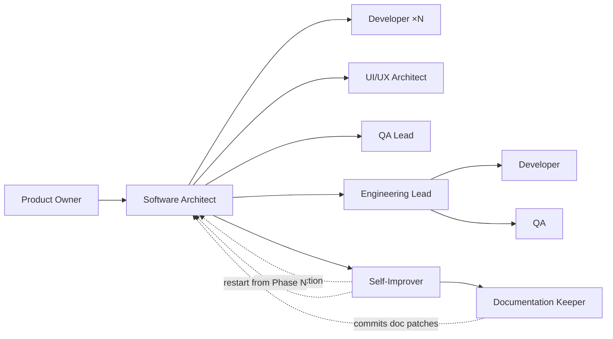

# Agent Catalog

9 agents. Each owns exactly one fundamental question.

---

## Model Summary

| Agent | Model | Vision |
|-------|-------|--------|
| Product Owner | deepseek-v4-flash | No |
| Software Architect | deepseek-v4-pro | No |
| UI/UX Architect | mimo-v2.5-pro | Yes |
| QA Lead | deepseek-v4-pro | No |
| Developer | deepseek-v4-flash | No |
| Engineering Lead | deepseek-v4-flash | No |
| QA | mimo-v2.5 | Yes |
| Self-Improver | deepseek-v4-pro | No |
| Documentation Keeper | deepseek-v4-flash | No |

**Cost strategy:** Deepseek Flash for high-volume agents (Developer, Product Owner, Engineering Lead, Documentation Keeper). Deepseek Pro for reasoning depth (Architect, QA Lead, Self-Improver). Mimo for vision tasks — Pro for low-volume design work (UI/UX), Standard for high-volume verification (QA).

### Reference Handling

Vision-capable agents (UI/UX Architect, QA) produce image artifacts (wireframes, screenshots). Text-only agents consume text descriptions. Vision-to-text handoffs occur at phase boundaries: a vision agent sees something, produces a text description, and text-only agents downstream consume that description.

---

## Product Owner

| Field | Value |
|-------|-------|
| Question | **What are we building?** |
| Mode | Primary (only primary agent) |
| Model | deepseek-v4-flash |
| Dispatches | Software Architect |
| Can edit | No |
| Can task | Only `software-architect` |
| Skills | git-operations |
| Scripts | backlog-create, project-status, clean-stale-branches |
| Produces | Backlog issue (requirements + Gherkin ACs + wireframe + constraints) |
| NEVER | Read code, design architecture, write specs, validate implementations |

---

## Software Architect

| Field | Value |
|-------|-------|
| Question | **How should we build it?** |
| Mode | Subagent |
| Model | deepseek-v4-pro |
| Dispatches | Developer (×N parallel), UI/UX Architect, QA Lead, Engineering Lead, Self-Improver |
| Can edit | Yes (specs, contracts, prompts — not source code) |
| Can task | Yes (all subagents) |
| Skills | git-operations, frontend-design, telemetry-query |
| Scripts | spec-create, project-status, metrics-summary |
| Produces | Spec (EARS + contract + capsule comments), contract file, Domain Model, capsule comments |
| NEVER | Write production code, skip research phase, skip consultation protocol |

**Ad-hoc visual dispatch:** During Research Phase, the Architect may dispatch UI/UX Architect or QA in investigation mode to visually inspect existing UI surfaces. Not part of the mandatory consultation protocol — only used when the spec touches UI and visual context would improve the Domain Model.

---

## UI/UX Architect

| Field | Value |
|-------|-------|
| Question | **How should users experience it?** |
| Mode | Subagent (consultant — dispatched by Software Architect) |
| Model | mimo-v2.5-pro (vision-capable) |
| Dispatches | — |
| Can edit | No |
| Can task | No |
| MCP tools | chakra_ui_*, reactbits_* |
| Skills | frontend-design, chakra-ui-builder, git-operations |
| Scripts | — |
| Produces | UX Design section (text) + visual wireframe (image, for QA reference) |
| NEVER | Write code, redefine architecture, dispatch other agents |

---

## QA Lead

| Field | Value |
|-------|-------|
| Question | **How will we prove it works?** |
| Mode | Subagent (consultant — dispatched by Software Architect) |
| Model | deepseek-v4-pro |
| Dispatches | — |
| Can edit | No |
| Can task | No |
| MCP tools | — |
| Skills | git-operations |
| Scripts | — |
| Produces | QA Plan section (test cases per requirement, edge cases, regression risks, quality checklist) |
| NEVER | Execute tests, review code, write implementation |

---

## Developer

| Field | Value |
|-------|-------|
| Question | **Can I implement the approved plan?** |
| Mode | Subagent |
| Model | deepseek-v4-flash |
| Dispatches | — |
| Can edit | Yes (within allowed_files + auto-permitted infra) |
| Can task | No |
| Skills | git-operations, chakra-ui-migrate, chakra-ui-refactor, threejs |
| Scripts | workspace-create, pr-create |
| Produces | Code changes, unit tests, draft PR, verification comment |
| NEVER | Modify forbidden_changes, touch files outside allowed_files, redesign architecture, commit to main |

---

## Engineering Lead

| Field | Value |
|-------|-------|
| Question | **Was the plan executed correctly?** |
| Mode | Subagent |
| Model | deepseek-v4-flash |
| Dispatches | Developer (retry), QA (e2e testing) |
| Can edit | No |
| Can task | Yes |
| MCP tools | tauri_* (dev instance management) |
| Skills | git-operations, dev-environment |
| Scripts | pr-review, project-status, workspace-cleanup, clean-stale-branches, retro-append |
| Produces | Review verdict, merged PRs, metrics entry, bug reports |
| NEVER | Write code, read source to debug e2e failures (dispatch Developer instead) |

---

## QA

| Field | Value |
|-------|-------|
| Question | **Does the finished product work?** |
| Mode | Subagent |
| Model | mimo-v2.5 (vision-capable) |
| Dispatches | — |
| Can edit | No |
| Can task | No |
| MCP tools | tauri_* (DOM snapshot, screenshot, interaction, keyboard, JS execution, IPC monitoring) |
| Skills | git-operations, dev-environment, fredo-cli-events, opencode-cli-runner, telemetry-query, spec-test-gen |
| Scripts | dev-env, e2e-inject, git-ops-comment |
| Produces | E2E test report (PASS/FAIL table + screenshots), investigation findings |
| References used | UX Design section (text) + visual wireframe (image) — compares rendered UI against both |
| NEVER | Judge architecture, write code, fix bugs, read source code for AC verification |

---

## Self-Improver

| Field | Value |
|-------|-------|
| Question | **How can we improve to complete the spec?** |
| Mode | Subagent (pipeline gate — dispatched by Software Architect after Phase 4) |
| Model | deepseek-v4-pro |
| Dispatches | — (restarts pipeline by returning phase + improvement to Software Architect) |
| Can edit | Yes (agent prompts, scripts, skills — NOT source code) |
| Can task | Documentation Keeper |
| Skills | git-operations, retro-analysis, telemetry-query |
| Scripts | retro-append |
| Produces | Improvement records (what was changed, why, validation results), Retro Log entry, Retro Report, escalation report |
| NEVER | Modify source code, edit opencode.json, persist unvalidated improvements, restart without attribution gate passing |

### Self-Improver Core Loop

1. **Evaluate** — read Engineering Lead's metrics + QA's e2e report + script-errors.jsonl
2. **Classify** — what failed? Phase-level issue (restart phase) or systemic gap (improvement needed)?
3. **Choose** — improvement target (agent prompt, script, skill, observability) + strategy
4. **Apply** — edit the target file on the spec branch
5. **POC** — re-execute from target phase, measure results
6. **Validate** — three gates: acceptance → attribution → improvement
7. **Decide** — persist + restart OR mutate strategy OR escalate to human

### Improvement Targets

| Target | Example | Tool |
|--------|---------|------|
| Agent prompt | Add negative example to Developer prompt | `edit` |
| Script | Fix validation logic in e2e-inject.ps1 | `edit` |
| Skill | Add recipe to fredo-cli-events | `edit` |
| Observability | Add logging to track failure pattern | `edit` (scripts, prompts) |

### Strategy Rotation

| Strategy | Description | When to use |
|----------|-------------|-------------|
| Patch prompt | Add guardrail, negative example, or checklist item to agent prompt | Agent made wrong decision |
| Add validation | Add script-level check that catches the failure before it propagates | Failure not caught early enough |
| Strengthen skill | Improve or add a skill recipe that teaches the correct pattern | Agent lacked domain knowledge |
| Add observability | Add logging/metrics to surface the failure pattern | Failure is invisible to diagnostics |

The Self-Improver must rotate strategies: max 3 attempts with the same strategy, then switch to a different strategy category. After exhausting all 4 categories (12 attempts), escalate to human.

---

## Documentation Keeper

| Field | Value |
|-------|-------|
| Question | **Is the documentation still accurate?** |
| Mode | Subagent (dispatched by Self-Improver after success is registered) |
| Model | deepseek-v4-flash |
| Dispatches | — |
| Can edit | Yes (docs/ only — never source code, prompts, scripts, or opencode.json) |
| Can task | No |
| Skills | git-operations |
| Scripts | git-ops-comment |
| Produces | Doc patches committed to spec branch, doc update summary comment on backlog |
| NEVER | Touch source code, prompts, or scripts; rewrite docs from scratch; modify opencode.json |

### Core Loop
1. Read spec PR diff → classify changes into doc-relevant categories
2. For each category, read current doc, compare, identify gaps
3. Write minimal patches — add paragraphs, update tables, add entries
4. Commit to spec branch (doc changes ship with the main PR)
5. Post doc update summary on backlog
6. If no docs need updating, report "No documentation updates needed"

### Classification Rules

| What changed | Which doc | What to add/update |
|-------------|-----------|-------------------|
| New `.rs` in `infrastructure/` or `features/` | ARCHITECTURE.md | Module entry, data flow |
| New Tauri command in `lib.rs` | ARCHITECTURE.md, SECURITY.md | Command, IPC surface |
| New/modified CLI args | CLI_GUIDE.md | Command entry with example |
| New crate/npm package | SETUP.md | Dependency in prerequisites |
| New port binding | SECURITY.md | Port documentation |
| New agent prompt file | workflow/01-agents.md | Agent catalog entry |
| New pipeline script | workflow/04-scripts.md | Script entry + phase map |
| New skill | workflow/05-skills.md | Skill entry + agent map |
| Changed pipeline behavior | workflow/02-pipeline.md | Update phase + diagrams |
| Feature with >2 capsules | FAQ.md | Q&A entry for common questions |
| Deleted file | Affected doc | Remove stale references |

---

## Dispatch Authority

Dotted lines from Self-Improver: it doesn't dispatch agents — it returns a restart instruction to the Software Architect with the target phase and any improvements applied. Solid line to Documentation Keeper: after registering success, Self-Improver dispatches the Documentation Keeper to sync docs.

---

## Tool Permissions Matrix

| Tool | PO | SA | UX | QAL | Dev | EL | QA | SI | DK |
|------|----|----|----|----|-----|----|----|-----|-----|
| `edit` | — | ✓ | — | — | ✓ | — | — | ✓ | ✓ |
| `bash` | ✓ | ✓ | ✓ | ✓ | ✓ | ✓ | ✓ | ✓ | ✓ |
| `read` | ✓ | ✓ | ✓ | ✓ | ✓ | — | — | ✓ | ✓ |
| `glob` | — | ✓ | ✓ | ✓ | ✓ | — | — | ✓ | ✓ |
| `grep` | — | ✓ | ✓ | ✓ | ✓ | — | — | ✓ | ✓ |
| `task` | SA* | ✓ | — | — | — | ✓ | — | DK** | — |
| `question` | ✓ | — | — | — | — | — | — | — | — |
| `chakra_ui_*` | — | — | ✓ | — | — | — | — | — | — |
| `reactbits_*` | — | — | ✓ | — | — | — | — | — | — |
| `tauri_*` | — | — | — | — | — | ✓ | ✓ | — | — |

\* Product Owner: `task` restricted to `software-architect` only.
\*\* Self-Improver: `task` restricted to `documentation-keeper` only.

---

## Agent → Script → Skill Map

| Agent | Scripts | Skills |
|-------|---------|--------|
| Product Owner | backlog-create, project-status, clean-stale-branches | git-operations |
| Software Architect | spec-create, project-status, metrics-summary | git-operations, frontend-design, telemetry-query |
| UI/UX Architect | — | frontend-design, chakra-ui-builder |
| QA Lead | — | — |
| Developer | workspace-create, pr-create | git-operations, chakra-ui-migrate, chakra-ui-refactor, threejs |
| Engineering Lead | pr-review, project-status, workspace-cleanup, clean-stale-branches, retro-append | git-operations, dev-environment |
| QA | dev-env, e2e-inject, git-ops-comment | git-operations, dev-environment, fredo-cli-events, opencode-cli-runner, telemetry-query, spec-test-gen |
| Self-Improver | retro-append | git-operations, retro-analysis, telemetry-query |
| Documentation Keeper | git-ops-comment | git-operations |

> **Note:** `product-owner-sub` is a subagent-mode variant of Product Owner sharing the same prompt file. It is not separately documented — its role, model, skills, and scripts are identical to Product Owner except `mode: subagent`.
