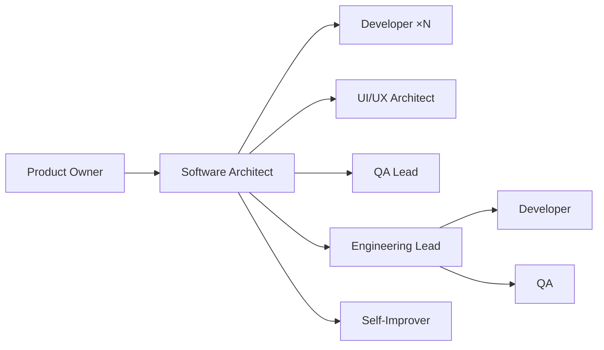

# Agent Catalog

8 agents. Each owns exactly one fundamental question.

---

## Product Owner

| Field | Value |
|-------|-------|
| Question | **What are we building?** |
| Mode | Primary (only primary agent) |
| Model | deepseek-v4-flash |
| Dispatches | Software Architect |
| Can edit | No |
| Can task | Only `software-architect` |
| Skills | git-operations |
| Scripts | backlog-create, bug-create, project-status, clean-stale-branches |
| Produces | Backlog issue (requirements + Gherkin ACs + wireframe + constraints) |
| NEVER | Read code, design architecture, write specs, validate implementations |

---

## Software Architect

| Field | Value |
|-------|-------|
| Question | **How should we build it?** |
| Mode | Subagent |
| Model | deepseek-v4-pro |
| Dispatches | Developer (×N parallel), UI/UX Architect, QA Lead, Engineering Lead, Self-Improver |
| Can edit | Yes (specs, contracts, prompts — not source code) |
| Can task | Yes (all subagents) |
| Skills | git-operations, frontend-design, telemetry-query |
| Scripts | spec-create, sub-issue-create, capsule-get, project-status, metrics-summary |
| Produces | Spec (EARS + contract + capsules), contract file, Domain Model, capsule sub-issues |
| NEVER | Write production code, skip research phase, skip consultation protocol |

---

## UI/UX Architect

| Field | Value |
|-------|-------|
| Question | **How should users experience it?** |
| Mode | Subagent (consultant — dispatched by Software Architect) |
| Model | deepseek-v4-pro |
| Dispatches | — |
| Can edit | No |
| Can task | No |
| MCP tools | chakra_ui_*, reactbits_* |
| Skills | frontend-design, chakra-ui-builder |
| Scripts | — |
| Produces | UX Design section (aesthetic direction, layout, components, states, accessibility, responsive behavior) |
| NEVER | Write code, redefine architecture, dispatch other agents |

---

## QA Lead

| Field | Value |
|-------|-------|
| Question | **How will we prove it works?** |
| Mode | Subagent (consultant — dispatched by Software Architect) |
| Model | mimo-v2.5-pro |
| Dispatches | — |
| Can edit | No |
| Can task | No |
| MCP tools | — |
| Skills | — |
| Scripts | — |
| Produces | QA Plan section (test cases per requirement, edge cases, regression risks, quality checklist) |
| NEVER | Execute tests, review code, write implementation |

---

## Developer

| Field | Value |
|-------|-------|
| Question | **Can I implement the approved plan?** |
| Mode | Subagent |
| Model | deepseek-v4-flash |
| Dispatches | — |
| Can edit | Yes (within allowed_files + auto-permitted infra) |
| Can task | No |
| Skills | git-operations, chakra-ui-migrate, chakra-ui-refactor, threejs |
| Scripts | workspace-create, pr-create, capsule-get |
| Produces | Code changes, unit tests, draft PR, verification comment |
| NEVER | Modify forbidden_changes, touch files outside allowed_files, redesign architecture, commit to main |

---

## Engineering Lead

| Field | Value |
|-------|-------|
| Question | **Was the plan executed correctly?** |
| Mode | Subagent |
| Model | deepseek-v4-flash |
| Dispatches | Developer (retry), QA (e2e testing) |
| Can edit | No |
| Can task | Yes |
| MCP tools | tauri_* (dev instance management) |
| Skills | git-operations, dev-environment |
| Scripts | pr-review, bug-create, project-status, workspace-cleanup, clean-stale-branches, retro-append |
| Produces | Review verdict, merged PRs, metrics entry, bug reports |
| NEVER | Write code, read source to debug e2e failures (dispatch Developer instead) |

---

## QA

| Field | Value |
|-------|-------|
| Question | **Does the finished product actually work?** |
| Mode | Subagent |
| Model | mimo-v2.5 |
| Dispatches | — |
| Can edit | No |
| Can task | No |
| MCP tools | tauri_* (DOM snapshot, screenshot, interaction, keyboard, JS execution, IPC monitoring) |
| Skills | git-operations, dev-environment, fredo-cli-events, opencode-cli-runner, telemetry-query, spec-test-gen |
| Scripts | dev-env, e2e-inject, git-ops-comment |
| Produces | E2E test report (PASS/FAIL table + screenshots), investigation findings |
| NEVER | Judge architecture, write code, fix bugs, read source code for AC verification |

---

## Self-Improver

| Field | Value |
|-------|-------|
| Question | **How can this workflow improve next time?** |
| Mode | Subagent |
| Model | deepseek-v4-pro |
| Dispatches | — |
| Can edit | Yes (docs, prompts, scripts — not source code) |
| Can task | No |
| Skills | git-operations, retro-analysis, telemetry-query |
| Scripts | retro-append |
| Produces | Improvement PR, Retro Report, IMPROVEMENTS.md updates |
| NEVER | Modify source code, edit opencode.json, run retro on specs where e2e failed |

---

## Dispatch Authority

---

## Tool Permissions Matrix

| Tool | PO | SA | UX | QAL | Dev | EL | QA | SI |
|------|----|----|----|----|-----|----|----|-----|
| `edit` | — | ✓ | — | — | ✓ | — | — | ✓ |
| `bash` | ✓ | ✓ | ✓ | ✓ | ✓ | ✓ | ✓ | ✓ |
| `read` | ✓ | ✓ | ✓ | ✓ | ✓ | — | — | ✓ |
| `glob` | — | ✓ | ✓ | ✓ | ✓ | — | — | ✓ |
| `grep` | — | ✓ | ✓ | ✓ | ✓ | — | — | ✓ |
| `task` | SA* | ✓ | — | — | — | ✓ | — | — |
| `question` | ✓ | — | — | — | — | — | — | — |
| `chakra_ui_*` | — | — | ✓ | — | — | — | — | — |
| `reactbits_*` | — | — | ✓ | — | — | — | — | — |
| `tauri_*` | — | — | — | — | — | ✓ | ✓ | — |

\* Product Owner: `task` restricted to `software-architect` only.

---

## Agent → Script → Skill Map

| Agent | Scripts | Skills |
|-------|---------|--------|
| Product Owner | backlog-create, bug-create, project-status, clean-stale-branches | git-operations |
| Software Architect | spec-create, sub-issue-create, capsule-get, project-status, metrics-summary | git-operations, frontend-design, telemetry-query |
| UI/UX Architect | — | frontend-design, chakra-ui-builder |
| QA Lead | — | — |
| Developer | workspace-create, pr-create, capsule-get | git-operations, chakra-ui-migrate, chakra-ui-refactor, threejs |
| Engineering Lead | pr-review, bug-create, project-status, workspace-cleanup, clean-stale-branches, retro-append | git-operations, dev-environment |
| QA | dev-env, e2e-inject, git-ops-comment | git-operations, dev-environment, fredo-cli-events, opencode-cli-runner, telemetry-query, spec-test-gen |
| Self-Improver | retro-append | git-operations, retro-analysis, telemetry-query |
