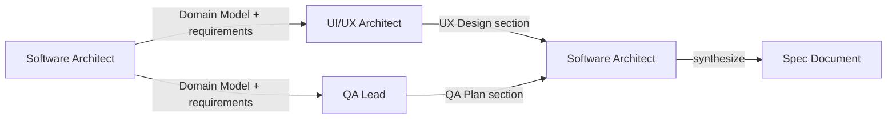
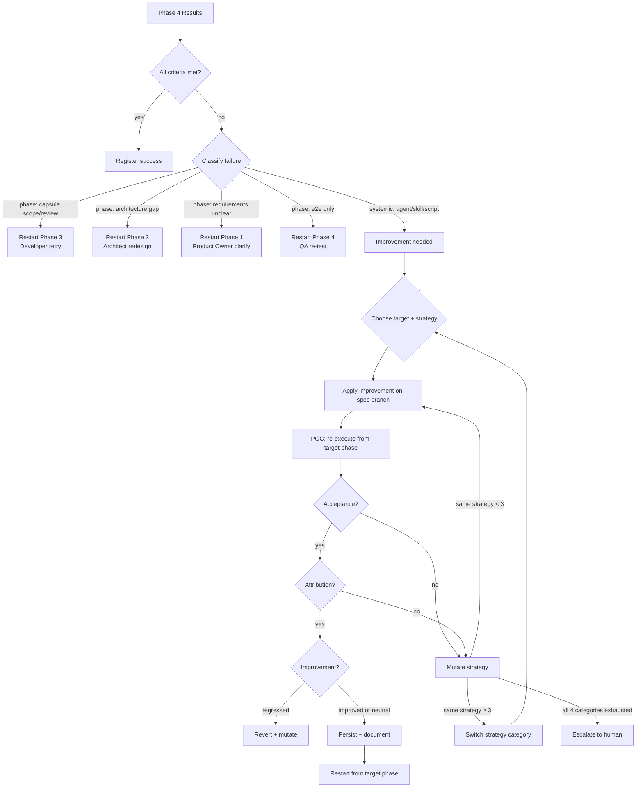
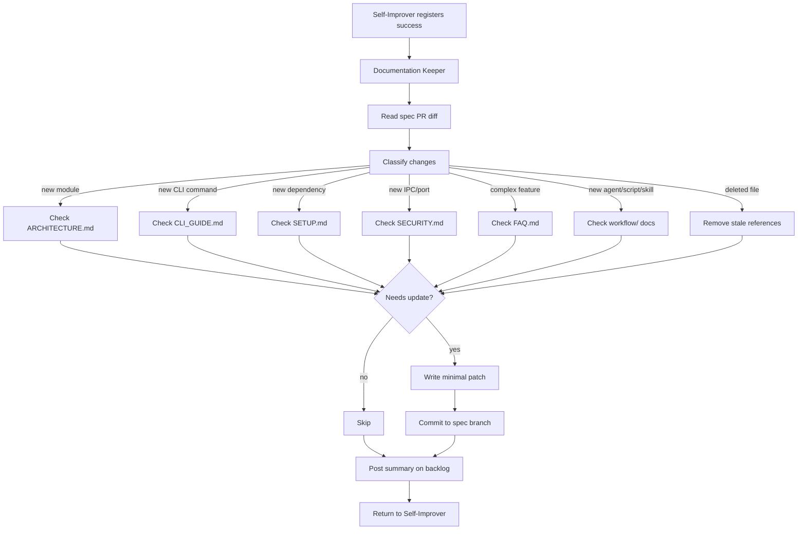

# SDD Pipeline

4 phases + 1 self-improvement gate. Sequential handoffs between phases, parallel execution within phases where dependencies allow. The Self-Improver is a gate after Phase 4 — not a separate phase. It evaluates, diagnoses failures, applies improvements, validates them, and restarts the pipeline from the optimal phase.

---

## Full Pipeline Flow

```mermaid
flowchart TD
    U([User Request]) --> P1

    subgraph P1[Phase 1: Intake]
        PO[Product Owner]
        PO --> |structured dialogue| SUM[Design Summary]
        SUM --> |backlog-create| BL[Backlog Issue]
    end

    subgraph P2[Phase 2: Design]
        BL --> SA[Software Architect]
        SA --> |research| DM[Domain Model]
        DM --> SA2[Software Architect]
        SA2 --> |dispatch parallel| UX[UI/UX Architect]
        SA2 --> |dispatch parallel| QAL[QA Lead]
        UX --> |UX Design| SA3[Software Architect]
        QAL --> |QA Plan| SA3
        SA3 --> |synthesize| SPEC[Spec Comment]
        SPEC --> |decompose| CAPS[Capsules ×N]
        CAPS --> |post as comments| COMMENTS[Capsule Comments]
        COMMENTS --> |dispatch parallel| DEV[Developer ×N]
    end

    subgraph P3[Phase 3: Implementation]
        DEV --> |workspace-create| WT[Worktree]
        WT --> IMPL[Implement]
        IMPL --> |lint + build + test| VERIFY[Verification Comment]
        VERIFY --> |pr-create| PR[Draft PR]
    end

    subgraph P4[Phase 4: Verification]
        PR --> EL[Engineering Lead]
        EL --> |EARS coverage| EC[Coverage Check]
        EC --> |per-PR review| REV[14-Point Checklist]
        REV --> |approved?| MRG{Pass?}
        MRG --> |yes| MERGE[merge]
        MRG --> |no| RETRY[Developer retry, max 4]
        RETRY --> REV
        MERGE --> COH[Coherence Check]
        COH --> |dispatch| QA[QA]
        QA --> |e2e report| EL2[Engineering Lead]
        EL2 --> |retro-append| METRICS[metrics.json]
    end

    METRICS --> PO2[Product Owner]
    PO2 --> |dispatches| SI

    subgraph GATE[Self-Improvement Gate — Product Owner dispatches]
        SI2{All criteria met?}
        SI2 --> |yes| REG[Register success + retro]
        REG --> DK[Documentation Keeper]
        DK --> |sync docs to spec branch| DONE[Done]
        SI2 --> |no| DIAG[Diagnose failure]
        DIAG --> |phase restart| RESTART[Restart from phase N]
        DIAG --> |systemic gap| IMPROVE[Improve → POC → Validate]
        IMPROVE --> |validated| RESTART
        IMPROVE --> |failed| MUTATE[Mutate strategy]
        MUTATE --> IMPROVE
        MUTATE --> |exhausted| ESCALATE[Escalate to human]
    end

    RESTART --> P2
    RESTART --> P3
    RESTART --> P4
    RESTART --> P1

    DONE --> U
    ESCALATE --> U
    DONE --> U
    ESCALATE --> U
```



---

## Phase 1: Intake

**Owner:** Product Owner  
**Input:** User request  
**Output:** Backlog issue with design summary

### Feature Request Flow
1. **Explore context** — understand scope, constraints, complexity
2. **Structured dialogue** — one question at a time. Never ask about implementation details (defer to Architect)
3. **Design summary** — what, wireframe (ASCII for UI), Gherkin behavioral ACs, non-behavioral constraints, risks
4. **User confirmation** — present summary, get approval
5. **Create backlog issue** — via `backlog-create.ps1`. Contains: What, Wireframe, Behavioral (Gherkin), Non-Behavioral, Risks/Unknowns. For bugs: use `--Label bug`, adapted dialogue (expected/actual/repro/severity instead of wireframe/Gherkin).
6. **Auto-dispatch Architect** — user confirmation triggers immediate dispatch without additional prompt

---

## Phase 2: Design

**Owner:** Software Architect  
**Input:** Backlog issue  
**Output:** Spec comment, contract file, capsules, Developer dispatch

### 2a. Research Phase (MANDATORY)
1. Read backlog issue
2. Identify all external APIs, SDKs, event models referenced
3. Trace real data flows end-to-end (cite file:line)
4. Verify Hook event payload shapes against telemetry DB (mock vs real opencode events differ)
5. Produce Domain Model (3-5 bullets with file:line citations)
6. For UI specs: trace full component tree from entry point to target container
7. **For UI specs (optional):** Dispatch UI/UX Architect or QA in investigation mode to visually inspect existing UI surfaces. Not part of the mandatory consultation protocol — use when visual context would improve the Domain Model. The vision agent returns a text description for the text-only Architect.

### 2b. Consultation (MANDATORY for all issues)



Dispatch both consultants in **parallel**. Both receive the same Domain Model + requirements brief. Architect synthesizes their output into the spec.

- **UI/UX Architect** — vision-capable (mimo-v2.5-pro). Returns UX Design section (text: aesthetic direction, layout, components, states, accessibility, responsive) + visual wireframe (image, for QA reference downstream). Returns "N/A" for backend/internal specs.
- **QA Lead** — text-only (deepseek-v4-pro). Returns QA Plan section (test cases per requirement, edge cases, regression risks, quality checklist)

### 2c. Spec Design
1. Write spec body: Overview + UX Design + EARS Requirements + QA Plan + Contract + Acceptance Criteria
2. Post spec via `spec-create.ps1` → creates spec branch
3. Rebase spec branch onto latest main
4. Commit contract file (contract.rs/contract.ts) to spec branch if multi-capsule

### 2d. Capsule Decomposition
1. Decompose EARS requirements into independent capsules
2. Every source file belongs to exactly one capsule
3. Capsules have: requirement_ids, allowed_files, forbidden_changes, acceptance_criteria, patterns, key_files
4. Review past metrics for failure patterns
5. Post capsules as comments on the backlog via the `git-operations` skill. Format: `## Capsule: {name} (REQ: {ids})` + YAML body.
6. Verify all capsules appear as comments

### 2e. Developer Dispatch
Dispatch all Developers in **parallel** with their comment number + backlog + spec branch + contract file.

---

## Phase 3: Implementation

**Owner:** Developer (×N parallel)  
**Input:** Capsule comment (text wireframes arrive as UX Design section in spec — Developer is text-only, deepseek-v4-flash)  
**Output:** Draft PR + verification comment

### Wireframe Handoff
Developer receives UI specifications as **text descriptions** in the spec's UX Design section. UI/UX Architect's visual wireframe is an image — Developer cannot see it. The text description in the spec is the canonical design spec for the Developer. QA visually verifies the rendered output against the wireframe image downstream.

### Steps
1. Read capsule from comment on backlog issue
2. Read backlog + spec for full context
3. Read contract file + key_files
4. Create git worktree from spec branch via `workspace-create.ps1`
5. Implement ONLY capsule scope (allowed_files, requirement_ids)
6. Run lint, typecheck, build, tests
7. Post verification comment (checklist per AC, build stats, infra changes)
8. **Verify NOT on main** before committing
9. Commit → push → create draft PR via `pr-create.ps1`

### Retry Path
When the Engineering Lead requests changes:
1. Enter worktree → fetch + rebase
2. Fix ONLY what was requested
3. Push to same branch → PR auto-updates
4. Return "PR #N updated"

### 8 Anti-Patterns
| # | Anti-Pattern | Fix |
|---|-------------|-----|
| 1 | React ref for cross-mount state | Module-level Map/Set |
| 2 | Delete+insert for SQLite upserts | Atomic UPDATE |
| 3 | Fire-and-forget async in persistence | await inside loop |
| 4 | Overwriting content on ECE updates | Spread-merge: `{...prev, ...new}` |
| 5 | Assuming OTLP/Hook payload shape matches ECE delivery | Dual-path extraction with fallback |
| 6 | ReactFlow edge creation interleaved with node creation | Two-pass: nodes first, edges second |
| 7 | Mock event field paths used for real opencode extraction | Verify against telemetry DB |
| 8 | useEffect with array .length / new object dependency | useMemo + monotonic epoch counter |

---

## Phase 4: Verification

**Owner:** Engineering Lead + QA  
**Input:** Developer PRs  
**Output:** Merged PRs, metrics entry, e2e report

### Engineering Lead Steps
1. **Read backlog** → set project status to Reviewing
2. **EARS coverage check** — every REQ in exactly one capsule
3. **Gherkin→EARS mapping integrity** — behavioral ACs map to event-driven EARS
4. **Read Developer verification comments** — trust-but-verify
5. **Check CI** — red → skip review, dispatch retry
6. **Per-PR review** — 14-point checklist against capsule
7. **Approved →** merge via `pr-review.ps1`
8. **Rejected →** dispatch Developer retry (max 4 per PR)
9. **>4 failures →** append blocked note to capsule comment, report in final summary. Self-Improver handles recovery.
10. **Final coherence check** — full test suite on spec branch, cross-capsule consistency. Use `git diff main...spec/N-slug` to inspect changes.
11. **Merge spec branch to main** — `git checkout main; git merge spec/N-slug --squash; git push origin main`
12. **Dispatch QA** for e2e testing (MANDATORY)
13. **Append metrics entry** via `retro-append.ps1`

### QA Steps
1. Read backlog + QA Plan section from spec + UX Design section (text)
2. **Review visual wireframe** (image, from UI/UX Architect) — the canonical visual reference
3. Ensure dev instance running via `dev-env.ps1`
4. Connect Tauri MCP driver session
5. For each user-observable test case:
   - Inject mock events if needed via `fredo emit`
   - DOM snapshot + interaction + screenshot
   - **Compare rendered output against wireframe** — not just AC text, but visual fidelity
   - Classify PASS / FAIL with evidence
6. Upload screenshots to GitHub CDN
7. Post E2E report as comment on backlog

### 14-Point Review Checklist
| # | Check |
|---|-------|
| 1 | Requirements — all requirement_ids implemented? |
| 2 | Acceptance — all acceptance_criteria satisfied? |
| 3 | Scope — only allowed_files modified (+ reported infra auto-permits)? |
| 4 | Forbidden — no forbidden_changes touched? |
| 5 | Contract align — capsule boundaries match spec contract? |
| 6 | Contract methods — all contract stubs implemented with correct signatures? |
| 7 | Patterns — referenced patterns followed? |
| 8 | Gherkin mapping — behavioral ACs → event-driven EARS? |
| 9 | Quality — clean code, no obvious bugs, follows conventions? |
| 10 | Tests — if required, all test results PASSED? |
| 11 | Infrastructure — auto-permit changes minimal and reported? |
| 12 | OTLP payload path — full adapter→ECE→frontend trace if multi-transport? |
| 13 | Edges & graph state — two-pass node/edge building if ReactFlow? |
| 14 | UI surface — targeting correct container component if modifying existing UI? |

---

## Self-Improvement Gate

**Owner:** Self-Improver  
**Input:** Phase 4 metrics + e2e report + script errors  
**Output:** Success registration OR improvement + pipeline restart OR escalation

The Self-Improver is dispatched by the Product Owner after **every** Phase 4 completion. It is a **recurring gate**, not a one-shot dispatch. After pipeline restarts (E2E retries, Developer retries, improvement cycles), the SI is dispatched again after the next Phase 4 completes. It returns either success or a restart instruction. The Product Owner loops: dispatch SI → if restart → re-dispatch Architect → Architect returns → dispatch SI again → until SI returns success. Every spec passes through the SI multiple times if needed.

### Core Loop



### Step 1: Evaluate
- Read Engineering Lead's metrics entry
- Read QA's e2e report
- Read `script-errors.jsonl` filtered by spec #
- Read IMPROVEMENTS.md Active guardrails for context

### Step 2: Classify Failure

| Failure signal | Action | Target phase |
|---------------|--------|-------------|
| `reviewer_issues` has scope violations | Retry | Phase 3 (Developer) |
| `architect_issues` has missing REQs | Redesign | Phase 2 (Architect) |
| `top_failure: no_upfront_research` | Redesign | Phase 2 (Architect) |
| `top_failure: cross_capsule_conflict` | Re-decompose | Phase 2 (Architect) |
| Capsule PR failed review (≥4 retries) | Retry | Phase 3 (Developer) |
| `passed_e2e: false`, no clear capsule fault | Re-verify | Phase 4 (QA + Engineering Lead) |
| Agent prompt pattern gap | Improve agent | POC → restart |
| Script error (consistent) | Improve script | POC → restart |
| Skill missing or wrong | Improve skill | POC → restart |
| Failure invisible to diagnostics | Improve observability | POC → restart |

### Step 3: Choose Improvement Target + Strategy

| Target | Strategy examples | Tool |
|--------|-----------------|------|
| **Agent prompt** | Add negative example, add checklist item, add guardrail rule | `edit` agent .md file |
| **Script** | Add validation, fix parsing, add error handling | `edit` script .ps1 file |
| **Skill** | Add recipe, fix existing recipe, add trigger description | `edit` skill SKILL.md file |
| **Observability** | Add logging in script, add metrics field, add telemetry query recipe | `edit` script/skill/metrics |

**Improvements are committed to the spec branch**, not main. They merge to main when the spec's main PR merges. Each improvement is traceable to the spec that triggered it.

### Step 4: POC (Proof of Concept)
- Re-execute the pipeline from the target phase with the improvement applied
- Only the failing phase and subsequent phases re-run, not everything

### Step 5: Validate — Three Gates

| Gate | Question | How | Autonomous? |
|------|----------|-----|-------------|
| **Acceptance** | Did the spec meet acceptance criteria? | All capsules merged, e2e passed, no open bugs | Yes |
| **Attribution** | Can we attribute the pass to this improvement? | Targeted failure category absent from new metrics; targeted capsule passed first-attempt | Yes |
| **Improvement** | Did overall quality measurably improve? | Before/after metrics delta comparison | Yes |

#### Gate 1: Acceptance
The spec must pass. Binary gate — no partial credit.

| Check | Source |
|-------|--------|
| All capsules merged | `tasks == merged` |
| e2e tests pass | `passed_e2e == true` |
| No open bug issues | `bugs == 0` |

#### Gate 2: Attribution
The improvement must be causally linked to the failure. Prevents the "spec passed but our improvement was irrelevant" false positive.

| Check | Source |
|-------|--------|
| Targeted failure category absent from this run | `top_failure` changed from previous attempt |
| Targeted capsule passed review first-attempt | `retries[target_capsule] == 0` |
| Targeted script produced zero errors | `script-errors.jsonl` filtered count == 0 |

#### Gate 3: Improvement
Quality delta comparison. The improvement made things better, not worse.

| Metric | Before | After | Desired |
|--------|--------|-------|---------|
| `capsules_first_pass` | 2/4 | 4/4 | Increase |
| `retries` per capsule | [2, 0, 1, 4] | [0, 0, 0, 0] | Decrease |
| `reviewer_issues` count | 3 | 0 | Decrease |
| `total_cycles` | 2 | 1 | Decrease |
| `script_errors` for target | 5 | 0 | Decrease |
| `bugs` | 1 | 0 | Decrease |

- Metrics improved → keep improvement, persist, restart
- Metrics unchanged → keep improvement (didn't hurt), persist, restart
- Metrics regressed → revert improvement, flag, try different strategy

### Step 6: Decide

| Outcome | Action |
|---------|--------|
| Gate 1 pass + Gate 2 pass + Gate 3 improved | Persist improvement, document in metrics, restart |
| Gate 1 pass + Gate 2 pass + Gate 3 neutral | Persist, document, restart |
| Gate 1 pass + Gate 2 fail | Improvement was noise — try different strategy |
| Gate 1 fail | Improvement didn't work — mutate strategy |
| Gate 3 regressed | Revert improvement, try different strategy |
| Same strategy failed 3 times | Rotate to new strategy category |
| All 4 categories exhausted | Escalate to human |

### Step 7: Register Success → Documentation Sync

After all criteria pass (with or without improvement cycles):

1. **Register success:**
   - Append Retro Log entry to IMPROVEMENTS.md
   - Post Retro Report comment on backlog
   - Generate improvement PR if cross-spec patterns found

2. **Dispatch Documentation Keeper:**
   ```
   task subagent_type="documentation-keeper" prompt="Sync docs after spec #N. Main PR: #X. Read the spec PR diff, classify changes, and update docs/ to match. Commit patches to spec branch."
   ```

3. **Wait for return.** The Documentation Keeper handles:
   - Reading the spec PR diff
   - Classifying changes into doc-relevant categories (ARCHITECTURE, CLI_GUIDE, SETUP, SECURITY, FAQ, workflow/)
   - Comparing against current docs, writing minimal patches
   - Committing doc patches to spec branch
   - Posting doc update summary on backlog

4. **Return to Software Architect:** "Spec #N complete. Docs synced."

### Documentation Keeper Flow



### Strategy Rotation Rules
- **Max 3 attempts** with the same strategy before forced rotation
- **4 strategy categories:** agent prompt, script, skill, observability
- **Max 12 total attempts** (3 × 4) before escalation
- If an improvement passes Gate 1-2 but Gate 3 shows regression, **revert** that improvement before trying a different strategy

### Escalation
When all strategy categories are exhausted without success:
1. Post escalation report on backlog (what was tried, what failed, why)
2. Set project status to Backlog
3. **Human decides:** accept partial state, abandon spec, or provide new direction
4. Self-Improver stops. No further autonomous retries.
