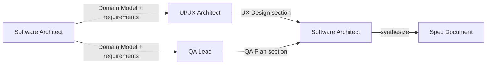
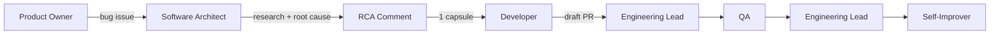
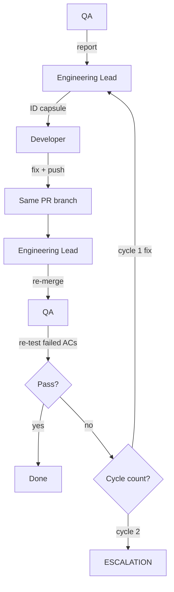

# SDD Pipeline

5 phases. Sequential handoffs between phases, parallel execution within phases where dependencies allow.

---

## Full Pipeline Flow

```mermaid
flowchart TD
    subgraph P1[Phase 1: Intake]
        direction LR
        U([User Request]) --> PO[Product Owner]
        PO --> |structured dialogue| SUM[Design Summary]
        SUM --> |backlog-create| BL[Backlog Issue]
    end

    subgraph P2[Phase 2: Design]
        direction TB
        BL --> SA[Software Architect]
        SA --> |research| DM[Domain Model]
        DM --> SA2[Software Architect]
        SA2 --> |dispatch parallel| UX[UI/UX Architect]
        SA2 --> |dispatch parallel| QAL[QA Lead]
        UX --> |UX Design| SA3[Software Architect]
        QAL --> |QA Plan| SA3
        SA3 --> |synthesize| SPEC[Spec Comment]
        SPEC --> |decompose| CAPS[Capsules ×N]
        CAPS --> |sub-issue-create| SUBS[Sub-Issues]
        SUBS --> |dispatch parallel| DEV[Developer ×N]
    end

    subgraph P3[Phase 3: Implementation]
        direction TB
        DEV --> |workspace-create| WT[Worktree]
        WT --> IMPL[Implement]
        IMPL --> |lint + build + test| VERIFY[Verification Comment]
        VERIFY --> |pr-create| PR[Draft PR]
    end

    subgraph P4[Phase 4: Verification]
        direction TB
        PR --> EL[Engineering Lead]
        EL --> |EARS coverage| EC[Coverage Check]
        EC --> |per-PR review| REV[14-Point Checklist]
        REV --> |approved?| MRG{Pass?}
        MRG --> |yes| MERGE[pr-review: merge + close sub-issue]
        MRG --> |no| RETRY[Developer retry, max 4]
        RETRY --> REV
        MERGE --> COH[Coherence Check]
        COH --> |dispatch| QA[QA]
        QA --> |e2e report| EL2[Engineering Lead]
        EL2 --> |retro-append| METRICS[metrics.json]
    end

    subgraph P5[Phase 5: Improvement]
        direction TB
        METRICS --> SI[Self-Improver]
        SI --> |analyze| PAT[Cross-Spec Patterns]
        PAT --> |retro-append| LOG[Retro Log]
        PAT --> IMPR[Improvement PR]
    end

    IMPR --> U
```

---

## Phase 1: Intake

**Owner:** Product Owner  
**Input:** User request  
**Output:** Backlog issue with design summary

### Feature Request Flow
1. **Explore context** — understand scope, constraints, complexity
2. **Structured dialogue** — one question at a time. Never ask about implementation details (defer to Architect)
3. **Design summary** — what, wireframe (ASCII for UI), Gherkin behavioral ACs, non-behavioral constraints, risks
4. **User confirmation** — present summary, get approval
5. **Create backlog issue** — via `backlog-create.ps1`. Contains: What, Wireframe, Behavioral (Gherkin), Non-Behavioral, Risks/Unknowns
6. **Auto-dispatch Architect** — user confirmation of design summary triggers immediate dispatch without additional prompt

### Bug Intake Variant
1. Structured dialogue: expected → actual → repro → severity
2. Bug summary → user confirmation
3. Create bug issue via `bug-create.ps1`
4. Auto-dispatch Architect in bug fix mode

---

## Phase 2: Design

**Owner:** Software Architect  
**Input:** Backlog issue  
**Output:** Spec comment, contract file, capsules, Developer dispatch

### 2a. Research Phase (MANDATORY)
1. Read backlog issue
2. Identify all external APIs, SDKs, event models referenced
3. Trace real data flows end-to-end (cite file:line)
4. Verify Hook event payload shapes against telemetry DB (mock vs real opencode events differ)
5. Produce Domain Model (3-5 bullets with file:line citations)
6. For UI specs: trace full component tree from entry point to target container

### 2b. Consultation (MANDATORY for feature specs)

The Architect dispatches BOTH consultants in **parallel**:

- **UI/UX Architect** — returns UX Design section (aesthetic direction, layout, components, states, accessibility, responsive). Returns "N/A" for backend/internal specs.
- **QA Lead** — returns QA Plan section (test cases per requirement, edge cases, regression risks, quality checklist)

Both receive the same Domain Model + requirements brief. The Architect synthesizes their output into the spec, resolves conflicts, and produces capsules. Bug fixes skip this step (single targeted fix).

### 2c. Spec Design
1. Write spec body: Overview + UX Design + EARS Requirements + QA Plan + Contract + Acceptance Criteria
2. Post spec via `spec-create.ps1` → creates spec branch + empty main PR
3. Rebase spec branch onto latest main
4. Commit contract file (contract.rs/contract.ts) to spec branch if multi-capsule

### 2d. Capsule Decomposition
1. Decompose EARS requirements into independent capsules
2. Every source file belongs to exactly one capsule
3. Capsules have: requirement_ids, allowed_files, forbidden_changes, acceptance_criteria, patterns, key_files
4. Review past metrics for failure patterns
5. Create sub-issues via `sub-issue-create.ps1`
6. Verify all capsules became sub-issues

### 2e. Developer Dispatch
Dispatch all Developers in **parallel** with their sub-issue number + backlog + spec branch + contract file.

---

## Phase 3: Implementation

**Owner:** Developer (×N parallel)  
**Input:** Capsule sub-issue  
**Output:** Draft PR + verification comment

### Steps
1. Read capsule from sub-issue
2. Read backlog + spec for full context
3. Read contract file + key_files
4. Create git worktree from spec branch via `workspace-create.ps1`
5. Implement ONLY capsule scope (allowed_files, requirement_ids)
6. Run lint, typecheck, build, tests
7. Post verification comment (checklist per AC, build stats, infra changes)
8. **Verify NOT on main** before committing
9. Commit → push → create draft PR via `pr-create.ps1`

### Retry Path
When the Engineering Lead requests changes:
1. Enter worktree → fetch + rebase
2. Fix ONLY what was requested
3. Push to same branch → PR auto-updates
4. Return "PR #N updated"

### 8 Anti-Patterns
| # | Anti-Pattern | Fix |
|---|-------------|-----|
| 1 | React ref for cross-mount state | Module-level Map/Set |
| 2 | Delete+insert for SQLite upserts | Atomic UPDATE |
| 3 | Fire-and-forget async in persistence | await inside loop |
| 4 | Overwriting content on ECE updates | Spread-merge: `{...prev, ...new}` |
| 5 | Assuming OTLP/Hook payload shape matches ECE delivery | Dual-path extraction with fallback |
| 6 | ReactFlow edge creation interleaved with node creation | Two-pass: nodes first, edges second |
| 7 | Mock event field paths used for real opencode extraction | Verify against telemetry DB |
| 8 | useEffect with array .length / new object dependency | useMemo + monotonic epoch counter |

---

## Phase 4: Verification

**Owner:** Engineering Lead + QA  
**Input:** Developer PRs  
**Output:** Merged PRs, metrics entry, e2e report

### Engineering Lead Steps
1. **Read backlog** → set project status to Reviewing
2. **EARS coverage check** — every REQ in exactly one capsule
3. **Gherkin→EARS mapping integrity** — behavioral ACs map to event-driven EARS
4. **Read Developer verification comments** — trust-but-verify
5. **Check CI** — red → skip review, dispatch retry
6. **Per-PR review** — 14-point checklist against capsule
7. **Approved →** merge + close sub-issue via `pr-review.ps1`
8. **Rejected →** dispatch Developer retry (max 4 per PR)
9. **>4 failures →** create bug issue via `bug-create.ps1`
10. **Final coherence check** — full test suite on spec branch, cross-capsule consistency
11. **Mark main PR ready**
12. **Dispatch QA** for e2e testing
13. **Append metrics entry** via `retro-append.ps1`

### QA Steps
1. Read backlog + QA Plan section from spec
2. Ensure dev instance running via `dev-env.ps1`
3. Connect Tauri MCP driver session
4. For each user-observable test case:
   - Inject mock events if needed via `fredo emit`
   - DOM snapshot + interaction + screenshot
   - Classify PASS / FAIL with evidence
5. Upload screenshots to GitHub CDN
6. Post E2E report as comment on backlog

### 14-Point Review Checklist
| # | Check |
|---|-------|
| 1 | Requirements — all requirement_ids implemented? |
| 2 | Acceptance — all acceptance_criteria satisfied? |
| 3 | Scope — only allowed_files modified (+ reported infra auto-permits)? |
| 4 | Forbidden — no forbidden_changes touched? |
| 5 | Contract align — capsule boundaries match spec contract? |
| 6 | Contract methods — all contract stubs implemented with correct signatures? |
| 7 | Patterns — referenced patterns followed? |
| 8 | Gherkin mapping — behavioral ACs → event-driven EARS? |
| 9 | Quality — clean code, no obvious bugs, follows conventions? |
| 10 | Tests — if required, all test results PASSED? |
| 11 | Infrastructure — auto-permit changes minimal and reported? |
| 12 | OTLP payload path — full adapter→ECE→frontend trace if multi-transport? |
| 13 | Edges & graph state — two-pass node/edge building if ReactFlow? |
| 14 | UI surface — targeting correct container component if modifying existing UI? |

---

## Phase 5: Improvement

**Owner:** Self-Improver  
**Input:** All Phase 1-4 artifacts  
**Output:** Improvement PR, Retro Report, IMPROVEMENTS.md update

### Steps
1. **E2E Gate** — abort if `passed_e2e: false`
2. **Read telemetry** — metrics.json, script-errors.jsonl, backlog comments
3. **Cross-spec patterns** — same `top_failure` in ≥2 specs → Active guardrail candidate
4. **Documentation gaps** — new scripts/behaviors not in docs?
5. **Prompt weaknesses** — agent prompts missing patterns that would have prevented issues
6. **Generate improvement PR** — only docs, prompts, scripts (never source code)
7. **Append Retro Log** to IMPROVEMENTS.md
8. **Post Retro Report** on backlog

---

## Sub-Flows

### Bug Fix Pipeline

**Differences from feature spec:**
- No EARS decomposition
- No multi-capsule split — ONE fix capsule
- No contract file
- Skip consultation protocol (no UI/UX Architect, no QA Lead)
- One Developer, not a swarm

### E2E Retry Loop

**Rules:**
- Max 2 spec-level e2e cycles
- Cycle 2 failure → ARCHITECTURE ESCALATION (human decides redesign or abandon)
- Do NOT count Engineering Lead's internal Reviewer e2e cycles — only Planner-initiated bug-fix cycles
- QA re-tests only failed ACs, not all ACs

### Regression E2E

When a spec has zero user-observable ACs (performance, internal refactors, cleanup):

1. Engineering Lead dispatches QA in regression mode
2. Smoke test checklist: app renders, no console errors, Mission Monitor accessible, Telemetry Settings accessible, screenshot
3. For specs touching ECE/node rendering: also verify Agent/Subagent node creation, delivery counts, graph rendering
4. Console error check runs at BOTH pre-interaction and post-interaction — infinite re-renders are invisible at initial render

### ARCHITECTURE ESCALATION

Triggered by Product Owner at e2e cycle 2. Not a bug-fix dispatch — a full architecture review:

1. Product Owner posts escalation comment on backlog
2. Software Architect produces: root cause analysis, why patches aren't working, proposed redesign direction
3. **Human decides:** accept redesign or abandon spec
4. No further dispatches until human approves new direction
