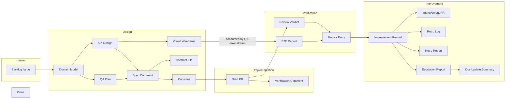

# Artifact Catalog

Every document, object, and record produced in the pipeline — who creates it, who consumes it, and what it looks like.

---

## Artifact Flow



Note: `Doc Update Summary` is produced by the Documentation Keeper after Self-Improver registers success. It is the final artifact in the pipeline before completion.

---

## Production/Consumption Table

| Artifact | Producer | Consumer | Format | Location |
|----------|----------|----------|--------|----------|
| Backlog Issue | Product Owner | Software Architect | GitHub Issue | #N on repo |
| Domain Model | Software Architect | UI/UX Architect, QA Lead | Markdown bullets in spec | Backlog #N comments |
| UX Design section | UI/UX Architect | Software Architect (integration) | Structured markdown | Spec comment |
| Visual Wireframe | UI/UX Architect | QA (visual verification) | Image (PNG/JPEG) | Backlog #N comments |
| QA Plan section | QA Lead | Software Architect, Engineering Lead, QA | Structured markdown | Spec comment |
| Spec Comment | Software Architect | Developer, Engineering Lead, QA | Markdown | Backlog #N comments |
| Contract File | Software Architect | Developer, Engineering Lead | contract.rs / contract.ts | Committed to spec branch |
| Capsule | Software Architect | Developer, Engineering Lead | YAML in sub-issue | Sub-issue under #N |
| Verification Comment | Developer | Engineering Lead | Markdown | Backlog #N comments |
| Draft PR | Developer | Engineering Lead | GitHub PR | feat/ branch → spec branch |
| Review Verdict | Engineering Lead | Software Architect, Self-Improver | Markdown | Backlog #N comments |
| Metrics Entry | Engineering Lead | Self-Improver, Product Owner | JSON object | .opencode/metrics.json |
| E2E Report | QA | Engineering Lead | Markdown + screenshots | Backlog #N comments |
| Improvement Record | Self-Improver | Human, future Self-Improver runs | JSON in metrics entry | .opencode/metrics.json |
| Improvement PR | Self-Improver | Human | GitHub PR | improvements/ branch → main |
| Retro Log Entry | Self-Improver | Humans, future specs | Markdown table row | IMPROVEMENTS.md |
| Retro Report | Self-Improver | Product Owner, Human | Markdown comment | Backlog #N comments |
| Escalation Report | Self-Improver | Human | Markdown comment | Backlog #N comments |
| Doc Update Summary | Documentation Keeper | Human, future agents | Markdown comment | Backlog #N comments |

---

## Artifact Templates

### Backlog Issue

```markdown
## What
<2-3 sentence description>

## Wireframe
<ASCII wireframe if UI feature, or "N/A">

## Behavioral (Gherkin)
- Given <context>, when <action>, then <outcome>

## Non-Behavioral
- <constraint/state/error case>

## Risks / Unknowns
- [Technical: defer to Architect] <...>
```

### Domain Model

```markdown
## Domain Model
- Events arrive via `EventBus::emit()` at `infrastructure/events/mod.rs:45`
- `message.updated` events have NO `content` field — text in `message.part.updated`
- UI consumes via `useStreamEvents` at `shared/hooks/useStreamEvents.ts:30`
```

### UX Design Section

```markdown
## UX Design

### Aesthetic Direction
<direction from frontend-design skill + justification>

### Layout & Hierarchy
<ASCII wireframe or component hierarchy — text description for Developer>

### Visual Wireframe

<Image — canonical visual reference for QA. Annotated with component zones, dimensions, color tokens.>

### Component Choices
| UI element | Component | Props | Why |

### States
| State | Behavior | Visual |

### Accessibility
<color contrast, keyboard nav, screen reader, focus>

### Responsive Behavior
<layout changes at narrow widths>
```

### QA Plan Section

```markdown
## QA Plan

### Test Cases per Requirement
| REQ-ID | Test case | Expected | Type | Edge cases |

### Regression Risks
| Feature | Risk | Why | Mitigation |

### Quality Checklist
| Check | Applies to | Priority |

### Visual Verification Checklist
| Check | Description |
|-------|-------------|
| Rendered output matches visual wireframe | QA compares screenshot against wireframe from UI/UX Architect |
| Theme tokens used (no hardcoded colors) | QA inspects computed styles |
| Component spacing/layout matches spec | Compare rendered layout against UX Design section description |

### Non-Testable Categories
<what QA cannot verify — Engineering Lead covers these>
```

### Spec Comment

```markdown
## Overview
<2-3 sentence description>

## UX Design
<from UI/UX Architect — or "N/A — backend/internal spec">

## Requirements (EARS)

> While `<optional precondition>`, when `<optional trigger>`, the `<system>` shall `<response>`

| Pattern | REQ-ID | Requirement |
|---------|--------|-------------|
| Ubiquitous | REQ-1 | The system shall ... |
| Event-Driven | REQ-2 | When ..., the system shall ... |
| State-Driven | REQ-3 | While ..., the system shall ... |
| Optional | REQ-4 | Where ..., the system shall ... |
| Unwanted | REQ-5 | If ..., then the system shall ... |

### Contract
- Public interface: <what's exposed>
- Events emitted: <FredoEvent types>
- State managed: <persistent vs ephemeral>
- Dependencies: <external modules/APIs>
- Forbidden changes: <files/filesystems never to touch>

## QA Plan
<from QA Lead>

## Acceptance Criteria
| ID | REQ | Description |
|----|-----|-------------|
| AC-1 | REQ-1 | ... |
```

### Contract File (contract.rs / contract.ts)

```rust
// contract.rs — Spec #N
pub trait SpecContract {
    fn req_n_1(&self, input: InputType) -> Result<OutputType>;
    fn req_n_2(&self) -> Result<()>;
}
```

```typescript
// contract.ts — Spec #N
export interface SpecContract {
    req_n_1(input: InputType): Promise<OutputType>;
    req_n_2(): Promise<void>;
}
```

### Capsule (YAML in Sub-Issue)

```yaml
## Capsule
requirement_ids: [REQ-1, REQ-2]
allowed_files:
  - src/ui/features/dark-mode/**
  - src/ui/shared/ThemeContext.tsx
forbidden_changes:
  - src/ui/features/query-viewer/**
  - apps/tauri/src-tauri/**
acceptance_criteria:
  - Toggle renders in settings panel
  - Toggle persists preference to localStorage
  - System preference respected on first load
patterns:
  - Feature class: see src/features/dashboard/DashboardFeature.tsx
  - Theme tokens: see apps/ui/src/app/theme/system.ts
key_files:
  - src/app/providers/ThemeProvider.tsx
  - src/shared/classes/FredoFeatureClass.ts
spec_branch: spec/N-slug
tests: required
```

### Verification Comment

```markdown
## Capsule: <name> — Implementation Notes

### Stats
- Files modified: N (M allowed_files, K infra auto-permits)
- Acceptance criteria: X/Y met (Z blocked)
- Build: PASSED / FAILED
- Tests: P passed, F failed, S skipped

### Acceptance Criteria
- [x] AC-1 description
- [ ] AC-2 description (blocked — reason)

### Notes
<any implementation decisions>

---
*Authored by Developer*
```

### Review Verdict

```markdown
## Review Results

### PR #X — Capsule: <name>
Verdict: APPROVED / CHANGES REQUESTED
- <per-checklist findings>

---
*Authored by Engineering Lead*
```

### E2E Report

```markdown
## E2E Test Results — Backlog #N

| AC | REQ | Capsule | Test Case | Result | Evidence | Screenshot |
|----|-----|---------|-----------|--------|----------|------------|
| AC-1 | REQ-1 | Capsule: X (#Y) | TC-1: Toggle renders | PASS | Element in accessibility tree |  |
| AC-2 | REQ-2 | Capsule: X (#Y) | TC-2: Toggle persists | FAIL | localStorage key missing |  |

### Summary
- Total ACs: 3 / Passed: 2 / Failed: 1
- Failed: AC-2 → REQ-2 → Capsule: X (#Y)

---
*Authored by QA*
```

### Metrics Entry (with Improvement Records)

```json
{
  "tasks": 4,
  "merged": 4,
  "bugs": 0,
  "retries": [0, 0, 0, 0],
  "architect_issues": [],
  "reviewer_issues": [],
  "top_failure": "none",
  "passed": true,
  "one_shot": true,
  "total_cycles": 1,
  "follow_up_specs": [],
  "passed_e2e": true,
  "closed_as": "ready_for_review",
  "root_cause": "none",
  "capsules_first_pass": 4,
  "capsules_total": 4,
  "improvements": [
    {
      "attempt": 1,
      "target": "agent_prompt",
      "file": ".opencode/agents/developer.md",
      "strategy": "added_negative_example",
      "strategy_category": "agent_prompt",
      "failure_addressed": "scope_violation",
      "validation": {
        "acceptance": true,
        "attribution": true,
        "improvement": "improved"
      },
      "delta": {
        "capsules_first_pass": { "before": 2, "after": 4 },
        "reviewer_issues": { "before": 3, "after": 0 },
        "reviewer_issues_scope_violation": { "before": 2, "after": 0 }
      }
    }
  ],
  "improvement_cycles": 1,
  "timestamp": "2026-07-11T00:00:00Z"
}
```

#### Improvement Record Fields

| Field | Type | Meaning |
|-------|------|---------|
| `attempt` | int | Which mutation attempt this was (1-based) |
| `target` | string | `agent_prompt`, `script`, `skill`, or `observability` |
| `file` | string | Path to the file modified |
| `strategy` | string | What was done (e.g. `added_negative_example`, `fixed_validation`, `added_recipe`) |
| `strategy_category` | string | Which of the 4 categories: `agent_prompt`, `script`, `skill`, `observability` |
| `failure_addressed` | string | The `top_failure` or error category being fixed |
| `validation` | object | Three-gate results |
| `validation.acceptance` | bool | Gate 1: did the spec pass? |
| `validation.attribution` | bool | Gate 2: was the pass caused by this improvement? |
| `validation.improvement` | string | Gate 3: `improved`, `neutral`, or `regressed` |
| `delta` | object | Before/after metrics pairs for key indicators |

### Improvement PR

```markdown
## Retro Improvements — Spec #N

### Changes
| File | Change | Evidence | Validation |
|------|--------|----------|------------|
| developer.md | Added scope_violation negative example | reviewer_issues: "scope violation in capsule 3" | acceptance: ✓, attribution: ✓, improvement: improved |
| IMPROVEMENTS.md | Active guardrail: ReactFlow deps check | Cross-spec: same bug in #275, #523 | N/A (cross-spec) |
```

### Retro Report

```markdown
## Retro Report — Spec #N

### Key Findings
- Capsules: M/total merged, X first-pass
- Top failure: <category>
- Improvement cycles: <count>
- Script errors: <count>

### Improvements Applied
| Attempt | Target | Strategy | Acceptance | Attribution | Improvement |
|---------|--------|----------|------------|-------------|--------------|
| 1 | agent_prompt | added_negative_example | ✓ | ✓ | improved |

### Cross-Spec Patterns
<List detected — with spec references>

### Improvement PR
PR #Y: <N> files changed
<List of changes>

---
*Authored by Self-Improver*
```

### Escalation Report

```markdown
## Escalation — Spec #N

### What Failed
<summary of the acceptance criteria not met>

### What We Tried
| Attempt | Target | Strategy | Acceptance | Attribution | Why Failed |
|---------|--------|----------|------------|-------------|------------|
| 1 | agent_prompt | added_negative_example | ✓ | ✗ | Spec passed but scope_violation still present |
| ... | ... | ... | ... | ... | ... |
| 12 | observability | added_logging | ✗ | — | Spec still failing |

### Strategy Categories Exhausted
- agent_prompt: 3 attempts — all failed attribution
- script: 3 attempts — 2 failed acceptance, 1 failed attribution
- skill: 3 attempts — all failed acceptance
- observability: 3 attempts — all failed acceptance

### Decision Needed
Human review required. Options: accept partial state, abandon spec, or provide new direction.

---
*Authored by Self-Improver*
```

### Doc Update Summary

```markdown
## Documentation Sync — Spec #N

### Docs Updated
| Doc | What changed | Why |
|-----|-------------|-----|
| ARCHITECTURE.md | Added <module> section | New Rust module in spec |
| CLI_GUIDE.md | Added `fredo <cmd>` entry | New CLI command added |
| workflow/01-agents.md | Added Documentation Keeper profile | New agent |
| FAQ.md | Added "How to <action>" entry | Feature users may ask about |

### Docs Skipped
| Doc | Reason |
|-----|--------|
| SETUP.md | No new dependencies added |
| SECURITY.md | No new surface area |

---
*Authored by Documentation Keeper*
```
