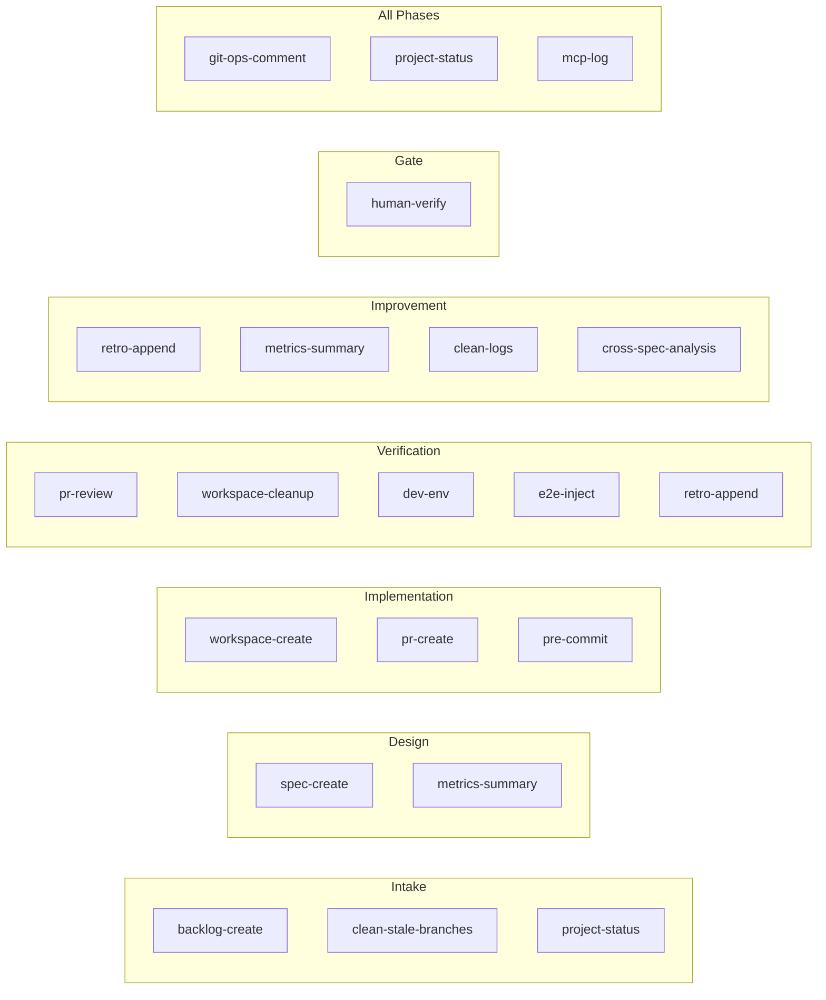

# Pipeline Scripts

All `.opencode/scripts/` — purpose, callers, phase, and known issues.

---

## Script Catalog

| Script | Purpose | Called by | Phase |
|--------|---------|-----------|-------|
| `backlog-create.ps1` | Create backlog or bug issue + add to project. Use `--Label bug` for bugs. | Product Owner | Intake |
| `spec-create.ps1` | Post spec comment + create spec branch | Software Architect | Design |
| `workspace-create.ps1` | Create git worktree from spec/fix branch | Developer | Implementation |
| `pr-create.ps1` | Create draft PR from worktree branch | Developer | Implementation |
| `pr-review.ps1` | Approve + merge PR, or request changes | Engineering Lead | Verification |
| `project-status.ps1` | Set project status (Backlog/Planning/Coding/Reviewing/E2E/Done) | Product Owner, Software Architect, Engineering Lead | All |
| `retro-append.ps1` | Append to metrics.json or IMPROVEMENTS.md | Engineering Lead, Self-Improver | Verification, Improvement |
| `metrics-summary.ps1` | Read metrics.json with optional `-Json` flag | Software Architect, Self-Improver | Design, Improvement |
| `git-ops-comment.ps1` | Post a comment on a GitHub issue via `--body-file` | All agents | All |
| `clean-stale-branches.ps1` | Scan or delete stale spec/feat/worktree branches | Product Owner, Engineering Lead | Intake, Verification |
| `workspace-cleanup.ps1` | Remove Developer worktrees | Engineering Lead | Verification |
| `dev-env.ps1` | Dev instance lifecycle (Up/Down/Status/Restart/Logs) | QA, Engineering Lead | Verification |
| `e2e-inject.ps1` | Validated wrapper for `fredo emit` (state casing, provider format, BOM stripping) | QA | Verification |
| `pre-commit.ps1` | Block commits to `main` locally | Developer (automated) | Implementation |
| `test-scripts.ps1` | Run all pipeline script tests | CI, manual | N/A |
| `clean-logs.ps1` | Truncate dev env logs + script-errors.jsonl after spec success | Self-Improver | Improvement |
| `cross-spec-analysis.ps1` | Analyze metrics.json for recurring failure patterns across specs | Self-Improver | Improvement |
| `human-verify.ps1` | Mark spec as human-verified or leaky in metrics.json | Product Owner, Human | Gate |
| `mcp-log.ps1` | Log MCP tool errors to mcp-errors.jsonl | Any agent | All |

---

## Script → Phase Map

---

## Script Profiles

### backlog-create.ps1
- **Args:** `-Title "<title>" -BodyFile <path>`
- **Does:** Creates GitHub issue → sets labels → adds to project. Strips common prefixes (`BL#NNN-`, `SP#NNN-`) from title.
- **Known issue:** `gh project item-create --url` flag intermittently fails → issue not in project → `project-status.ps1` fails for entire spec lifecycle

### spec-create.ps1
- **Args:** `-Title "<title>" -Branch "<branch>" -BodyFile <path> -BacklogIssue <N>`
- **Does:** Posts spec comment → creates spec branch → sets project status to Planning. No longer creates a main PR — the Engineering Lead creates the PR at spec completion.
- **Note:** Posts the spec comment automatically — do NOT call `git-ops-comment.ps1` separately

### workspace-create.ps1
- **Args:** `-BacklogIssue <N> -SpecBranch <branch> -CapsuleName "<name>"`
- **Does:** `git worktree add .worktrees/workspace-<N>-<slug> <spec-branch>` → creates isolated workspace

### pr-create.ps1
- **Args:** `-BacklogIssue <N> -SpecBranch <branch> -CapsuleName "<name>"`
- **Does:** Creates DRAFT PR from worktree branch → spec branch. Auto-derives base/head/title from capsule params.

### pr-review.ps1
- **Args:** `-Action approve|request-changes -PrNumber <N> -SpecBranch <branch> -ReviewFile <path>`
- **Does:** Posts approval review → merges PR (squash + delete branch). Request-changes returns feedback without posting a public comment — EL handles retry silently.

### project-status.ps1
- **Args:** `-IssueNumber <N> -Status Backlog|Planning|Coding|Reviewing|E2E|Done`
- **Does:** Sets project status on the backlog issue
- **Known issue:** Fails if backlog-create never added issue to project (see backlog-create known issue)

### retro-append.ps1
- **Args:** `-Mode retro|metrics|both -BacklogIssue <N> -BodyFile <path>`
- **Does:** `retro` → appends table row to IMPROVEMENTS.md. `metrics` → appends JSON entry to metrics.json. `both` → does both.

### metrics-summary.ps1
- **Args:** `-Json` (optional)
- **Does:** Reads and formats metrics.json. `-Json` returns raw JSON for programmatic parsing. Used by Software Architect (review past metrics for failure patterns) and Self-Improver (read current + previous attempts for before/after comparison).

### git-ops-comment.ps1
- **Args:** `-IssueNumber <N> -BodyFile <path>`
- **Does:** Posts comment on GitHub issue via `gh issue comment --body-file`. Preferred over direct `gh` CLI for encoding reliability.

### dev-env.ps1
- **Args:** `-Action Up|Down|Status|Restart|Logs -TimeoutSecs <N>`
- **Does:** Full dev instance lifecycle. `WaitForReady` blocks until Vite + Tauri respond.

### e2e-inject.ps1
- **Args:** `--state <lowercase> --provider <hyphenated> --event-type <underscore> --session-id <uuid> --tool-name <name> --payload <json>`
- **Does:** Validated wrapper for `fredo emit` — enforces correct casing/format. Use lowercase state (`init`, `update`, `response`, `error`), hyphenated provider (`open-code`, `claude-code`, `internal`), underscore event type (`tool_use`, `chat`, `agent_session`).

### clean-logs.ps1
- **Args:** none
- **Does:** Truncates dev environment logs (`dev-env-stderr.log`, `dev-env-stdout.log`) and `script-errors.jsonl` after successful spec completion. Called by Self-Improver during Step 8 (Register Success) to ensure each spec starts from a clean log slate. Never called during active spec execution.

### cross-spec-analysis.ps1
- **Args:** `-LastN <N>` (default 10), `-Json` (output as JSON), `-Verbose`
- **Does:** Reads `metrics.json`, sorts specs by number descending, and identifies recurring failure patterns (`top_failure`, `reviewer_issues`, `architect_issues`) across the last N specs. Used by Self-Improver to detect systemic patterns for proactive guardrail creation.

### human-verify.ps1
- **Args:** `-BacklogIssue <N> -Verified` or `-Leaky [-Reason "<text>"]` or `-Status`
- **Does:** Sets `human_verified` and `result` fields in `metrics.json` for a spec. `-Verified` marks a spec as human-confirmed. `-Leaky` flags it as having issues found during manual testing with an optional reason. `-Status` displays current verification state. Called by the Product Owner or human during the Self-Improvement gate when results need manual judgment.

### mcp-log.ps1
- **Args:** `-Tool "<name>" -Error "<message>" [-Issue "<N>"] [-Agent "<name>"]`
- **Does:** Appends a JSONL entry to `mcp-errors.jsonl` in `.opencode/state/` with tool name, error message, optional issue number and agent name. Called by any agent when an MCP tool call fails to surface tool errors for diagnostic review.

---

## Common Error Scenarios

| Error | Cause | Fix |
|-------|-------|-----|
| `project-status.ps1` fails "Issue not found in project" | backlog-create `--url` flag failed | Wait or manually add issue to project |
| `workspace-cleanup.ps1` fails "main working tree" | Run from main worktree, not a linked worktree | Script now detects and skips main — handled |
| `fredo emit` events silently dropped | PascalCase state or underscore provider | Use lowercase + hyphenated: `--state init --provider open-code` |
| Script errors accumulate across Self-Improvement cycles | Script failing on repeated POC runs | Self-Improver classifies as `script` failure → improves or mutates |
