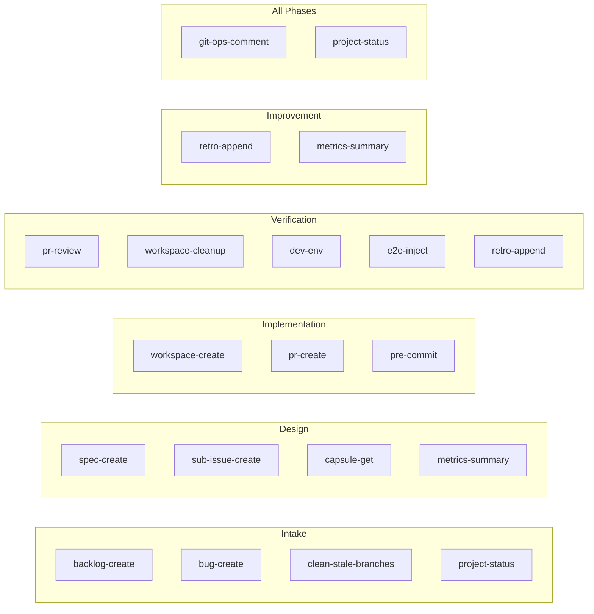

# Pipeline Scripts

All `.opencode/scripts/` — purpose, callers, phase, and known issues.

---

## Script Catalog

| Script | Purpose | Called by | Phase |
|--------|---------|-----------|-------|
| `backlog-create.ps1` | Create backlog issue + add to project | Product Owner | Intake |
| `bug-create.ps1` | Create standalone bug issue | Product Owner, Engineering Lead | Intake, Verification |
| `spec-create.ps1` | Post spec comment + create spec branch + empty main PR | Software Architect | Design |
| `sub-issue-create.ps1` | Create capsule sub-issue under parent | Software Architect | Design |
| `capsule-get.ps1` | List sub-issues or read single capsule body | Software Architect, Developer, Engineering Lead, QA | Design, Implementation, Verification |
| `workspace-create.ps1` | Create git worktree from spec/fix branch | Developer | Implementation |
| `pr-create.ps1` | Create draft PR from worktree branch | Developer | Implementation |
| `pr-review.ps1` | Approve + merge PR + close sub-issue, or request changes | Engineering Lead | Verification |
| `project-status.ps1` | Set project status (Backlog/Planning/Coding/Reviewing/E2E/Done) | Product Owner, Software Architect, Engineering Lead | All |
| `retro-append.ps1` | Append to metrics.json or IMPROVEMENTS.md | Engineering Lead, Self-Improver | Verification, Improvement |
| `metrics-summary.ps1` | Read metrics.json with optional `-Json` flag | Software Architect, Self-Improver | Design, Improvement |
| `git-ops-comment.ps1` | Post a comment on a GitHub issue via `--body-file` | All agents | All |
| `clean-stale-branches.ps1` | Scan or delete stale spec/feat/worktree branches | Product Owner, Engineering Lead | Intake, Verification |
| `workspace-cleanup.ps1` | Remove Developer worktrees | Engineering Lead | Verification |
| `dev-env.ps1` | Dev instance lifecycle (Up/Down/Status/Restart/Logs) | QA, Engineering Lead | Verification |
| `e2e-inject.ps1` | Validated wrapper for `fredo emit` (state casing, provider format, BOM stripping) | QA | Verification |
| `pre-commit.ps1` | Block commits to `main` locally | Developer (automated) | Implementation |
| `test-scripts.ps1` | Run all pipeline script tests | CI, manual | N/A |

---

## Script → Phase Map

---

## Script Profiles

### backlog-create.ps1
- **Args:** `-Title "<title>" -BodyFile <path>`
- **Does:** Creates GitHub issue → sets labels → adds to project. Strips common prefixes (`BL#NNN-`, `SP#NNN-`) from title.
- **Known issue:** `gh project item-create --url` flag intermittently fails → issue not in project → `project-status.ps1` fails for entire spec lifecycle

### spec-create.ps1
- **Args:** `-Title "<title>" -Branch "<branch>" -BodyFile <path> -BacklogIssue <N>`
- **Does:** Posts spec comment → creates spec branch → creates empty draft PR main ← spec → sets project status to Planning. Deletes `$BodyFile` after posting.
- **Note:** Posts the spec comment automatically — do NOT call `git-ops-comment.ps1` separately

### sub-issue-create.ps1
- **Args:** `-ParentIssue <N> -Title "<title>" -BodyFile <path> [-Label "<label>"]`
- **Does:** Creates child issue → attempts `addSubIssue` mutation. Optional `-Label` applies a label to the sub-issue.
- **Known issue:** `addSubIssue` GraphQL mutation chronically fails with `"Argument 'issueId' on InputObject 'AddSubIssueInput' has an invalid value"` (50+ errors across 20+ specs). Script no longer throws — logs warning, returns child issue number. Always verify linkage via `gh issue view <N> --json subIssues` after creation.

### capsule-get.ps1
- **Args:** `-ParentIssue <N>` (list all) or `-SubIssueNumber <X>` (read one)
- **Does:** Lists sub-issues or reads single capsule YAML body

### workspace-create.ps1
- **Args:** `-BacklogIssue <N> -SpecBranch <branch> -CapsuleName "<name>"`
- **Does:** `git worktree add .worktrees/workspace-<N>-<slug> <spec-branch>` → creates isolated workspace

### pr-create.ps1
- **Args:** `-BacklogIssue <N> -SpecBranch <branch> -CapsuleName "<name>"`
- **Does:** Creates DRAFT PR from worktree branch → spec branch. Auto-derives base/head/title from capsule params.

### pr-review.ps1
- **Args:** `-Action approve -PrNumber <N> -SpecBranch <branch> -ReviewFile <path> -SubIssueNumber <N>`
- **Does:** Posts review → merges PR (squash + delete branch) → closes sub-issue atomically

### project-status.ps1
- **Args:** `-IssueNumber <N> -Status Backlog|Planning|Coding|Reviewing|E2E|Done`
- **Does:** Sets project status on the backlog issue
- **Known issue:** Fails if backlog-create never added issue to project (see backlog-create known issue)

### retro-append.ps1
- **Args:** `-Mode retro|metrics|both -BacklogIssue <N> -BodyFile <path>`
- **Does:** `retro` → appends table row to IMPROVEMENTS.md. `metrics` → appends JSON entry to metrics.json. `both` → does both.

### metrics-summary.ps1
- **Args:** `-Json` (optional)
- **Does:** Reads and formats metrics.json. `-Json` returns raw JSON for programmatic parsing. Used by Software Architect (review past metrics for failure patterns) and Self-Improver (read current + previous attempts for before/after comparison).

### git-ops-comment.ps1
- **Args:** `-IssueNumber <N> -BodyFile <path>`
- **Does:** Posts comment on GitHub issue via `gh issue comment --body-file`. Preferred over direct `gh` CLI for encoding reliability.

### dev-env.ps1
- **Args:** `-Action Up|Down|Status|Restart|Logs -TimeoutSecs <N>`
- **Does:** Full dev instance lifecycle. `WaitForReady` blocks until Vite + Tauri respond.

### e2e-inject.ps1
- **Args:** `--state <lowercase> --provider <hyphenated> --event-type <underscore> --session-id <uuid> --tool-name <name> --payload <json>`
- **Does:** Validated wrapper for `fredo emit` — enforces correct casing/format. Use lowercase state (`init`, `update`, `response`, `error`), hyphenated provider (`open-code`, `claude-code`, `internal`), underscore event type (`tool_use`, `chat`, `agent_session`).

---

## Common Error Scenarios

| Error | Cause | Fix |
|-------|-------|-----|
| `project-status.ps1` fails "Issue not found in project" | backlog-create `--url` flag failed | Wait or manually add issue to project |
| `sub-issue-create.ps1` warns "addSubIssue mutation failed" | GraphQL rejects issue global node ID | Capsule IS created — verify linkage; fall back to posting capsule as comment |
| `workspace-cleanup.ps1` fails "main working tree" | Run from main worktree, not a linked worktree | Script now detects and skips main — handled |
| `fredo emit` events silently dropped | PascalCase state or underscore provider | Use lowercase + hyphenated: `--state init --provider open-code` |
| Script errors accumulate across Self-Improvement cycles | Script failing on repeated POC runs | Self-Improver classifies as `script` failure → improves or mutates |
