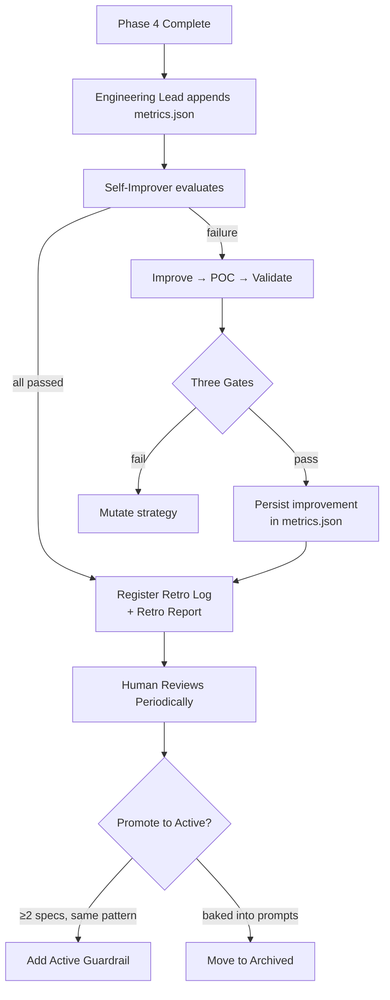

# Metrics & Improvement Validation

The feedback loop that makes each spec better than the last. Two subsystems: **metrics tracking** (what happened) and **improvement validation** (did our fix work?).

---

## Metrics Collection Flow



---

## metrics.json Schema

### Spec-Level Fields

| Field | Type | Set by | Meaning |
|-------|------|--------|---------|
| `tasks` | int | Engineering Lead | Total capsule count |
| `merged` | int | Engineering Lead | Capsules successfully merged to spec branch |
| `bugs` | int | Engineering Lead | Bug reports posted |
| `retries` | int[] | Engineering Lead | Attempt count per PR. `0` = first-pass merge |
| `architect_issues` | string[] | Engineering Lead | Gaps found during EARS coverage check |
| `reviewer_issues` | string[] | Engineering Lead | Capsule defects found during review |
| `top_failure` | string | Engineering Lead | Most frequent failure category |
| `passed` | bool | Engineering Lead | All capsules merged with no bugs |
| `one_shot` | bool | Engineering Lead | All first-pass + no bugs + passed e2e + no follow-ups + no improvement cycles |
| `total_cycles` | int | Engineering Lead | Spec-level pipeline re-execution rounds |
| `follow_up_specs` | int[] | Engineering Lead | Backlog numbers spawned to fix this spec |
| `passed_e2e` | bool | Engineering Lead | All user-observable ACs passed |
| `closed_as` | string | Engineering Lead | `ready_for_review`, `abandoned`, or `deferred` |
| `root_cause` | string | Engineering Lead | Fundamental failure reason |
| `capsules_first_pass` | int | Engineering Lead | Merged on review attempt 1 |
| `capsules_total` | int | Engineering Lead | Total capsules (should equal `tasks`) |
| `improvements` | object[] | Self-Improver | Improvement records applied during self-improvement (see below) |
| `improvement_cycles` | int | Self-Improver | How many times the Self-Improver was invoked for this spec |
| `timestamp` | ISO 8601 | Engineering Lead | When review completed |

### Improvement Record Fields (`improvements[]`)

| Field | Type | Set by | Meaning |
|-------|------|--------|---------|
| `attempt` | int | Self-Improver | Which mutation attempt (1-based, resets per strategy rotation) |
| `target` | string | Self-Improver | `agent_prompt`, `script`, `skill`, or `observability` |
| `file` | string | Self-Improver | Path to the file modified |
| `strategy` | string | Self-Improver | What was done (e.g. `added_negative_example`, `fixed_validation`) |
| `strategy_category` | string | Self-Improver | Which of 4 categories: `agent_prompt`, `script`, `skill`, `observability` |
| `failure_addressed` | string | Self-Improver | The `top_failure` or error category being fixed |
| `validation.acceptance` | bool | Self-Improver | Gate 1: did the spec meet acceptance criteria after this improvement? |
| `validation.attribution` | bool | Self-Improver | Gate 2: was the pass caused by this improvement (not coincidence)? |
| `validation.improvement` | string | Self-Improver | Gate 3: `improved`, `neutral`, or `regressed` |
| `delta` | object | Self-Improver | Before/after metrics pairs for key indicators |

### Example: Spec with One Improvement Cycle

```json
{
  "tasks": 4,
  "merged": 4,
  "bugs": 0,
  "retries": [0, 0, 0, 0],
  "architect_issues": [],
  "reviewer_issues": [],
  "top_failure": "none",
  "passed": true,
  "one_shot": false,
  "total_cycles": 2,
  "follow_up_specs": [],
  "passed_e2e": true,
  "closed_as": "ready_for_review",
  "root_cause": "none",
  "capsules_first_pass": 4,
  "capsules_total": 4,
  "improvements": [
    {
      "attempt": 1,
      "target": "agent_prompt",
      "file": ".opencode/agents/developer.md",
      "strategy": "added_negative_example",
      "strategy_category": "agent_prompt",
      "failure_addressed": "scope_violation",
      "validation": {
        "acceptance": true,
        "attribution": true,
        "improvement": "improved"
      },
      "delta": {
        "capsules_first_pass": { "before": 2, "after": 4 },
        "reviewer_issues": { "before": 3, "after": 0 },
        "reviewer_issues_scope_violation": { "before": 2, "after": 0 }
      }
    }
  ],
  "improvement_cycles": 1,
  "timestamp": "2026-07-11T00:00:00Z"
}
```

### Example: Spec with Multiple Mutations

```json
{
  "tasks": 4,
  "merged": 4,
  "passed": true,
  "passed_e2e": true,
  "improvements": [
    {
      "attempt": 1,
      "target": "agent_prompt",
      "strategy_category": "agent_prompt",
      "strategy": "added_negative_example",
      "failure_addressed": "scope_violation",
      "validation": { "acceptance": true, "attribution": false, "improvement": "neutral" }
    },
    {
      "attempt": 2,
      "target": "agent_prompt",
      "strategy_category": "agent_prompt",
      "strategy": "added_checklist_item",
      "failure_addressed": "scope_violation",
      "validation": { "acceptance": true, "attribution": false, "improvement": "neutral" }
    },
    {
      "attempt": 3,
      "target": "agent_prompt",
      "strategy_category": "agent_prompt",
      "strategy": "strengthened_forbidden_changes_rule",
      "failure_addressed": "scope_violation",
      "validation": { "acceptance": true, "attribution": false, "improvement": "neutral" }
    },
    {
      "attempt": 1,
      "target": "script",
      "strategy_category": "script",
      "strategy": "added_pre_commit_validation",
      "file": ".opencode/scripts/pre-commit.ps1",
      "failure_addressed": "scope_violation",
      "validation": { "acceptance": true, "attribution": true, "improvement": "improved" }
    }
  ],
  "improvement_cycles": 2,
  "one_shot": false,
  "timestamp": "2026-07-11T00:00:00Z"
}
```

Note: attempts 1-3 tried `agent_prompt` strategies — all passed acceptance but failed attribution (the spec passed, but scope violations persisted). On attempt 4, the Self-Improver rotated to `script` strategy — added pre-commit validation. This passed all three gates. The improvement was causal and measurable.

---

## Three-Gate Validation Framework

The Self-Improver validates every improvement through three sequential gates. Each gate must pass before the next is evaluated.

### Gate 1: Acceptance — "Did the spec meet acceptance criteria?"

Binary gate. The spec must pass. No partial credit.

| Check | Source | Fail if |
|-------|--------|---------|
| All capsules merged | `tasks == merged` in metrics.json | Any capsule unmerged |
| e2e tests pass | `passed_e2e == true` | Any user-observable AC fails |
| No open bug issues | `bugs == 0` | Any bug report filed for this spec |

**On failure:** improvement did not work. Mutate strategy (try different approach).

**On pass:** proceed to Gate 2.

### Gate 2: Attribution — "Can we attribute the pass to this improvement?"

Causality check. Prevents false positives where the spec happened to pass but our improvement was irrelevant.

| Check | Source | Fail if |
|-------|--------|---------|
| Targeted failure absent from this run | `top_failure` changed from previous attempt | Same failure category appears again |
| Targeted capsule passed first-attempt | `retries[target] == 0` | Same capsule still needed retries |
| Targeted script produced zero errors | `script-errors.jsonl` count == 0 | Same script still failing |

**On failure:** improvement was noise — the spec passed for other reasons. Discard this improvement, try different strategy.

**On pass:** the improvement is causally linked to the spec passing. Proceed to Gate 3.

| acceptance | attribution | Meaning | Action |
|-----------|-------------|---------|--------|
| true | true | Improvement was causal AND spec passed | Keep it, proceed to Gate 3 |
| true | false | Spec passed for other reasons — improvement wasn't what fixed it | Discard improvement, mutate strategy |
| false | true | Targeted failure fixed but something ELSE broke | Unlikely — indicates regression, mutate |
| false | false | Improvement didn't fix anything | Obvious failure, mutate strategy |

### Gate 3: Improvement — "Did overall quality measurably improve?"

Before/after comparison. The improvement made things better, not worse.

| Metric | Direction | Meaning |
|--------|-----------|---------|
| `capsules_first_pass` | Increase | Capsules are clearer, less rework needed |
| `retries` per capsule | Decrease | Less review churn |
| `reviewer_issues` count | Decrease | Fewer defects caught at review |
| `total_cycles` | Decrease | Less pipeline re-execution |
| `script_errors` for target | Decrease | Script fix worked |
| `bugs` | Decrease | Fewer bug reports |

**Decision rules:**

| Delta | Action |
|-------|--------|
| Metrics **improved** | Keep improvement, persist in metrics.json, document in Retro Report, restart pipeline |
| Metrics **unchanged** | Keep improvement (it didn't hurt), persist, restart |
| Metrics **regressed** | Revert improvement from spec branch, flag in metrics, try different strategy |

---

## Signal Table

How to read metrics for improvement:

| Metrics field | Signal | Action |
|---------------|--------|--------|
| `reviewer_issues` | Capsule contract gaps, pattern violations, missing key_files | Strengthen capsule rules in Architect prompt |
| `architect_issues` | Decomposition flaws, REQ coverage, forbidden_changes gaps | Add EARS coverage checklist items |
| `top_failure` (recurring ≥2 specs) | Systemic failure category | Create Active guardrail in IMPROVEMENTS.md |
| `retries` with values >1 across specs | Unclear capsule contracts or wrong patterns | Add negative examples to capsule design rules |
| `root_cause` = `no_upfront_research` | Architect skipped Research Phase | Strengthen Step 1b mandatory language |
| `improvement_cycles` > 3 | Spec is resisting autonomous fixes | Human should review the spec design |
| `validation.attribution` false in multiple attempts | Improvement strategy not targeting root cause | Self-Improver should rotate strategy categories |
| `validation.improvement: "regressed"` | Improvement caused collateral damage | Revert + try more targeted approach |

---

## Root Cause Taxonomy

| root_cause | Meaning | Typical fix |
|------------|---------|-------------|
| `no_upfront_research` | Architect designed without understanding problem domain | Mandatory Research Phase, real data tracing |
| `cross_capsule_conflict` | Same source file assigned to multiple capsules | Exclusive file ownership, contract file pre-commit |
| `cross_capsule_dependency` | Capsule A depends on capsule B's code | Combine capsules or split into separable sub-REQs |
| `spec_contract_conflict` | Capsule AC conflicts with real API/SDK behavior | Research Phase: trace real data flows before designing ACs |
| `forbidden_changes` | Developer modified files outside allowed_files | Strengthen capsule scope rules + negative examples |
| `scope_violation` | Developer added features not in requirement_ids | Add Wrong/Right negative examples to Developer prompt |
| `none` | No systemic failure | — |

---

## IMPROVEMENTS.md Lifecycle

```
┌────────────┐     ┌────────────┐     ┌────────────┐
│  Active    │────→│  Archived  │     │ Retro Log  │
│ Guardrails │     │ Guardrails  │     │ (per-spec) │
│ (enforced) │     │ (baked in)  │     │ (historical)│
└────────────┘     └────────────┘     └────────────┘
      ↑                                      ↑
      │                                      │
   Human writes                       Self-Improver appends
   (after review)                     (automatic)
```

### Sections

| Section | Author | Trigger | Content |
|---------|--------|---------|---------|
| **Active** | Human | After reviewing completed spec's metrics + retro | Guardrails agents MUST follow — backed by prompt, script, or pipeline step |
| **Archived** | Human | When guardrail baked into prompts or obsolete | Former Active entries no longer in effect |
| **Retro Log** | Self-Improver | After spec success (with or without improvement cycles) | Per-spec summary: date, result, key lesson |

### Promotion Flow (Human-Driven)
1. Spec completes → Self-Improver appends Retro Log
2. Engineering Lead appends metrics.json entry
3. Self-Improver appends improvement records (if any)
4. Human reviews metrics → `reviewer_issues`, `top_failure`, `improvements[]`, `improvement_cycles`
5. Human reviews Retro Log entry
6. For patterns appearing in ≥2 specs → promote to Active guardrail
7. For guardrails now baked into prompts → archive

---

## Guardrail Categories

| Category | Example | Signal |
|----------|---------|--------|
| **Architect prompt** | "Must complete Research Phase with Domain Model" | `top_failure: no_upfront_research` |
| **Developer prompt** | "Build ReactFlow edges in separate pass after all nodes" | `reviewer_issues` mentioning "edges disappeared" |
| **Engineering Lead checklist** | "Verify file overlap — no source file in >1 capsule" | `top_failure: cross_capsule_conflict` |
| **Pipeline script** | "dev-env.ps1 restarts dev instance on webview freeze" | Script errors in `script-errors.jsonl` |
| **CLI format** | "fredo emit uses lowercase state, hyphenated provider" | E2E cycles lost to CLI arg format |
| **Process gate** | "Strategy exhaustion → escalate to human" | `improvement_cycles` > 12 across strategies |
