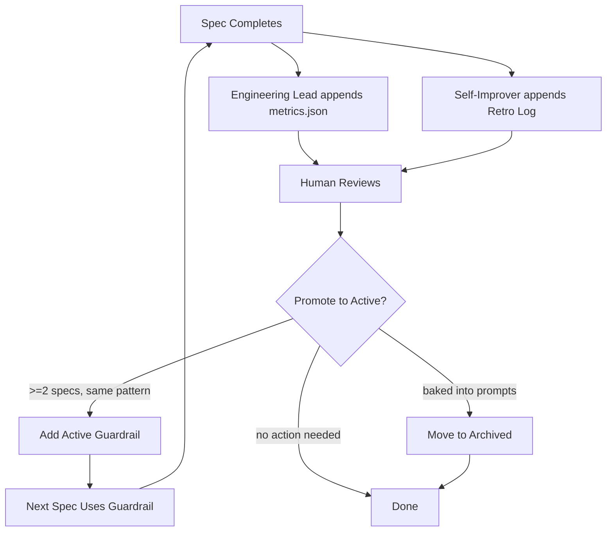

# Metrics & Continuous Improvement

The feedback loop that makes each spec better than the last.

---

## Improvement Cycle



---

## metrics.json Schema

| Field | Type | Set by | Meaning |
|-------|------|--------|---------|
| `tasks` | int | Engineering Lead | Total capsule count |
| `merged` | int | Engineering Lead | Capsules successfully merged to spec branch |
| `bugs` | int | Engineering Lead | Bug reports posted (standalone issues or comments) |
| `retries` | int[] | Engineering Lead | Attempt count per PR. `0` = first-pass merge. `[2, 0, 1, 4]` = PR1 took 2 retries, PR2 first-pass, etc. |
| `architect_issues` | string[] | Engineering Lead | Gaps found during EARS coverage check (step 0b) |
| `reviewer_issues` | string[] | Engineering Lead | Capsule defects found during review (scope, patterns, contract) |
| `top_failure` | string | Engineering Lead | Most frequent failure category: `cross_capsule_conflict`, `no_upfront_research`, `forbidden_changes`, `scope_violation`, `none` |
| `passed` | bool | Engineering Lead | All capsules merged with no bugs |
| `one_shot` | bool | Engineering Lead | All capsules first-pass + no bug-fix cycles + passed e2e + no follow-up specs |
| `total_cycles` | int | Engineering Lead | Spec-level e2e retry rounds (counts Planner-initiated `## Bug — E2E Failure` comments) |
| `follow_up_specs` | int[] | Engineering Lead | Backlog issue numbers spawned to fix this spec |
| `passed_e2e` | bool | Engineering Lead | All user-observable ACs passed DOM-based testing |
| `closed_as` | string | Engineering Lead | `ready_for_review` (main PR marked ready), `abandoned`, or `deferred` |
| `root_cause` | string | Engineering Lead | Fundamental failure reason: `no_upfront_research`, `cross_capsule_conflict`, `cross_capsule_dependency`, `spec_contract_conflict`, `none` |
| `capsules_first_pass` | int | Engineering Lead | Capsules that merged on review attempt 1 (retries[x] = 0) |
| `capsules_total` | int | Engineering Lead | Total capsules (should equal `tasks`) |
| `timestamp` | ISO 8601 | Engineering Lead | When review completed |

### Example Entry

```json
{
  "tasks": 4,
  "merged": 4,
  "bugs": 0,
  "retries": [0, 0, 1, 0],
  "architect_issues": [],
  "reviewer_issues": ["forbidden_changes missing in capsule 3"],
  "top_failure": "forbidden_changes",
  "passed": true,
  "one_shot": false,
  "total_cycles": 1,
  "follow_up_specs": [],
  "passed_e2e": true,
  "closed_as": "ready_for_review",
  "root_cause": "none",
  "capsules_first_pass": 3,
  "capsules_total": 4,
  "timestamp": "2026-07-10T22:00:00Z"
}
```

---

## Signal Table

How to read metrics for improvement:

| Metrics field | Signal | Action |
|---------------|--------|--------|
| `reviewer_issues` | Capsule contract gaps, pattern violations, missing key_files | Strengthen capsule rules in Software Architect prompt |
| `architect_issues` | Decomposition flaws, missing REQ coverage, forbidden_changes gaps | Add EARS coverage checklist items |
| `top_failure` (recurring in ≥2 specs) | Systemic failure category | Create Active guardrail in IMPROVEMENTS.md |
| `retries` with values >1 across specs | Unclear capsule contracts or wrong patterns | Add negative examples to capsule design rules |
| `root_cause` = `no_upfront_research` | Architect skipped Research Phase | Strengthen Step 1b mandatory language |
| `root_cause` = `cross_capsule_conflict` | File overlap between capsules | Enforce exclusive file ownership rule |
| `capsules_first_pass` / `capsules_total` < 0.5 | Capsules too complex or poorly scoped | Review capsule decomposition rules |
| `one_shot: false` (recurring) | Pipeline has systemic friction | Check for common failure mode across specs |

---

## IMPROVEMENTS.md Lifecycle

```
┌────────────┐     ┌────────────┐     ┌────────────┐
│  Active    │────→│  Archived  │     │ Retro Log  │
│ Guardrails │     │ Guardrails  │     │ (per-spec) │
│ (enforced) │     │ (baked in)  │     │ (historical)│
└────────────┘     └────────────┘     └────────────┘
      ↑                                      ↑
      │                                      │
   Human writes                       Self-Improver appends
   (after review)                     (automatic)
```

### Sections

| Section | Author | Trigger | Content |
|---------|--------|---------|---------|
| **Active** | Human | After reviewing completed spec's metrics + retro | Guardrails agents MUST follow — backed by prompt, script, or pipeline step |
| **Archived** | Human | When guardrail baked into prompts or obsolete | Former Active entries no longer in effect |
| **Retro Log** | Self-Improver | After code review + e2e passes | Per-spec summary: date, result, key lesson |

### Promotion Flow (Human-Driven)
1. Spec completes → Self-Improver appends Retro Log
2. Engineering Lead appends metrics.json entry
3. Human reads metrics → `reviewer_issues`, `architect_issues`, `top_failure`
4. Human reads Retro Log entry for that spec
5. For each issue that looks like a lasting pattern:
   - **Recurring?** (appears in ≥2 specs) → Active candidate
   - **Actionable?** (can become a prompt, script, or pipeline step) → write guardrail
   - **Not already captured?** (check Active table for duplicates) → add entry
6. Periodically review Active → move baked-in entries to Archived

### Active Guardrail Format
```
| <date> | Spec #N | <guardrail description> | <evidence from metrics/retro> |
```

### Retro Log Format
```
| <date> | #N | <merged>/<total> merged, <bugs> bugs | <one-line observation> |
```

---

## Guardrail Categories

| Category | Example | Signal from metrics |
|----------|---------|---------------------|
| **Architect prompt** | "Must complete Research Phase with Domain Model" | `top_failure: no_upfront_research` |
| **Coder prompt** | "Build ReactFlow edges in separate pass after all nodes" | `reviewer_issues` mentioning "edges disappeared" |
| **Reviewer checklist** | "Verify file overlap — no source file in >1 capsule" | `top_failure: cross_capsule_conflict` |
| **Pipeline script** | "dev-env.ps1 restarts dev instance on webview freeze" | Script errors in `script-errors.jsonl` |
| **CLI format** | "fredo emit uses lowercase state, hyphenated provider" | E2E cycles lost to CLI arg format |
| **Process gate** | "After 2 e2e cycles → ARCHITECTURE ESCALATION" | `total_cycles` > 2 across multiple specs |

---

## Root Cause Taxonomy

| root_cause | Meaning | Fix direction |
|------------|---------|---------------|
| `no_upfront_research` | Architect designed without understanding problem domain | Mandatory Research Phase, Domain Model, real data tracing |
| `cross_capsule_conflict` | Same source file assigned to multiple capsules | Exclusive file ownership, contract file pre-commit |
| `cross_capsule_dependency` | Capsule A depends on capsule B's code | Combine capsules or split into separable sub-requirements |
| `spec_contract_conflict` | Capsule AC conflicts with real API/SDK behavior | Research Phase: trace real data flows before designing ACs |
| `forbidden_changes` | Developer modified files outside allowed_files | Strengthen capsule scope rules + negative examples |
| `scope_violation` | Developer added features not in requirement_ids | Add Wrong/Right negative examples to Developer prompt |
| `none` | No systemic failure | — |

---

## Historical Context

The IMPROVEMENTS.md file and metrics.json database have been maintained since spec #93 (June 2026). As of July 2026: 27 spec entries, 25 Active guardrails, 38 Retro Log entries. Key patterns:

- **#1 failure mode:** `cross_capsule_conflict` (4 specs: #108, #124, #275, #407)
- **#1 abandoned cause:** `no_upfront_research` (#265, #369)
- **#1 script error:** `sub-issue-create.ps1` addSubIssue mutation failure (50+ errors, 20+ specs — fixed in #498)
- **Best practice:** Exploratory performance audits with profiling-first research (#498: 4/4 first-pass, one-shot)
