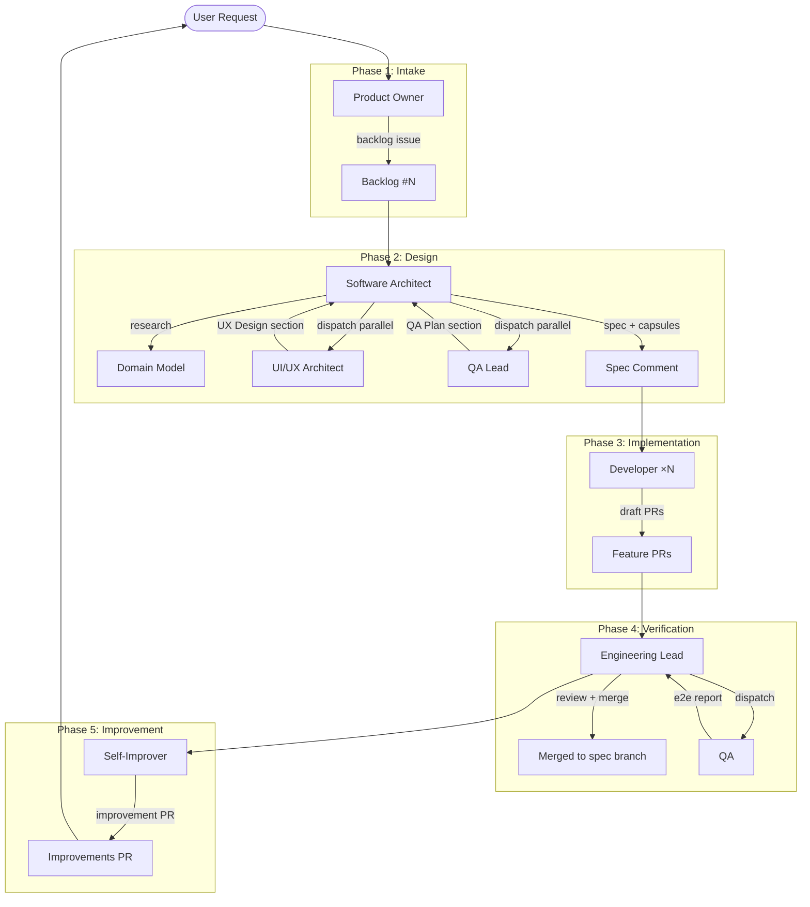

# Agentic SDD Workflow

Spec-Driven Development pipeline with multi-agent orchestration. 8 agents, 5 phases, 18 scripts, 12 skills — one continuous loop from user request to shipped improvement.

---

## Master Diagram



---

## Quick Reference: Ownership Matrix

| Agent | Question | Dispatches | Never |
|-------|----------|------------|-------|
| **Product Owner** | What are we building? | Software Architect | Read code, design architecture |
| **Software Architect** | How should we build it? | Developer, UI/UX Architect, QA Lead, Engineering Lead, Self-Improver | Write production code |
| **UI/UX Architect** | How should users experience it? | — | Write code, define architecture |
| **QA Lead** | How will we prove it works? | — | Execute tests, review code |
| **Developer** | Can I implement the approved plan? | — | Redesign architecture, touch forbidden files |
| **Engineering Lead** | Was the plan executed correctly? | Developer (retry), QA | Write code, change requirements |
| **QA** | Does the finished product work? | — | Judge architecture, write code |
| **Self-Improver** | How can we improve next time? | — | Modify source code |

---

## Document Index

| File | Content |
|------|---------|
| [01-agents.md](01-agents.md) | Agent catalog: roles, permissions, models, dispatch authority, tool permissions matrix |
| [02-pipeline.md](02-pipeline.md) | Phase walkthrough: Intake → Design → Implementation → Verification → Improvement. Sub-flows (bug fix, e2e retry, escalation) |
| [03-artifacts.md](03-artifacts.md) | Artifact catalog: every document/object produced in the pipeline with templates |
| [04-scripts.md](04-scripts.md) | Pipeline scripts: purpose, callers, outputs, known issues, script→phase map |
| [05-skills.md](05-skills.md) | Skills catalog: specialized instruction packs, load triggers, skill→agent matrix |
| [06-metrics.md](06-metrics.md) | Metrics & improvement cycle: metrics.json schema, IMPROVEMENTS.md lifecycle, signal table |

---

## Phase at a Glance

| Phase | Owner | Key actions | Artifact produced |
|-------|-------|-------------|-------------------|
| 1. Intake | Product Owner | Clarify → Design summary → Backlog | Backlog issue |
| 2. Design | Software Architect | Research → Consult UX+QA → Spec → Capsules | Spec, contract, capsules |
| 3. Implementation | Developer ×N | Worktree → Implement → Build → Draft PR | Feature PRs |
| 4. Verification | Engineering Lead + QA | Review → Merge → Coherence → E2E | Merged PRs, metrics, e2e report |
| 5. Improvement | Self-Improver | Analyze → Cross-spec patterns → Improvement PR | Improvement PR, Retro Report |

---

## Sub-Flow Quick Reference

| Sub-Flow | When | Path |
|----------|------|------|
| Bug Fix | User reports a bug | Product Owner → Software Architect → 1 Developer → Engineering Lead → QA → Self-Improver |
| E2E Retry | QA finds failures | Engineering Lead identifies capsule → Developer retry → re-merge → QA re-test (max 2 cycles) |
| ARCHITECTURE ESCALATION | 2nd e2e cycle fails | Product Owner posts escalation → Architect does RCA → Human decides redesign or abandon |
| Regression E2E | Spec has no user-observable ACs | Engineering Lead dispatches QA in regression mode → smoke test checklist |
| Reviewer Retry Loop | PR fails review | Engineering Lead → Developer retry (max 4 per PR) → re-review → merge or bug report |

---

## Connection Map

```
Agent              Scripts              Skills               Artifacts
───────            ────────             ──────               ─────────
Product Owner  →  backlog-create       git-operations       Backlog issue
                  bug-create
                  project-status

Software       →  spec-create          git-operations       Spec comment
Architect          sub-issue-create     frontend-design      Contract file
                  project-status        telemetry-query      Capsules

UI/UX          →  —                    frontend-design      UX Design section
Architect                               chakra-ui-builder

QA Lead        →  —                    —                    QA Plan section

Developer      →  workspace-create     git-operations       Draft PRs
                  pr-create
                  capsule-get

Engineering    →  pr-review            git-operations       Merged PRs
Lead               bug-create           dev-environment      Metrics entry
                  project-status
                  workspace-cleanup
                  retro-append

QA             →  dev-env              git-operations       E2E report
                  e2e-inject           dev-environment
                  git-ops-comment      fredo-cli-events
                                       opencode-cli-runner
                                       telemetry-query
                                       spec-test-gen

Self-Improver  →  retro-append         git-operations       Improvement PR
                                       retro-analysis        Retro Report
                                       telemetry-query
```
