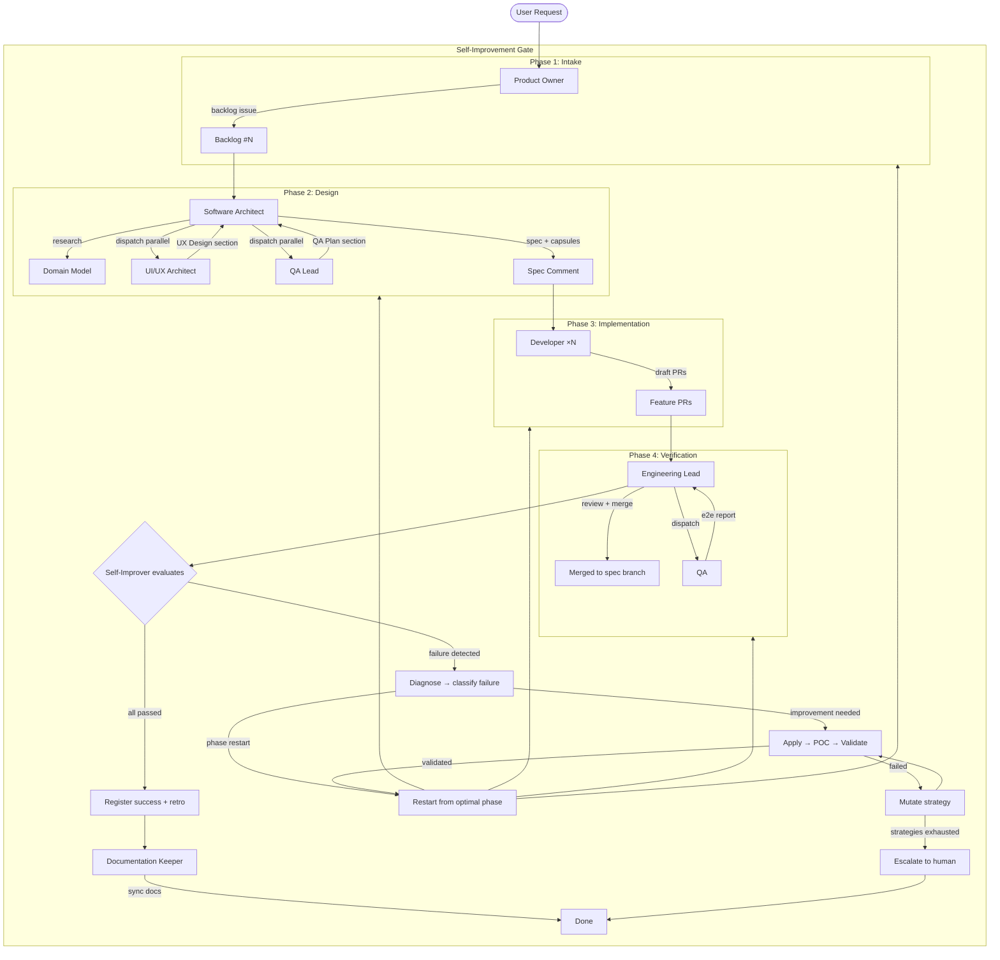
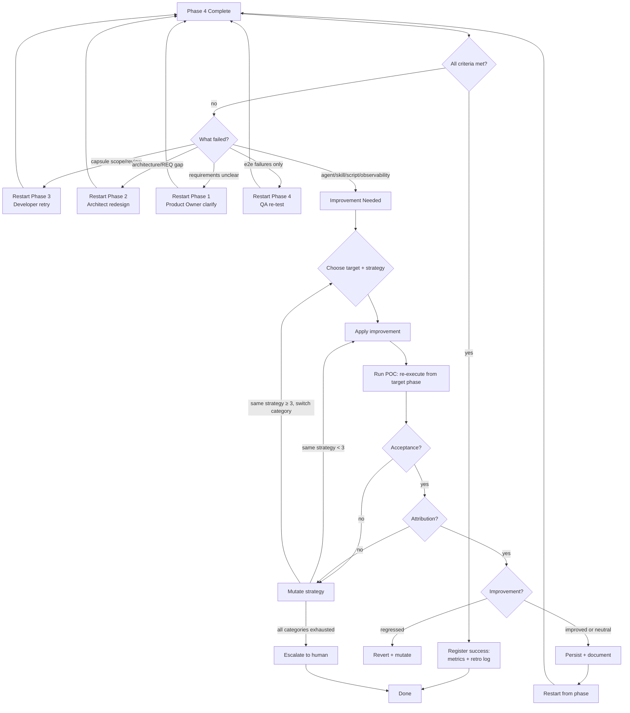

# Agentic SDD Workflow

Spec-Driven Development pipeline with multi-agent orchestration. 9 agents, 5 phases (one is a self-improvement gate), 18 scripts, 12 skills — one continuous loop from user request to shipped documentation.

---

## Master Diagram



---

## Quick Reference: Ownership Matrix

| Agent | Question | Dispatches | Never |
|-------|----------|------------|-------|
| **Product Owner** | What are we building? | Software Architect | Read code, design architecture |
| **Software Architect** | How should we build it? | Developer, UI/UX Architect, QA Lead, Engineering Lead, Self-Improver | Write production code |
| **UI/UX Architect** | How should users experience it? | — | Write code, define architecture |
| **QA Lead** | How will we prove it works? | — | Execute tests, review code |
| **Developer** | Can I implement the approved plan? | — | Redesign architecture, touch forbidden files |
| **Engineering Lead** | Was the plan executed correctly? | Developer (retry), QA | Write code, change requirements |
| **QA** | Does the finished product work? | — | Judge architecture, write code |
| **Self-Improver** | How can we improve to complete the spec? | Documentation Keeper | Modify source code, edit opencode.json |
| **Documentation Keeper** | Is the documentation still accurate? | — | Touch source code, rewrite docs from scratch |

---

## Document Index

| File | Content |
|------|---------|
| [01-agents.md](01-agents.md) | Agent catalog: roles, permissions, models, dispatch authority, tool permissions matrix |
| [02-pipeline.md](02-pipeline.md) | Phase walkthrough: Intake → Design → Implementation → Verification → Self-Improvement Gate |
| [03-artifacts.md](03-artifacts.md) | Artifact catalog: every document/object produced in the pipeline with templates |
| [04-scripts.md](04-scripts.md) | Pipeline scripts: purpose, callers, outputs, known issues, script→phase map |
| [05-skills.md](05-skills.md) | Skills catalog: specialized instruction packs, load triggers, skill→agent matrix |
| [06-metrics.md](06-metrics.md) | Metrics, improvement validation (acceptance→attribution→improvement), IMPROVEMENTS.md lifecycle |

---

## Phase at a Glance

| Phase | Owner | Key actions | Artifact produced |
|-------|-------|-------------|-------------------|
| 1. Intake | Product Owner | Clarify → Design summary → Backlog | Backlog issue |
| 2. Design | Software Architect | Research → Consult UX+QA → Spec → Capsules | Spec, contract, capsules |
| 3. Implementation | Developer ×N | Worktree → Implement → Build → Draft PR | Feature PRs |
| 4. Verification | Engineering Lead + QA | Review → Merge → Coherence → E2E | Merged PRs, metrics, e2e report |
| **Gate** | **Self-Improver** | **Evaluate → Diagnose → Improve → POC → Validate → Restart or Escalate** | **Improvement artifacts, Retro Log, escalation report** |

---

## Improvement Loop Flow



---

## Connection Map

```
Agent              Scripts              Skills               Artifacts
───────            ────────             ──────               ─────────
Product Owner  →  backlog-create       git-operations       Backlog issue
                  project-status
                  project-status

Software       →  spec-create          git-operations       Spec comment
Architect          project-status        frontend-design      Contract file
                                         telemetry-query      Capsule comments

UI/UX          →  —                    frontend-design      UX Design section
Architect                               chakra-ui-builder    Visual wireframe
                                                             (image, for QA)

QA Lead        →  —                    —                    QA Plan section

Developer      →  workspace-create     git-operations       Draft PRs
                  pr-create

Engineering    →  pr-review            git-operations       Merged PRs
Lead               project-status       dev-environment      Metrics entry
                  project-status
                  workspace-cleanup
                  retro-append

QA             →  dev-env              git-operations       E2E report
                  e2e-inject           dev-environment      (compares rendered UI
                  git-ops-comment      fredo-cli-events      against visual wireframe
                                       opencode-cli-runner   from UI/UX Architect)
                                       telemetry-query
                                       spec-test-gen

Self-Improver  →  retro-append         git-operations       Improvement records
                                       retro-analysis        Retro Log
                                       telemetry-query       Escalation report

Documentation  →  git-ops-comment      git-operations       Doc patches
Keeper                                                       Doc update summary
```
